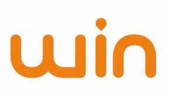
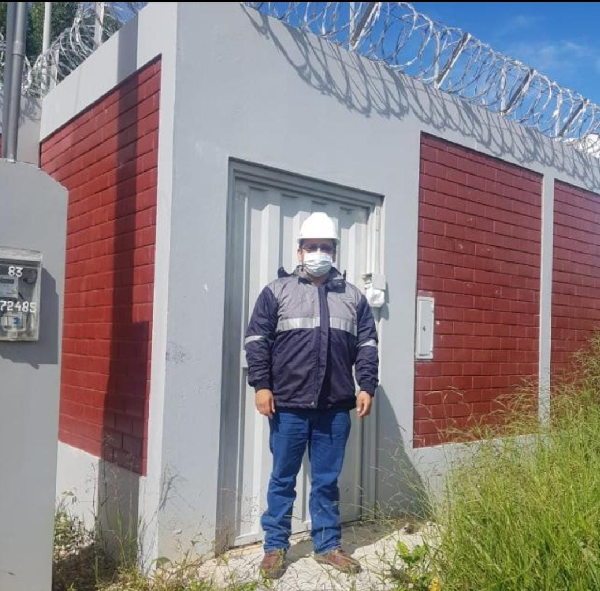
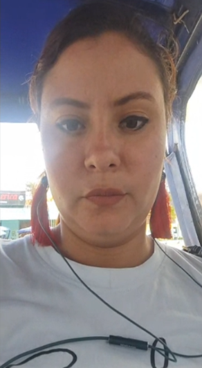
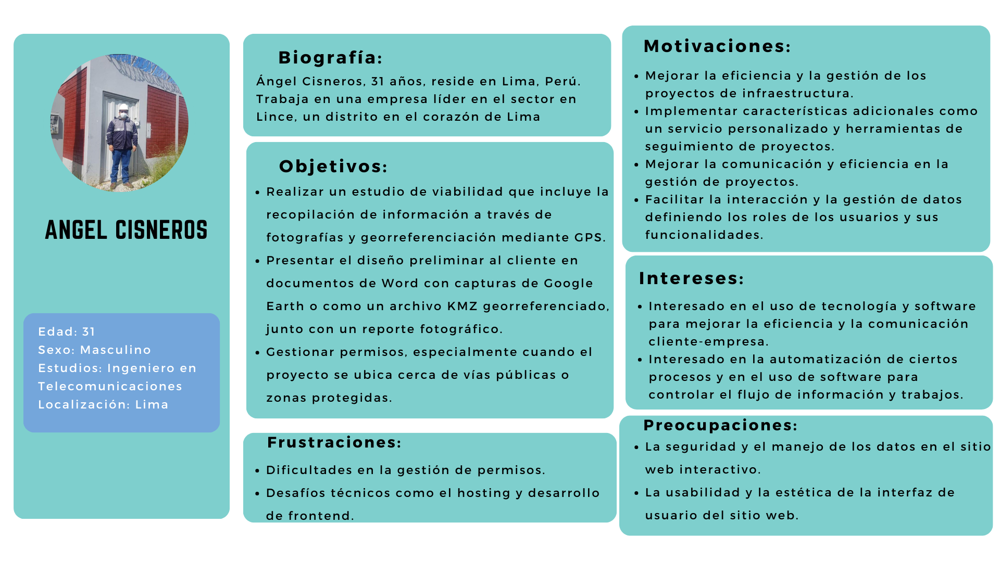
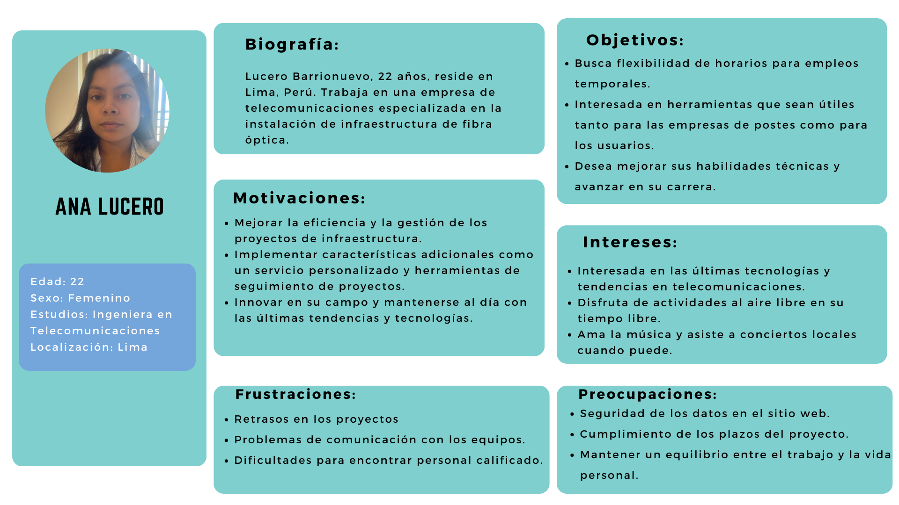
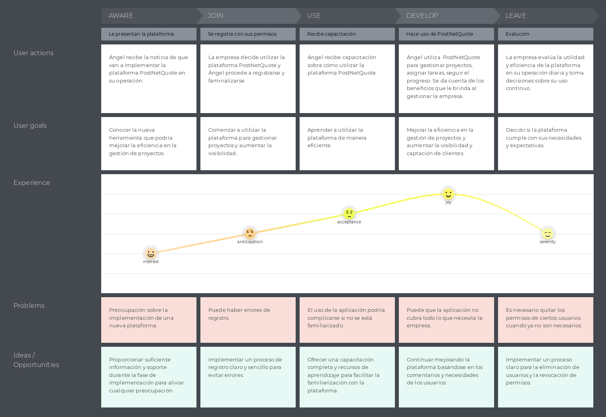
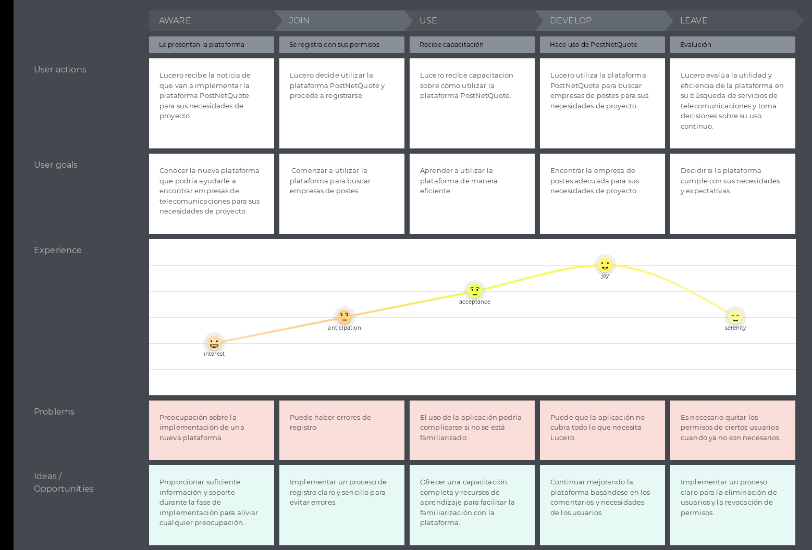

# Capítulo II: Requirements Elicitation & Analysis
## 2.1. Competidores

Luego de realizar una investigación en el mercado peruano, hemos hallado tres portales de trabajo que ofrecen características similares a la de PostNetQuote. Es por eso que son considerados como potenciales competidores. Estos son:

1. **Claro:**

   Es uno de los principales proveedores de servicios de telecomunicaciones en Perú. Ofrecen fibra óptica para hogares y empresas en diversas regiones del país.

  

2. **WIN:**

   Es una empresa de telecomunicaciones peruana que ofrece una red de transmisión totalmente de fibra óptica, desde su centro de distribución principal hasta la ONT del cliente

  

    </img>
  

3. **Optical Networks:**

   Es una empresa peruana de telecomunicaciones que cuenta con más de 20 años de experiencia en el sector de las telecomunicaciones y las tecnologías de la información para el segmento B2B. Proporcionan servicios de infraestructura de telecomunicaciones, TI y energía.
   

   

    </img>
  

### 2.1.1. Análisis competitivo

<table>
  <tr>
    <th colspan="7" valign="top"><b>Competitive Analysis Landscape</b></th>
  </tr>
  <tr>
    <td colspan="2" rowspan="2">¿Por qué llevar a cabo este análisis?</td>
    <td colspan="5">Escriba en el recuadro la pregunta que busca responder o el objetivo de este análisis.</td>
  </tr>
  <tr>
    <td colspan="5">Este análisis se realizó con la finalidad de poder identificar a nuestros potenciales competidores e idear estrategias y tácticas para diferenciarnos de estos.</td>
  </tr>
  <tr>
    <td colspan="2"></td>
    <td colspan="1" valign="top" style="font-weight: bold;">
        Claro
  

    </img>
  

        
  <td colspan="1" valign="top" style="font-weight: bold;">
    Win

    </img>

</td>
    <td colspan="1" valign="top" style="font-weight: bold;">
      Optical Networks

      </img>

</td>
    <td colspan="1" valign="top" style="font-weight: bold;" >
      PostNetQuote

      </img>

    </td>
  </tr>
  <tr>
    <td rowspan="2">Perfil</td>
    <td>Overview</td>
    <td>Es uno de los principales proveedores de servicios de telecomunicaciones en Perú. Ofrecen fibra óptica para hogares y empresas en diversas regiones del país.</td>
    <td>Ofrece una red de transmisión totalmente de fibra óptica en Perú. Desde su centro de distribución principal hasta la ONT del cliente.</td>
    <td>Empresa peruana que brinda servicios de telecomunicaciones, con una red de fibra óptica. Ofrecen soluciones tecnológicas, equipo especializado y colaboran con socios de industria.</td>
    <td>PostNetQuote es una startup que busca facilitar la visibilidad de los servicios de diferentes empresas de postes en Perú. Su objetivo es conectar a las empresas de telecomunicaciones con las empresas de postes a través de una plataforma digital.</td>  
</tr>
  <tr>
    <td>Ventaja competitiva</td>
    <td>Amplia cobertura y variedad de servicios de telecomunicaciones.</td>
    <td>Especialización en la transmisión de fibra óptica.</td>
    <td>Conocimiento local del mercado peruano y soluciones tecnológicas integrales.</td>
    <td>La principal ventaja competitiva de PostNetQuote es ser la primera plataforma en Perú que conecta a las empresas de telecomunicaciones con las empresas de postes, lo que le da una ventaja competitiva.</td>  
</tr>
  <tr>
    <td rowspan="2">Perfil de Marketing</td>
    <td>Mercado objetivo</td>
    <td>Hogares y empresas en diversas regiones del Perú que necesitan servicios de telecomunicaciones.</td>
    <td>Clientes que necesitan una red de transmisión de fibra óptica en Perú.</td>
    <td>Empresas y clientes individuales en Perú que necesitan soluciones tecnológicas y servicios de telecomunicaciones.</td>
    <td>Empresas de telecomunicaciones que buscan servicios de postes y las empresas de postes que buscan aumentar su visibilidad en el mercado.</td>  
</tr>
  <tr>
    <td>Estrategias de marketing</td>
    <td>Marketing digital y promociones para atraer a más clientes.</td>
    <td>Enfoque en la calidad y velocidad de la fibra óptica para atraer a los clientes.</td>
    <td>Colaboraciones con socios de la industria y marketing digital para aumentar su presencia en el mercado.</td>
    <td>PostNetQuote se centrará en el marketing digital y las colaboraciones con empresas de telecomunicaciones y empresas de postes para aumentar su visibilidad en el mercado.</td>  
</tr>
  <tr>
    <td rowspan="2">Perfil de Producto</td>
    <td>Productos & Servicios</td>
    <td>Proveedor de servicios de telecomunicaciones que ofrece fibra óptica para hogares y empresas.</td>
    <td>Proveedor de una red de transmisión totalmente de fibra óptica en Perú.</td>
    <td>Proveedor de servicios de telecomunicaciones con una red de fibra óptica. Ofrece soluciones tecnológicas y colabora con socios de industria.</td>
    <td>PostNetQuote ofrece una plataforma digital que permite a las empresas de telecomunicaciones ver y comparar los servicios ofrecidos por diferentes empresas de postes.</td>  
</tr>
  <tr>
    <td>Precios & Costos</td>
    <td>Versión de pago con tarifas basadas en planes.</td>
    <td>Versión de pago con tarifas basadas en planes.</td>
    <td>Aplicación totalmente gratuita.</td>
    <td>PostNetQuote será una plataforma gratuita para empresas de postes/clientes, mientras que ofrecerá planes de suscripción premium para las empresas de telecomunicaciones.</td>
  </tr>
  <tr>
  <td rowspan="4">Análisis SWOT</td>
  <td>Fortalezas</td>
  <td>Claro tiene una gran presencia en Perú, lo que le permite llegar a una amplia base de clientes. Además, ofrece una amplia gama de servicios de telecomunicaciones, incluyendo telefonía móvil, telefonía fija, televisión por cable e internet, lo que le permite satisfacer una variedad de necesidades de los clientes.</td>
  <td>WIN se especializa en la transmisión de fibra óptica, lo que le permite ofrecer servicios de internet de alta velocidad. Esta especialización podría ser una ventaja competitiva en el mercado de telecomunicaciones de Perú.</td>
  <td>Optical Networks es una empresa local con un profundo conocimiento del mercado peruano. Además, ofrece soluciones tecnológicas integrales, lo que le permite satisfacer una variedad de necesidades de los clientes.</td>
  <td>PostNetQuote es la primera plataforma en Perú que conecta a las empresas de telecomunicaciones con las empresas de postes, lo que le da una ventaja competitiva.</td>
</tr>
<tr>
  <td>Debilidades</td>
  <td>Una de las principales debilidades de Claro es su dependencia de la infraestructura de telecomunicaciones. Cualquier interrupción o problema con esta infraestructura podría afectar la calidad de sus servicios.</td>
  <td>WIN está limitada a la fibra óptica. Esto podría ser una desventaja si la demanda de otros tipos de servicios de internet aumenta.</td>
  <td>Optical Networks depende de la infraestructura de telecomunicaciones. Cualquier problema con esta infraestructura podría afectar la calidad de sus servicios.</td>
  <td>Como startup, PostNetQuote puede enfrentar desafíos para ganar reconocimiento en el mercado y confianza entre las empresas de telecomunicaciones y las empresas de postes.</td>
</tr>
<tr>
  <td>Oportunidades</td>
  <td>La expansión de la fibra óptica en Perú representa una gran oportunidad para Claro. Esto podría permitirle ofrecer servicios de internet de alta velocidad a más clientes.</td>
  <td>La creciente demanda de fibra óptica en Perú representa una gran oportunidad para WIN. Esto podría permitirle expandir su base de clientes y aumentar sus ingresos.</td>
  <td>La creciente demanda de soluciones tecnológicas en Perú representa una gran oportunidad para Optical Networks. Esto podría permitirle expandir su base de clientes y aumentar sus ingresos.</td>
  <td>La expansión de la fibra óptica en Perú y la falta de una plataforma que conecte a las empresas de telecomunicaciones con las empresas de postes representan una gran oportunidad para PostNetQuote.</td>
</tr>
<tr>
  <td>Amenazas</td>
  <td>Claro enfrenta una fuerte competencia en el mercado de telecomunicaciones de Perú. Esto podría limitar su capacidad para ganar nuevos clientes y retener a los existentes.</td>
  <td>WIN depende de la demanda de fibra óptica. Si esta demanda disminuye, podría afectar negativamente a su negocio.</td>
  <td>Optical Networks también enfrenta una fuerte competencia en el mercado de telecomunicaciones de Perú. Esto podría limitar su capacidad para ganar nuevos clientes y retener a los existentes.</td>
  <td>PostNetQuote puede enfrentar competencia si otras plataformas deciden ofrecer servicios similares. Además, la regulación gubernamental en el sector de las telecomunicaciones podría representar una amenaza.</td>
</tr>
</table>

### 2.1.2. Estrategias y tácticas frente a competidores

Usaremos estrategias y tácticas que aprovechen nuestras fortalezas y oportunidades y poder sacar ventaja de las debilidades y amenazas de nuestros competidores. Por lo mismo nuestras estrategias son las siguientes:

## Estrategias y tácticas frente a competidores:

### Análisis FODA de nuestro negocio:
- **Fortalezas (F):**
  - Experiencia especializada en el despliegue de infraestructura de fibra óptica en Perú.
  - Modelo de negocio por suscripción que ofrece ingresos recurrentes y estabilidad financiera.
  - Plataforma dedicada que facilita la gestión de proyectos de infraestructura de telecomunicaciones para empresas de postes.

- **Oportunidades (O):**
  - Crecimiento continuo en la demanda de servicios de infraestructura de telecomunicaciones en Perú.
  - Potencial para expandir nuestros servicios a nuevos mercados y sectores dentro de la industria de las telecomunicaciones.

- **Debilidades (D):**
  - Limitaciones presupuestarias para promoción y marketing para aumentar la visibilidad de nuestra plataforma.
  - Competencia potencial de otros proveedores de servicios de infraestructura de telecomunicaciones en el mercado.

- **Amenazas (A):**
  - Posibilidad de la entrada de nuevos competidores en el mercado de infraestructura de telecomunicaciones en Perú.
  - Riesgo de perder clientes ante la competencia de otras plataformas o proveedores de servicios similares.

### Estrategias y tácticas:
1. **Diferenciación de servicios:**
- Destacarnos ofreciendo herramientas especializadas para la gestión de proyectos de infraestructura de telecomunicaciones, como seguimiento de progreso, asignación de recursos y comunicación en tiempo real entre equipos.

2. **Campañas de marketing digital:**
- Ejecutar campañas publicitarias dirigidas a empresas de postes de telecomunicaciones en Perú a través de marketing de contenido, anuncios en redes sociales y campañas de correo electrónico para aumentar la conciencia de nuestra plataforma y sus beneficios.

3. **Alianzas estratégicas:**
- Establecer asociaciones con empresas de telecomunicaciones y proveedores de servicios relacionados para ofrecer servicios integrados y ampliar nuestra base de clientes potenciales.

4. **Desarrollo de comunidad:**
- Crear una comunidad en línea para empresas de postes y profesionales de la industria de telecomunicaciones donde puedan intercambiar conocimientos, compartir experiencias y acceder a recursos exclusivos proporcionados por nuestra plataforma.

5. **Optimización de la experiencia del usuario:**
- Mejorar continuamente la usabilidad y funcionalidad de nuestra plataforma para garantizar una experiencia de usuario óptima y aumentar la retención de clientes.

6. **Análisis de datos y retroalimentación del cliente:**
- Utilizar análisis de datos para comprender mejor las necesidades y preferencias de nuestros clientes, y recopilar retroalimentación regular para iterar y mejorar nuestros servicios según las demandas del mercado.

## 2.2. Entrevistas
### 2.2.1. Diseño de entrevistas

En esta sección se han definido una cierta cantidad de preguntas para nuestro segmento objetivo, con la finalidad de obtener información cualitativa como opiniones o descripciones. Esta información nos será de gran ayuda en el desarrollo de nuestra solución.

**Preguntas demográficas:**

1. ¿Cómo te llamas?
2. ¿Cuántos años tienes?
3. ¿Cuál es tu ubicación?
4. ¿Cuál es tu ocupación actual o en qué industria trabajas?

**Preguntas sobre personalidad**

1. ¿Tienes experiencia en la industria de las telecomunicaciones o en proyectos de infraestructura?
2. ¿Qué nivel de familiaridad tienes con la instalación de postes de fibra óptica?

**Preguntas Segmento 1: Empresas de telecomunicaciones**

1. ¿Ha tenido dificultades para aumentar su visibilidad y captar clientes para sus servicios de instalación de postes de fibra óptica?
2. ¿Qué obstáculos encuentra habitualmente al gestionar proyectos de infraestructura de telecomunicaciones?
3. ¿Qué tipo de servicios o proyectos de instalación de postes de fibra óptica ofrece su empresa?
4. ¿Cómo establece los precios para sus servicios? ¿Qué factores influyen en esta decisión?
5. ¿Qué características o funcionalidades consideraría esenciales en una plataforma en línea dedicada a la gestión de proyectos y la captación de clientes para servicios de instalación de postes?
6. ¿Qué aspectos valoraría más al suscribirse a una plataforma como la nuestra? ¿La facilidad de uso, la variedad de oportunidades de negocio, la seguridad de los datos?

**Segmento 2: Clientes**

1. ¿Qué consideras importante al momento de contratar a alguien?
2. ¿Consideras que la experiencia previa es importante?
3. ¿Prefieres contratar a trabajadores especializados o considerarías a aquellos sin experiencia previa?
4. ¿Cuáles son las cualidades o habilidades clave que buscas al contratar a un trabajador para un empleo eventual o proyecto?
5. ¿Qué factores influyen en tu decisión de contratar a alguien que carece de experiencia laboral pero muestra entusiasmo y potencial?
6. ¿Has tenido experiencias previas con trabajadores jóvenes o sin experiencia? ¿Cuáles fueron los aspectos positivos y los desafíos?
7. ¿Qué tan importante es la flexibilidad de horarios en los candidatos que consideras para empleos temporales?

**Para mejorar la idea del negocio**

1. ¿Qué opinas sobre la idea de nuestro proyecto? ¿Crees que sería útil para las empresas de postes y los usuarios?
2. ¿Qué características adicionales te gustaría ver en nuestro sitio web para que sea más útil o atractivo para ti?
3. ¿Tienes alguna preocupación o consideración sobre la seguridad de tus datos al utilizar un sitio web en línea para gestionar proyectos y servicios de instalación de postes de fibra óptica?

### 2.2.2. Registro de entrevistas

**Segmento 01**

**Entrevista 01**

Nombre: Ángel

Edad: 31 años

Distrito: Lince

Evidencia de la reunión:

  

Duración: 12:31

Enlace de entrevista: [https://www.youtube.com/watch?v=J6JVWyPkIjY&ab_channel=crhlatinoxD](https://www.youtube.com/watch?v=J6JVWyPkIjY&ab_channel=crhlatinoxD)

Resumen de la entrevista:

La entrevista aborda el proceso y las fases involucradas en la realización de un proyecto de tendido de fibra óptica, desde la concepción inicial hasta la finalización y entrega al cliente, incluyendo el uso de tecnología y software para mejorar la eficiencia y la comunicación cliente-empresa.

El proyecto inicia con una fase de diseño, donde se realiza un estudio de viabilidad que incluye la recopilación de información a través de fotografías y georreferenciación mediante GPS. Este diseño preliminar se presenta al cliente en documentos de Word con capturas de Google Earth o como un archivo KMZ georreferenciado, junto con un reporte fotográfico.

Además de la fase de diseño, se menciona la importancia de la gestión de permisos, que es vital para la realización del proyecto, especialmente cuando este se ubica cerca de vías públicas o zonas protegidas, requiriendo autorizaciones de diversas entidades como el Ministerio de Cultura o empresas de servicios públicos.

Se destacó la idea de desarrollar un sitio web interactivo que permita a los clientes visualizar el progreso del proyecto y acceder a datos relevantes. Este portal también podría incluir funciones para la gestión de tickets por diferentes grupos de trabajo (como Nitrógenos, Networking, Averías, etc.), asignación de tareas, y reportes de avance, mejorando la comunicación y eficiencia en la gestión de proyectos.

Se habló sobre la posibilidad de automatizar ciertos procesos y utilizar software para controlar el flujo de información y trabajos. La creación de una base de datos flexible, posiblemente utilizando MongoDB, y la consideración de aspectos técnicos como hosting y desarrollo de frontend fueron discutidos como pasos futuros.

Finalmente, se mencionó la intención de estructurar bien el sitio, definiendo los roles de los usuarios y sus funcionalidades para facilitar la interacción y la gestión de datos. El proceso terminaría con el diseño y la implementación de la interfaz de usuario, con un enfoque en la estética y la usabilidad.

**Segmento 02**

**Entrevista 02**

Nombres: Ana Lucero

Apellidos: Barrionuevo Reto

Edad: 22 años

Distrito: Pueblo Libre

Evidencia de la reunión:
 

    

Duracion: 7:43

Enlace de entrevista: [https://youtu.be/rZdEwrJbjxY](https://youtu.be/rZdEwrJbjxY)

Resumen de la entrevista:

Se entrevistó a Lucero Barrionuevo, una joven de 22 años que reside en Lima, Perú, trabaja en una empresa de telecomunicaciones especializada en la instalación de infraestructura de fibra óptica.
Mencionó que tiene experiencia en proyectos de infraestructura y está familiarizada con la instalación de postes de fibra óptica.
También comentó que valora la experiencia previa y las habilidades técnicas sólidas al contratar personal.
Considera importante la flexibilidad de horarios para empleos temporales.
Además, respecto al proyecto propuesto, cree que sería útil tanto para las empresas de postes como para los usuarios, sugiriendo características adicionales como un servicio personalizado y herramientas de seguimiento de proyectos.
Finalmente, no mostró preocupaciones significativas sobre la seguridad de los datos en el sitio web.

**Entrevista 03**

Nombres: Adriana Lizeth

Apellidos: García Bardales

Edad: 28 años

Distrito: Pueblo Libre

Evidencia de la reunión:

  

Duración: 5:40

Enlace de entrevista: [https://youtu.be/F3mO6B6Ll7s](https://youtu.be/F3mO6B6Ll7s)

Resumen de la entrevista:

Adriana Lizeth comparte su rol como animadora independiente y sus preferencias de contratación.
Valora la responsabilidad, la proactividad y la puntualidad, pero también ha tenido experiencias positivas con trabajadores sin experiencia que aprenden rápido.
Agrega que el proyecto será útil, ya que puede ayudar a las empresas a aumentar su visibilidad y captar más clientes.
Sugiere agregar funciones como servicio personalizado y programación de recordatorios para que la plataforma sea más efectiva.
Finalmente, expresa que no tiene mayores preocupaciones sobre la seguridad de los datos en un sitio web si se agrega algo al mismo.

### 2.2.3. Análisis de entrevistas

**Segmento 1: Empresas de telecomunicaciones**

Las entrevistas con las empresas de de telecomunicaciones arrojaron una variedad de perspectivas sobre el proceso de gestión de proyectos y la utilidad del sitio web.
Se destaca la necesidad de aumentar la visibilidad y captar clientes para los servicios de instalación de postes de fibra óptica, así como la importancia de superar obstáculos habituales en la gestión de proyectos de infraestructura de telecomunicaciones.
Los entrevistados describen los servicios y proyectos que ofrecen sus empresas, así como los factores que influyen en la fijación de precios para dichos servicios.
Recomendaron que el sitio web dedicada debe ofrecer características esenciales como facilidad de uso, variedad de oportunidades de negocio y seguridad de los datos para atraer a las empresas de postes como suscriptores.

**Segmento 2: Clientes**

Las entrevistas nos ofrecieron una variedad de perspectivas sobre la contratación y la utilidad del servicio. Se destacó la importancia de la experiencia previa y las cualidades personales al momento de contratar a alguien para un proyecto o empleo temporal.
Los entrevistados expresan preferencia por trabajadores especializados, pero también consideran a aquellos sin experiencia previa si demuestran entusiasmo y potencial.
Además, se resalta la flexibilidad de horarios como un factor importante en la decisión de contratación.
En relación con la propuesta del sitio web PostNetQuote, valoran su utilidad potencial para las empresas de postes y los usuarios, destacando la importancia de características adicionales como un sistema de búsqueda avanzada y medidas de seguridad de datos sólidas.

## 2.3. Needfinding
### 2.3.1. User Personas

**Segmento 1**

 

 </img>
 

**Segmento 2**

 

  </img>
 

### 2.3.2. User Task Matrix

<table>
  <tr>
    <th>Tarea</th>
    <th>Frecuencia</th>
    <th>Importancia</th>
  </tr>
  <tr>
    <td>Monitorear los procesos de gestión de proyectos</td>
    <td>Alta</td>
    <td>Alta</td>
  </tr>
  <tr>
    <td>Supervisar los registros de proyectos</td>
    <td>Media</td>
    <td>Alta</td>
  </tr>
  <tr>
    <td>Contratar personal para proyectos</td>
    <td>Alta</td>
    <td>Media</td>
  </tr>
  <tr>
    <td>Valorar la experiencia previa y habilidades técnicas al contratar</td>
    <td>Alta</td>
    <td>Alta</td>
  </tr>
  <tr>
    <td>Considerar la flexibilidad de horarios para empleos temporales</td>
    <td>Alta</td>
    <td>Media</td>
  </tr>
  <tr>
    <td>Superar obstáculos en la gestión de proyectos</td>
    <td>Alta</td>
    <td>Alta</td>
  </tr>
  <tr>
    <td>Describir los servicios y proyectos que ofrecen</td>
    <td>Alta</td>
    <td>Alta</td>
  </tr>
  <tr>
    <td>Fijar precios para los servicios</td>
    <td>Alta</td>
    <td>Alta</td>
  </tr>
  <tr>
    <td>Contratar empresas de postes a través de la plataforma</td>
    <td>Media</td>
    <td>Media</td>
  </tr>
  <tr>
    <td>Actualizar la información de los servicios ofrecidos</td>
    <td>Alta</td>
    <td>Alta</td>
  </tr>
  <tr>
    <td>Responder a las solicitudes de las empresas de telecomunicaciones</td>
    <td>Media</td>
    <td>Media</td>
  </tr>
  <tr>
    <td>Seguimiento de las solicitudes de las empresas de telecomunicaciones</td>
    <td>Media</td>
    <td>Media</td>
  </tr>
  <tr>
    <td>Ofrecer características esenciales como facilidad de uso, variedad de oportunidades de negocio y seguridad de los datos</td>
    <td>Alta</td>
    <td>Alta</td>
  </tr>
  <tr>
    <td>Contratar a trabajadores especializados</td>
    <td>Alta</td>
    <td>Media</td>
  </tr>
  <tr>
    <td>Considerar a trabajadores sin experiencia previa si demuestran entusiasmo y potencial</td>
    <td>Alta</td>
    <td>Media</td>
  </tr>
  <tr>
    <td>Valorar la flexibilidad de horarios en los candidatos</td>
    <td>Alta</td>
    <td>Media</td>
  </tr>
  <tr>
    <td>Utilizar la plataforma para aumentar la visibilidad y captar clientes</td>
    <td>Alta</td>
    <td>Alta</td>
  </tr>
  <tr>
    <td>Recomendar características adicionales para la plataforma</td>
    <td>Media</td>
    <td>Media</td>
  </tr>
</table>

### 2.3.3. User Journey Mapping
En la presente sección se ilustra el end-to-end journey de la aplicación PostNetQuote para los segmentos objetivos, Empresas de telecomunicaciones y clientes. El User Journey Mapping empieza desde el momento en el que el cliente adquiere
conocimiento de la aplicación pasando por el proceso de tomar la decisión de usarlo, registrarse, hacer uso de este mismo y finalmente la posibilidad de que deje de hacer uso de este mismo.

**Segmento 1**
 

  </img>
 

**Segmento 2**
 

 </img>

# 4.1. Style Guidelines

## 4.1.1. General Style Guidelines
La coherencia visual y la accesibilidad son pilares de nuestro diseño web. Nos enfocamos en crear una experiencia de usuario uniforme a través de colores, tipografías, y elementos de diseño consistentes. Nuestro objetivo es facilitar una interfaz intuitiva y agradable, que refleje la identidad de nuestra marca y mejore la interacción del usuario con nuestra plataforma. Seleccionamos una paleta de colores que refuerza nuestra imagen de marca, con colores primarios, secundarios, y de acento cuidadosamente elegidos para mejorar la legibilidad y la navegación. Las tipografías se eligen para garantizar la legibilidad en diversos dispositivos, manteniendo un equilibrio entre estética y funcionalidad.

## 4.1.2. Web Style Guidelines
Para las interfaces web responsivas, adoptamos un enfoque 'mobile-first', asegurando que nuestro diseño sea efectivo y atractivo en dispositivos móviles, y luego escalando hacia arriba para adaptarse a pantallas más grandes. Los principios de diseño inclusivo guían cada decisión, desde el contraste de colores hasta el tamaño de los elementos interactivos, para asegurar que nuestro sitio sea accesible para todos los usuarios, independientemente de sus capacidades. Implementamos también un sistema de diseño modular, lo que nos permite reutilizar componentes y garantizar consistencia a través de la experiencia del usuario.

# 4.2. Information Architecture

## 4.2.1. Organization Systems
Nuestra arquitectura de información se estructura alrededor de sistemas de organización claramente definidos. Utilizamos una combinación de organización jerárquica para estructurar el contenido por importancia y relevancia, y organización secuencial para guiar a los usuarios a través de procesos paso a paso. Para categorizar contenido, aplicamos esquemas temáticos, permitiendo a los usuarios encontrar información basada en temas específicos o áreas de interés. La organización por audiencia también juega un papel crucial, segmentando el contenido para diferentes grupos de usuarios, asegurando que la información sea relevante y fácilmente accesible.

## 4.2.2. Labeling Systems
Nuestro sistema de etiquetado está diseñado para claridad y simplicidad. Utilizamos etiquetas intuitivas y descriptivas para grupos de información y enlaces, reduciendo la ambigüedad y mejorando la navegación. Cada etiqueta es el resultado de un análisis detallado de la terminología más comprensible para nuestro público objetivo, asegurando que la estructura de la información sea fácil de entender y seguir.

## 4.2.3. SEO Tags and Meta Tags
Optimizamos nuestro sitio web para motores de búsqueda a través de un uso estratégico de SEO tags y meta tags. Para cada página principal, definimos títulos únicos y descripciones meta que reflejan el contenido y las keywords clave. Esto mejora la visibilidad y el ranking en resultados de búsqueda. Además, implementamos tags para redes sociales, asegurando que el contenido compartido se vea atractivo y sea coherente con nuestra marca.

## 4.2.4. Searching Systems
Para mejorar la búsqueda de información dentro de nuestro producto digital, implementamos sistemas de búsqueda avanzada con opciones de filtrado por categoría, fecha, y tipo de contenido. Nuestro objetivo es minimizar el tiempo que los usuarios pasan buscando información, proporcionando resultados relevantes y organizados de manera intuitiva. Estos sistemas se diseñan pensando en la facilidad de uso, con sugerencias de búsqueda y corrección automática de errores comunes de entrada.

## 4.2.5. Navigation Systems
Nuestro sistema de navegación está diseñado para ser intuitivo y eficiente, permitiendo a los usuarios moverse por el sitio sin esfuerzo. Utilizamos menús claramente estructurados, breadcrumbs para indicar la ubicación actual dentro del sitio, y enlaces de navegación lógica para guiar a los usuarios. El diseño responsivo asegura que la navegación sea coherente en todos los dispositivos, y las acciones comunes están accesibles desde cualquier punto dentro del sitio, reduciendo la cantidad de clics necesarios para llegar al destino deseado.

## 4.3. Landing Page UI Design

### 4.3.1. Landing Page Wireframe
Presentación y explicación de los wireframes para navegadores web de escritorio y móviles, aplicando principios de diseño e información arquitectónica.

### 4.3.2. Landing Page Mock-up
Mock-ups detallados del Landing Page, demostrando la aplicación de los principios de diseño y el sistema de diseño establecido.

## 4.4. Web Applications UX/UI Design

### 4.4.1. Web Applications Wireframes
Wireframes de las aplicaciones móviles, mostrando la aplicación de principios de diseño y arquitectura de información.

### 4.4.2. Web Applications Wireflow Diagrams
Propuesta de wireflows para cada objetivo del usuario, complementado con una explicación detallada del flujo.

### 4.4.2. Web Applications Mock-ups
Mock-ups de las aplicaciones, evidenciando la aplicación de principios y elementos de diseño, diseño inclusivo y arquitectura de información.

### 4.4.3. Web Applications User Flow Diagrams
Diagrams de flujo de usuario para cada objetivo, incluyendo mock-ups de las vistas y pantallas junto con las rutas esperadas y alternativas.

## 4.5. Web Applications Prototyping
Prototipos de UI con simulación de interacción y navegación, acorde con los paths de User Flow Diagrams, incluyendo screenshots y enlaces a videos demostrativos.

## 4.6. Domain-Driven Software Architecture

### 4.6.1. Software Architecture Context Diagram
Diagrama de contexto que muestra la relación del sistema con entidades externas y usuarios.

### 4.6.2. Software Architecture Container Diagrams
Diagramas de contenedores que detallan las aplicaciones de alto nivel, servicios, y bases de datos.

### 4.6.3. Software Architecture Components Diagrams
Diagramas de componentes que describen la organización y relaciones entre componentes de software dentro de un contenedor.

## 4.7. Software Object-Oriented Design
Descripción del diseño orientado a objetos del software, incluyendo modelos de clases y relaciones entre ellas para reflejar la lógica de negocio y requerimientos del sistema.
