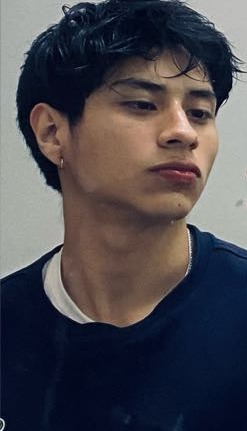

# 
COURSE PROJECT

    <strong>Universidad Peruana de Ciencias Aplicadas</strong> 
     
    <strong>Ingeniería de Software - 5to Ciclo</strong> 
    <strong>Desarrollo de Aplicaciones Open Source - WX55</strong> 
    <strong>Profesor: Angel Augusto Velasquez Nuñez</strong> 
     INFORME DE TRABAJO FINAL - TB1

    <strong>Startup: OpenMind</strong> 
    <strong>Producto: PostNetQuote</strong>

    <h3>Team Members:</h3>
    <table align="center">
        <tr>
            <th style="text-align:center;">Member</th>
            <th style="text-align:center;">Code</th>
        </tr>
        <tr>
            <td>Avellaneda Ramos, Carlos Edward</td>
            <td>U201923994</td>
        </tr>
        <tr>
            <td>Chavez Guerrero, Luis Sebastian</td>
            <td>U202216444</td>
        </tr>
        <tr>
            <td>Zagaceta Bardales, Rodrigo Enrique</td>
            <td>U202215489</td>
        </tr>
        <tr>
            <td>Barrionuevo Reto, Jean Franco Joel</td>
            <td>U202219284</td>
        </tr>
        <tr>
            <td>Cueva Elera, Erick Armando</td>
            <td>U201910151</td>
        </tr>
    </table>

 

# Registro de Versiones del Informe

| Versión |   Fecha    |                                Autor                                | Descripción de modificación                                                                                                                                                                                                                      | 
|:-------:|:----------:|:-------------------------------------------------------------------:|:-------------------------------------------------------------------------------------------------------------------------------------------------------------------------------------------------------------------------------------------------| 
|   1.0   | 27/03/2024 |                  Todos los integrantes del equipo                   | Creación del informe en MarkDown. Se añadió la Tabla de Contenidos.                                                                                                                                                                              |
|   1.1   | 29/03/2024 | Todos los integrantes del equipo | Se añadió el Studen Outcome. Se añadió el Capítulo 1: "Introducción".                                                                                                                                                                            |
|   1.2   | 01/04/2024 | Todos los integrantes del equipo | Se desarrollaron las preguntas para las entrevistas. Se realizaron las entrevistas. Se realizó el analisis de las entrevistas.                                                                                                                   |
|   1.3   | 02/04/2024 | Todos los integrantes del equipo | Se realizó el Needfinding y se culminó con el Capítulo 2: "Requirements Elicitation & Analysis"                                                                                                                                                  |
|   1.4   | 05/04/2024 | Todos los integrantes del equipo | Se realizó el To-Be Scenario Mapping. Se realizaron las User Stories.                                                                                                                                                                            |
|   1.5   | 06/04/2024 | Todos los integrantes del equipo | Se realizó el Impact Mapping. Se realizó el Product Backlog.                                                                                                                                                                                     |
|   1.6   | 08/04/2024 | Todos los integrantes del equipo | Se realizó el Style Guideline. Se realizó el Information Arquitecture. Se realizó el Landing Page UI Design. Se realizó el Web Applications UI/UX Design. Se realizó el Web Application Prototyping. Se desarrolló la Landing Page del proyecto. |
|   1.7   | 10/04/2024 | Todos los integrantes del equipo | Se culminó con los puntos restantes del capitulo 4 "Product Design". Se realizó el Capítulo 5 "Product Implementation, Validation & Deployment". Se realizó el informe de reporte de participación.                                              |

  

# Project Report Collaboration Insights
  

# Contenido
## Tabla de Contenidos
### [Registro de versiones del informe]()
### [Project Report Collaboration Insights]()
### [Contenido]()
### [Student Outcome]()
### [Capítulo I: Introducción]()
- [1.1. Startup Profile]()
  - [1.1.1. Descripción de la Startup]()
  - [1.1.2. Perfiles de integrantes del equipo]()
- [1.2. Solution Profile]()
  - [1.2.1 Antecedentes y problemática]()
  - [1.2.2 Lean UX Process]()
    - [1.2.2.1. Lean UX Problem Statements]()
    - [1.2.2.2. Lean UX Assumptions]()
    - [1.2.2.3. Lean UX Hypothesis Statements]()
    - [1.2.2.4. Lean UX Canvas]()
- [1.3. Segmentos objetivo]()

### [Capítulo II: Requirements Elicitation & Analysis]()
- [2.1. Competidores]()
  - [2.1.1. Análisis competitivo]()
  - [2.1.2. Estrategias y tácticas frente a competidores]()
- [2.2. Entrevistas]()
  - [2.2.1. Diseño de entrevistas]()
  - [2.2.2. Registro de entrevistas]()
  - [2.2.3. Análisis de entrevistas]()
- [2.3. Needfinding]()
  - [2.3.1. User Personas]()
  - [2.3.2. User Task Matrix]()
  - [2.3.3. User Journey Mapping]()
  - [2.3.4. Empathy Mapping]()
  - [2.3.5. As-is Scenario Mapping]()

### [Capítulo III: Requirements Specification]()
- [3.1. To-Be Scenario Mapping]()
- [3.2. User Stories]()
- [3.3. Impact Mapping]()
- [3.4. Product Backlog]()

### [Capítulo IV: Product Design]()
- [4.1. Style Guidelines]()
  - [4.1.1. General Style Guidelines]()
  - [4.1.2. Web Style Guidelines]()
- [4.2. Information Architecture]()
  - [4.2.1. Organization Systems]()
  - [4.2.2. Labeling Systems]()
  - [4.2.3. SEO Tags and Meta Tags]()
  - [4.2.4. Searching Systems]()
  - [4.2.5. Navigation Systems]()
- [4.3. Landing Page UI Design]()
  - [4.3.1. Landing Page Wireframe]()
  - [4.3.2. Landing Page Mock-up]()
- [4.4. Web Applications UX/UI Design]()
  - [4.4.1. Web Applications Wireframes]()
  - [4.4.2. Web Applications Wireflow Diagrams]()
  - [4.4.3. Web Applications Mock-ups]()
  - [4.4.4. Web Applications User Flow Diagrams]()
- [4.5. Web Applications Prototyping]()
- [4.6. Domain-Driven Software Architecture]()
  - [4.6.1. Software Architecture Context Diagram]()
  - [4.6.2. Software Architecture Container Diagrams]()
  - [4.6.3. Software Architecture Components Diagrams]()
- [4.7. Software Object-Oriented Design]()
  - [4.7.1. Class Diagrams]()
  - [4.7.2. Class Dictionary]()
- [4.8. Database Design]()
  - [4.8.1. Database Diagram]()

### [Capítulo V: Product Implementation, Validation & Deployment]()
- [5.1. Software Configuration Management]()
  - [5.1.1. Software Development Environment Configuration]()
  - [5.1.2. Source Code Management]()
  - [5.1.3. Source Code Style Guide & Conventions]()
  - [5.1.4. Software Deployment Configuration]()
- [5.2. Landing Page, Services & Applications Implementation]()
  - [5.2.1. Sprint 1]()
    - [5.2.1.1. Sprint Planning 1]()
    - [5.2.1.2. Sprint Backlog 1]()
    - [5.2.1.3. Development Evidence for Sprint Review]()
    - [5.2.1.4. Testing Suite Evidence for Sprint Review]()
    - [5.2.1.5. Execution Evidence for Sprint Review]()
    - [5.2.1.6. Services Documentation Evidence for Sprint Review]()
    - [5.2.1.7. Software Deployment Evidence for Sprint Review]()
    - [5.2.1.8. Team Collaboration Insights during Sprint]()

### [Conclusiones]()
- [Conclusiones y recomendaciones]()
### [Bibliografía]()
### [Anexos]()

  

# Student Outcome
Criterio: Capacidad de comunicarse efectivamente con un rango de audiencias

En el siguiente cuadro se describe las acciones realizadas y enunciados de
conclusiones por parte del grupo, que permiten sustentar el haber alcanzado el logro del ABET – EAC - Student Outcome 3.

<table>
  <tr>
    <td><b>Criterio específico</b></td>
    <td><b>Acciones realizadas</b></td>
    <td><b>Conclusiones</b></td>
  </tr>
  <tr>
    <td><b>Comunica oralmente con efectividad a diferentes rangos de audiencia.</b></td>
    <td> TB1  
         <b>Carlos Edward Avellaneda Ramos </b> 
        - 
           
         <b>Rodrigo Enrique Zagaceta Bardales</b> 
        - 
          
        <b>Luis Sebastian Chavez Guerrero</b> 
        - 
           
        <b>Jean Franco Joel Barrionuevo Reto</b> 
        - 
          
        <b>Erick Armando Cueva Elera</b> 
        - 
          
   </td>
    <td>  
  </td>
  </tr>
  <tr>
    <td><b>Comunica por escrito con efectividad a diferentes rangos de audiencia.</b></td>
    <td> TB1  
         <b>Carlos Edward Avellaneda Ramos</b> 
        - 
           
         <b>Rodrigo Enrique Zagaceta Bardales</b> 
        -
          
        <b>Luis Sebastian Chavez Guerrero</b> 
        - 
           
        <b>Jean Franco Joel Barrionuevo Reto</b> 
        - 
          
        <b>Erick Armando Cueva Elera</b> 
        - 
          
   </td>
    <td>  
  </td>
  </tr>
</table>

  

# Capítulo I: Introducción
## 1.1. StartUp Profile
### 1.1.1. Description de la StartUp
Nuestra StartUp "PostNetQuote" consiste en una aplicación web dedicada al funcionamiento del servicio de instalación para postes de fibra óptica en Perú y gestión de proyectos de infraestructura de telecomunicaciones. El sitio web funcionará bajo un modelo de negocio por suscripción, dirigido principalmente a empresas de postes que deseen aumentar su visibilidad y captar clientes. Estas empresas se suscribiran para poder hacer uso de la plataforma y poder conseguir los trabajos y servicios. Por otro lado, los usuarios finales, que no incurriran en costos por suscripcion, estos tendran acceso a la informacion y servicios de la aplicación.

### 1.1.2. Perfiles de integrantes del equipo

<table>
    <tr>
        <td rowspan="3">
            
        </td>
        <td>
            <b>Nombre y Apellido:</b>
                         
            Rodrigo Enrique Zagaceta Bardales
        </td>
    </tr>
    <tr>
        <td>
        <b>Carrera:</b>
         
        Ing. de Software
        </td>
    </tr>
    <tr>
        <td>
        <b>Acerca de:</b>
         
        Soy Rodrigo Zagaceta, estudiante de quinto ciclo de la carrera de Ingeniería de Software. Poseo conocimientos intermedios en programación C + +. Entre mis habilidades poseo la empatía y la puntualidad.
        </td>
    </tr>
    <tr>
        <td rowspan="3">
            
        </td>
        <td>
            <b>Nombre y Apellido:</b>
                         
            Erick Armando Cueva Elera
        </td>
    </tr>
    <tr>
        <td>
        <b>Carrera:</b>
         
        Ing. de Software
        </td>
    </tr>
    <tr>
        <td>
        <b>Acerca de:</b>
         
        Soy Erick Cueva, estudiante de la carrera de Ingenieria de Software, cuento con experiencia en el lenguaje C++, además de un enfoque colaborativo y puntual que ayudará al desarrollo de este proyecto en conjunto.
        </td>
    </tr>
    <tr>
        <td rowspan="3">
            
        </td>
        <td>
            <b>Nombre y Apellido:</b>
                         
            Carlos Edward Avellaneda Ramos
        </td>
    </tr>
    <tr>
        <td>
        <b>Carrera:</b>
         
        Ing. de Software
        </td>
    </tr>
    <tr>
        <td>
        <b>Acerca de:</b>
         
        Soy Carlos Avellaneda, estudiante de la carrera de Ingenieria de Software en la Universidad Peruana de Ciencias Aplicadas (UPC). Cuento con conocimientos en distintos lenguajes, tales como: Java, C++, Python y conocimientos básicos en C#. Soy una persona bastante proactiva y espero que eso ayude en el desarrollo de nuestra startup grupal. 
        </td>
    </tr>
    <tr>
        <td rowspan="3">
            
        </td>
        <td>
            <b>Nombre y Apellido:</b>
                         
            Luis Sebastian Chavez Guerrero
        </td>
    </tr>
    <tr>
        <td>
        <b>Carrera:</b>
         
        Ing. de Software
        </td>
    </tr>
    <tr>
        <td>
        <b>Acerca de:</b>
         
        Mi nombre es Luis Sebastian Chavez Guerrero tengo 19 años de edad y actualmente curso el quinto ciclo de la carrera de ingeniería de software en la Universidad Peruana de Ciencias Aplicadas (UPC).Tengo conocimientos de diferentes lenguajes de programación como C++ y Java entre otros. 
Me considero que soy una persona con la capacidad de trabajar de manera eficiente ademas cuento con la habilidad para resolver problemas de la mejor manera posible.
        </td>
    </tr>
     <tr>
        <td rowspan="3">
            
        </td>
        <td>
            <b>Nombre y Apellido:</b>
                         
            Jean Franco Joel Barrionuevo Reto
        </td>
    </tr>
    <tr>
        <td>
        <b>Carrera:</b>
         
        Ing. de Software
        </td>
    </tr>
    <tr>
        <td>
        <b>Acerca de:</b>
         
        Mi nombre es Jean Franco Barrionuevo, me encuentro en el 5to ciclo de Ingeniería de Software. Decidí estudiar esta carrera porque siempre me ha apasionado el mundo de la tecnología y software en particular.
        </td>
    </tr>
</table>

## 1.2. Solution Profile
### 1.2.1. Antecedentes y problemática

La expansión de fibra optica en el Perú es un fenómeno que año tras año va avanzando a una velocidad increible.

Según un informe de Point Topic, en el último trimestre de 2022, Perú experimentó un crecimiento del 16.2% en conexión a internet fijo con fibra óptica.

Esto supone una gran responsabilidad para las empresas de telecomunicaciónes que se encargan de proveer este servicio a todo el país, ya que tienen que ofrecer los mejores servicios y comodidades a los usuarios finales. Además, también supone una gran duda para los usuarios que desean contratar esta tecnología, ya que deberán comparar las diferentes opciones y seleccionar la que más le convenga entre todas.

Sin embargo, no existe hasta el momento una aplicación web totalmente dedicada a brindar esta información de forma simple e intuitiva, carencia que afecta directamente tanto a las empresas, que muchas no son tomadas en cuenta, como a los usuarios finales, quieren no contemplan todas las opciones existentes en el mercado.

Nuestra StartUp "PostNetQuote" se centra en crear una aplicación web que ayude a facilitar la visibilidad de las diferentes empresas que proveen los servicios de instalación de fibra óptica en el Perú.

-   **What?**

    El problema principal es la poca visibilidad que tienen las empresas que se encargan de proveer la tecnología de fibra óptica alrededor de todo el Perú y la poca información y forma de contrastar esta información que tienen los usuarios finales.

-   **When?**

    El problema surge cuando las empresas de telecomunicaciones no cuentan con una aplicación web en donde se les de visibilidad a su información y las personas que desean contratarlas no saben que opción les conviene más.

-   **Where?**

    El problema reside a nivel nacional, en todas las zonas en donde se desea implementar la fibra óptica.

-   **Who?**

    El problema afecta a ambos sectores, a las empresas de telecomunicaciones y los usuarios finales.

-   **Why?**

    Uno de los principales motivos de este problema es la ausencia de una aplicación web que permite la facil y eficaz interacción entre los 2 segmentos objetivos.

-   **How?**

    La problematica se complica cuando existe una gran demanda de empresas de telecomunicaciones, en donde necesitarán los servicios de las empresas de postes y estas no tengan una manera de ofrecer sus servicios en un lugar con visibilidad.

-   **How much?**

    Según el informe de Point Topic, en el último trimestre de 2022, Perú experimentó un crecimiento del 16.2% en conexión a internet fijo con fibra óptica Esto nos puede dar indicios de que el problema planteado puede ser bastante común debido a la gigantesca demanda de la contratación de estos servicios.

### 1.2.2. Lean UX Process
#### 1.2.2.1. Lean UX Problem Statements

- En la actualidad, la conexión mediante fibra óptica es la conexión que más se usa a nivel mundial, debido a sus grandes ventajas, como la increible velocidad que ofrece a diferencia de las demás tecnologías. 
  En los últimos años, Perú ha sufrido un exponencial crecimiento de implementación de la conexión por fibra óptica, siendo solo superado por Alemania. Esto conlleva a que las empresas de telecomunicaciones tengan una gran responsabilidad, que es ofrecer a toda la población la oportunidad de unirse a este desarrollo. Por tal motivo, los usuarios finales, tambien tienen el derecho de poder contemplar toda la información de dichas empresas, comparar tal información y elegir la opción que más le convenga y convenza.
  Nuestra aplicación web tiene como objetivo servir como puente entre las empresas de telecomunicaciones y los usuarios que requieren tener el conocimiento de estas empresas para poder cumplir su objetivo de contratar esta tecnología.

#### 1.2.2.2. Lean UX Assumptions

**Business Assumptions:**
1. Creemos que nuestros usuarios necesitan un medio que sea eficiente e intuitivo para poder determinar la compañia de telecomunicaciónes que van a contratar basandose en los criterios que ellos crean necesarios.
2. Esta necesidad se puede satisfacer con el desarrollo de una aplicación web que permitirá el registro de las compañias de telecomunicaciones, las cuales proveeran información sobre sus servicios, así como sus ventajas y por qué deberian elegirlos a ellos por encima del resto. Además que esta información será visible para todo el públicos, los cuales podrán comparar las compañias entre sí para poder realizar una elección más precisa.
3. Nuestros clientes iniciales serán las personas interesadas en contar con la tecnología de fibra óptica.
4. Lo principal que buscará un cliente en nuestro servicio será contar con toda la información de las empresas registradas, detallando y resaltando sus planes ofrecidos y sus ventajas.
5. Vamos a obtener ingresos mediante la suscripción de las compañias que deseen figurar en nuestra aplicación web.
6. Vamos a tener ventaja sobre nuestra competencia debido a que nuestra aplicación web contará con la opción de comparar los planes de las distincas compañías, resaltando sus características más importantes y sus ventajas frente a la competencia.

**Business outcomes:**

- Con la gran ayuda que ofreceremos a nuestro público objetivo con nuestra aplicación web, nos posicionaremos como la aplicación web lider en nuestro rubro.

- Con el éxito y eficacia de nuestra aplicación, las suscripciones de pago nos harán capaces de generar ingresos suficientes para el total mantenimiento de la aplicación web y como beneficio propio de los miembros de la StartUp.

- Debido al éxito de nuestra aplicación web, el desarrollo a nivel nacional del uso de la fibra óptica no se verá estancado y seguirá su linea de crecimiento como en los últimos años.

- Gracias a nuestra aplicación web, las empresas se verán obligadas a mejorar y pulir sus servicios ofrecidos, ya que la competencia crecerá y los usuarios serán más exigentes con el correcto funcionamiento de los servicios contratados.

**Users:**
- Empresas de telecomunicaciones.
- Personas en Perú interesadas en contratar la tecnología de fibra óptica.

**Users outcomes:**
- Ampliar la visibilidad de las empresas de telecomunicaciones en Perú, destacando las opciones y ventajas de sus servicios ofrecidos.
- Fomentar más competencia entre las distintas empresas de telecomunicaciones, ayudando a que se motiven entre sí para mejorar sus servicios ofrecidos.
- Ayudar a las personas interesadas en la contratación de la fibra óptica a contemplar todas las opciones posibles, para una elección que vaya acorde a lo que buscan.
- Fomentar que las personas que no saben sobre esta tecnología se interesen por esta y puedan informarse debidamente.

**Features:**
- Creemos que nuestra aplicación debe contar con un sistema de inscripción mediante suscripción para las empresas que deseen figurar en nuestra aplicación web.
- Creemos que nuestra aplicación debe proporcionar la visualización de información, planes y ventajas de las distintas empresas que figuren en la aplicación web.
- Creemos que nuestra aplicación debe implementar un sistema de comparación de información entre compañias.
- Creemos que nuestra aplicación debe contar con un sistema de cotización previa y medio de contacto con la empresa elegida.
- Creemos que debemos ser capaces de resolver las dudas más frecuentes con relación esta tecnología mediante nuestra aplicación web.

# 4.1. Style Guidelines

## 4.1.1. General Style Guidelines
La coherencia visual y la accesibilidad son pilares de nuestro diseño web. Nos enfocamos en crear una experiencia de usuario uniforme a través de colores, tipografías, y elementos de diseño consistentes. Nuestro objetivo es facilitar una interfaz intuitiva y agradable, que refleje la identidad de nuestra marca y mejore la interacción del usuario con nuestra plataforma. Seleccionamos una paleta de colores que refuerza nuestra imagen de marca, con colores primarios, secundarios, y de acento cuidadosamente elegidos para mejorar la legibilidad y la navegación. Las tipografías se eligen para garantizar la legibilidad en diversos dispositivos, manteniendo un equilibrio entre estética y funcionalidad.

## 4.1.2. Web Style Guidelines
Para las interfaces web responsivas, adoptamos un enfoque 'mobile-first', asegurando que nuestro diseño sea efectivo y atractivo en dispositivos móviles, y luego escalando hacia arriba para adaptarse a pantallas más grandes. Los principios de diseño inclusivo guían cada decisión, desde el contraste de colores hasta el tamaño de los elementos interactivos, para asegurar que nuestro sitio sea accesible para todos los usuarios, independientemente de sus capacidades. Implementamos también un sistema de diseño modular, lo que nos permite reutilizar componentes y garantizar consistencia a través de la experiencia del usuario.

# 4.2. Information Architecture

## 4.2.1. Organization Systems
Nuestra arquitectura de información se estructura alrededor de sistemas de organización claramente definidos. Utilizamos una combinación de organización jerárquica para estructurar el contenido por importancia y relevancia, y organización secuencial para guiar a los usuarios a través de procesos paso a paso. Para categorizar contenido, aplicamos esquemas temáticos, permitiendo a los usuarios encontrar información basada en temas específicos o áreas de interés. La organización por audiencia también juega un papel crucial, segmentando el contenido para diferentes grupos de usuarios, asegurando que la información sea relevante y fácilmente accesible.

## 4.2.2. Labeling Systems
Nuestro sistema de etiquetado está diseñado para claridad y simplicidad. Utilizamos etiquetas intuitivas y descriptivas para grupos de información y enlaces, reduciendo la ambigüedad y mejorando la navegación. Cada etiqueta es el resultado de un análisis detallado de la terminología más comprensible para nuestro público objetivo, asegurando que la estructura de la información sea fácil de entender y seguir.

## 4.2.3. SEO Tags and Meta Tags
Optimizamos nuestro sitio web para motores de búsqueda a través de un uso estratégico de SEO tags y meta tags. Para cada aplicación principal, definimos títulos únicos y descripciones meta que reflejan el contenido y las keywords clave. Esto mejora la visibilidad y el ranking en resultados de búsqueda. Además, implementamos tags para redes sociales, asegurando que el contenido compartido se vea atractivo y sea coherente con nuestra marca.

## 4.2.4. Searching Systems
Para mejorar la búsqueda de información dentro de nuestro producto digital, implementamos sistemas de búsqueda avanzada con opciones de filtrado por categoría, fecha, y tipo de contenido. Nuestro objetivo es minimizar el tiempo que los usuarios pasan buscando información, proporcionando resultados relevantes y organizados de manera intuitiva. Estos sistemas se diseñan pensando en la facilidad de uso, con sugerencias de búsqueda y corrección automática de errores comunes de entrada.

## 4.2.5. Navigation Systems
Nuestro sistema de navegación está diseñado para ser intuitivo y eficiente, permitiendo a los usuarios moverse por el sitio sin esfuerzo. Utilizamos menús claramente estructurados, breadcrumbs para indicar la ubicación actual dentro del sitio, y enlaces de navegación lógica para guiar a los usuarios. El diseño responsivo asegura que la navegación sea coherente en todos los dispositivos, y las acciones comunes están accesibles desde cualquier punto dentro del sitio, reduciendo la cantidad de clics necesarios para llegar al destino deseado.

## 4.3. Landing Page UI Design

### 4.3.1. Landing Page Wireframe
Presentación y explicación de los wireframes para navegadores web de escritorio y móviles, aplicando principios de diseño e información arquitectónica.

### 4.3.2. Landing Page Mock-up
Mock-ups detallados del Landing Page, demostrando la aplicación de los principios de diseño y el sistema de diseño establecido.

## 4.4. Web Applications UX/UI Design

### 4.4.1. Web Applications Wireframes
Wireframes de las aplicaciones móviles, mostrando la aplicación de principios de diseño y arquitectura de información.

### 4.4.2. Web Applications Wireflow Diagrams
Propuesta de wireflows para cada objetivo del usuario, complementado con una explicación detallada del flujo.

### 4.4.2. Web Applications Mock-ups
Mock-ups de las aplicaciones, evidenciando la aplicación de principios y elementos de diseño, diseño inclusivo y arquitectura de información.

### 4.4.3. Web Applications User Flow Diagrams
Diagrams de flujo de usuario para cada objetivo, incluyendo mock-ups de las vistas y pantallas junto con las rutas esperadas y alternativas.

## 4.5. Web Applications Prototyping
Prototipos de UI con simulación de interacción y navegación, acorde con los paths de User Flow Diagrams, incluyendo screenshots y enlaces a videos demostrativos.

## 4.6. Domain-Driven Software Architecture

### 4.6.1. Software Architecture Context Diagram
Diagrama de contexto que muestra la relación del sistema con entidades externas y usuarios.

### 4.6.2. Software Architecture Container Diagrams
Diagramas de contenedores que detallan las aplicaciones de alto nivel, servicios, y bases de datos.

### 4.6.3. Software Architecture Components Diagrams
Diagramas de componentes que describen la organización y relaciones entre componentes de software dentro de un contenedor.

## 4.7. Software Object-Oriented Design
Descripción del diseño orientado a objetos del software, incluyendo modelos de clases y relaciones entre ellas para reflejar la lógica de negocio y requerimientos del sistema.
