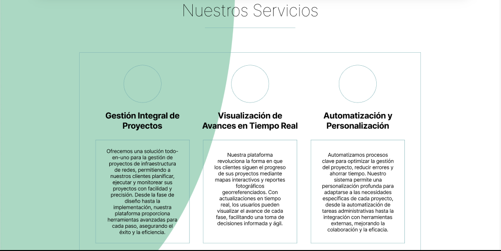
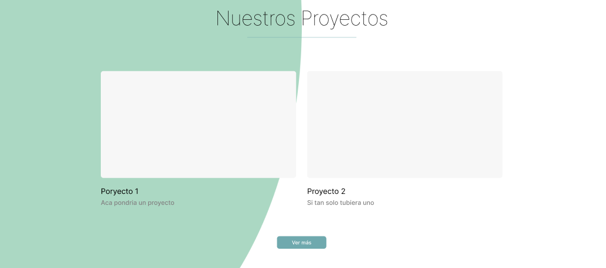
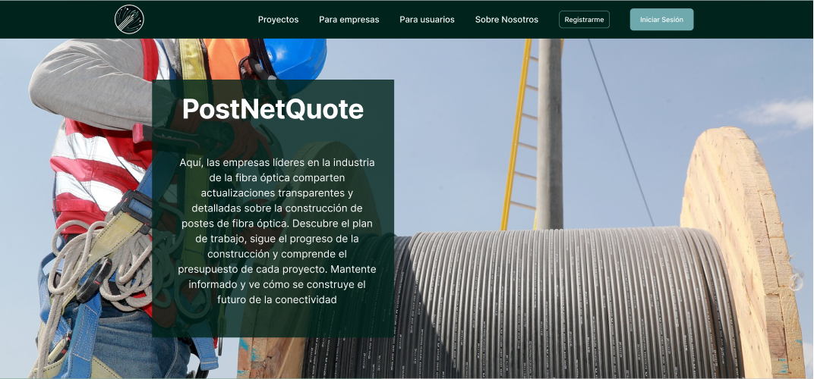
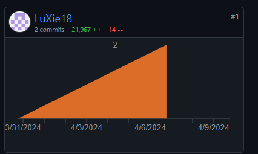

# 4.1. Style Guidelines

## 4.1.1. General Style Guidelines
La coherencia visual y la accesibilidad son pilares de nuestro diseño web. Nos enfocamos en crear una experiencia de usuario uniforme a través de colores, tipografías, y elementos de diseño consistentes. Nuestro objetivo es facilitar una interfaz intuitiva y agradable, que refleje la identidad de nuestra marca y mejore la interacción del usuario con nuestra plataforma. Seleccionamos una paleta de colores que refuerza nuestra imagen de marca, con colores primarios, secundarios, y de acento cuidadosamente elegidos para mejorar la legibilidad y la navegación. Las tipografías se eligen para garantizar la legibilidad en diversos dispositivos, manteniendo un equilibrio entre estética y funcionalidad.

## 4.1.2. Web Style Guidelines
Para las interfaces web responsivas, adoptamos un enfoque 'mobile-first', asegurando que nuestro diseño sea efectivo y atractivo en dispositivos móviles, y luego escalando hacia arriba para adaptarse a pantallas más grandes. Los principios de diseño inclusivo guían cada decisión, desde el contraste de colores hasta el tamaño de los elementos interactivos, para asegurar que nuestro sitio sea accesible para todos los usuarios, independientemente de sus capacidades. Implementamos también un sistema de diseño modular, lo que nos permite reutilizar componentes y garantizar consistencia a través de la experiencia del usuario.

# 4.2. Information Architecture

## 4.2.1. Organization Systems
Nuestra arquitectura de información se estructura alrededor de sistemas de organización claramente definidos. Utilizamos una combinación de organización jerárquica para estructurar el contenido por importancia y relevancia, y organización secuencial para guiar a los usuarios a través de procesos paso a paso. Para categorizar contenido, aplicamos esquemas temáticos, permitiendo a los usuarios encontrar información basada en temas específicos o áreas de interés. La organización por audiencia también juega un papel crucial, segmentando el contenido para diferentes grupos de usuarios, asegurando que la información sea relevante y fácilmente accesible.

## 4.2.2. Labeling Systems
Nuestro sistema de etiquetado está diseñado para claridad y simplicidad. Utilizamos etiquetas intuitivas y descriptivas para grupos de información y enlaces, reduciendo la ambigüedad y mejorando la navegación. Cada etiqueta es el resultado de un análisis detallado de la terminología más comprensible para nuestro público objetivo, asegurando que la estructura de la información sea fácil de entender y seguir.

## 4.2.3. SEO Tags and Meta Tags
Optimizamos nuestro sitio web para motores de búsqueda a través de un uso estratégico de SEO tags y meta tags. Para cada página principal, definimos títulos únicos y descripciones meta que reflejan el contenido y las keywords clave. Esto mejora la visibilidad y el ranking en resultados de búsqueda. Además, implementamos tags para redes sociales, asegurando que el contenido compartido se vea atractivo y sea coherente con nuestra marca.

## 4.2.4. Searching Systems
Para mejorar la búsqueda de información dentro de nuestro producto digital, implementamos sistemas de búsqueda avanzada con opciones de filtrado por categoría, fecha, y tipo de contenido. Nuestro objetivo es minimizar el tiempo que los usuarios pasan buscando información, proporcionando resultados relevantes y organizados de manera intuitiva. Estos sistemas se diseñan pensando en la facilidad de uso, con sugerencias de búsqueda y corrección automática de errores comunes de entrada.

## 4.2.5. Navigation Systems
Nuestro sistema de navegación está diseñado para ser intuitivo y eficiente, permitiendo a los usuarios moverse por el sitio sin esfuerzo. Utilizamos menús claramente estructurados, breadcrumbs para indicar la ubicación actual dentro del sitio, y enlaces de navegación lógica para guiar a los usuarios. El diseño responsivo asegura que la navegación sea coherente en todos los dispositivos, y las acciones comunes están accesibles desde cualquier punto dentro del sitio, reduciendo la cantidad de clics necesarios para llegar al destino deseado.

## 4.3. Landing Page UI Design

### 4.3.1. Landing Page Wireframe
Presentación y explicación de los wireframes para navegadores web de escritorio y móviles, aplicando principios de diseño e información arquitectónica.

### 4.3.2. Landing Page Mock-up
Mock-ups detallados del Landing Page, demostrando la aplicación de los principios de diseño y el sistema de diseño establecido.

## 4.4. Web Applications UX/UI Design

### 4.4.1. Web Applications Wireframes
Wireframes de las aplicaciones móviles, mostrando la aplicación de principios de diseño y arquitectura de información.

### 4.4.2. Web Applications Wireflow Diagrams
Propuesta de wireflows para cada objetivo del usuario, complementado con una explicación detallada del flujo.

### 4.4.2. Web Applications Mock-ups
Mock-ups de las aplicaciones, evidenciando la aplicación de principios y elementos de diseño, diseño inclusivo y arquitectura de información.

### 4.4.3. Web Applications User Flow Diagrams
Diagrams de flujo de usuario para cada objetivo, incluyendo mock-ups de las vistas y pantallas junto con las rutas esperadas y alternativas.

## 4.5. Web Applications Prototyping
Prototipos de UI con simulación de interacción y navegación, acorde con los paths de User Flow Diagrams, incluyendo screenshots y enlaces a videos demostrativos.

## 4.6. Domain-Driven Software Architecture

### 4.6.1. Software Architecture Context Diagram
Diagrama de contexto que muestra la relación del sistema con entidades externas y usuarios.

### 4.6.2. Software Architecture Container Diagrams
Diagramas de contenedores que detallan las aplicaciones de alto nivel, servicios, y bases de datos.

### 4.6.3. Software Architecture Components Diagrams
Diagramas de componentes que describen la organización y relaciones entre componentes de software dentro de un contenedor.

## 4.7. Software Object-Oriented Design
Descripción del diseño orientado a objetos del software, incluyendo modelos de clases y relaciones entre ellas para reflejar la lógica de negocio y requerimientos del sistema.

# Capítulo V: Product Implementation, Validation & Deployment
## 5.1. Software Configuration Management
### 5.1.1. Software Development Environment Configuration

Project management

Trello: https://trello.com/
Utilizaremos esta herramienta para la gestión del proyecto. Se crearán tableros para organizar tareas y así asignarle a cada miembro del equipo.

Requirements Management

Google Docs: https://docs.google.com/
Lo empleamos para documentar y gestionar los requisitos del proyecto. Se harán documentos compartidos para definir los requisitos funcionales y no funcionales del software

Product UX/UI Design

Figma: https://www.figma.com/
Usamos esta herrramienta para diseñar la interfaz de usuario y la experiencia del usuario de la aplicación web. Se crearán prototipos interactivos y se diseñarán los elementos de la interfaz de usuario, como botones, formularios y diseños de página.

Software Development

Para el desarrollo de nuestra landing page, empleamos herramientas estándar para la creación de páginas web, incluyendo HTML5, CSS3 y JavaScript

Software Documentation

Utilizaremos Markdown para la documentación del código y README, alojado en el repositorio de Github

### 5.1.2. Source Code Management.
Para nuestro proyecto utilizaremos GitHub como plataforma principal de gestión de código fuente y control de versiones. A continuación, se detalla cómo se organizará y gestionará el código para cada componente del proyecto:

Organization: https://github.com/Open-Souce-Final-Project

Landing Page Repository: https://github.com/Open-Souce-Final-Project/LandingPage

Report Repository: https://github.com/Open-Souce-Final-Project/Final-Project-OS

Seguiremos el modelo GitFlow para gestionar el flujo de trabajo y control de versiones del proyecto. Este modelo implica la creación de diferentes ramas para cada etapa del ciclo de vida del desarrollo de software. Las ramas principales incluyen:

main (Rama Principal)

develop (Rama de Desarrollo)

feature/{feature-name} (Ramas de Funcionalidades)

release/{version-number} (Ramas de Lanzamiento)

hotfix/{issue-number} (Ramas de Corrección)

Se aplicará Conventional Commits para los mensajes de commit, siguiendo las convenciones especificadas en el estándar.

5.1.3. Source Code Style Guide & Conventions.

Para el desarrollo de la parte HTML y CSS, seguiremos las convenciones del Google HTML/CSS Style Guide. Algunas de las convenciones que aplicaremos incluyen:

Declarar siempre el tipo de documento.
Usar minúsculas para los nombres de los elementos HTML, como `
, <h1>, <section>, etc".`
Cerrar siempre los elementos HTML, por ejemplo, `
 
.`
Colocar entre comillas los atributos de los elementos HTML, por ejemplo, `

.`
Especificar alt, width y height para las imágenes.
Evitar líneas de código muy largas.
Incluir el elemento `<title>` al principio.
Utilizar meta tags al inicio.
Para el lenguaje JavaScript, seguiremos las convenciones del Google JavaScript Style Guide. Algunas de las convenciones que aplicaremos son:
Utilizar comillas simples para los strings, como 'This is a string'.
Agregar punto y coma (; ) al final de cada sentencia.
Evitar declarar variables con var y usar let o const en su lugar.

## 5.2. Landing Page, Services & Applications Implementation
### 5.2.1. Sprint 1
En esta sección se registra y explica el avance en términos de producto y trabajo
colaborativo para el Sprint
#### 5.2.1.1. Sprint Planning 1

En esta sección se especifica los aspectos principales del Sprint Planning Meeting. Se
inicia la sección con una introducción y a continuación se coloca el cuadro de
resumen del sprint planning meeting.

<table align="center"  border="1" width="70%" style="text-align:center;">
    <tr align="left">
        <td>
            <b>Sprint #</b>
        </td>
        <td>
            <b>Sprint 1</b>           
        </td>
    </tr>
    <tr align="left">
        <td colspan="2">
            <b>Sprint Planning Background</b>
        </td>
    </tr>
    <tr align="left">
        <td>
            <b>Date</b>
        </td>
        <td>
            06/04/24         
        </td>
    </tr>
       <tr align="left">
        <td>
            <b>Time</b>
        </td>
        <td>
            15:00 pm         
        </td>
    </tr>
       <tr align="left">
        <td>
            <b>Location</b>
        </td>
        <td>
            Modalidad remota por Google Meet   
        </td>
    </tr>
     </tr>
       <tr align="left">
        <td>
            <b>Prepared By</b>
        </td>
        <td>
            OpenMind 
        </td>
    </tr>
    </tr>
       <tr align="left">
        <td>
            <b>Attendess (to planning meeting)</b>
        </td>
        <td>
            Todos los miembros del grupo OpenMind   
        </td>
    </tr>
      </tr>
       <tr align="left">
        <td>
            <b>Sprint n - 0</b>
            <b>Review Summary</b>
        </td>
        <td>
Las primeras historias de usuario se definieron con un enfoque en el desarrollo del Landing Page y la integración de la lógica funcional para la plataforma OpenMind.
  
El despliegue del Landing Page se realizó dentro del plazo establecido de manera exitosa.
  
Se ha mejorado la documentación mediante la ampliación de la perspectiva empresarial y la inclusión de los artefactos correspondientes.   
        </td>
    </tr>
    <tr align="left">
        <td>
            <b>Sprint n - 1</b>
            <b>Retrospective Summary</b>
        </td>
        <td>
En términos generales, hemos mantenido una sólida organización y comunicación como equipo, aprovechando herramientas como Google Meet. Sin embargo, siempre hay espacio para mejorar nuestra coordinación y colaboración para alcanzar la excelencia en nuestros proyectos.
  
Además, es crucial que incorporemos el formato Markdown de manera más frecuente y coherente en nuestras comunicaciones y documentación. Esto mejorará la accesibilidad y comprensión de la información por parte de todos los miembros del equipo.
        </td>
    </tr>
     <tr align="left">
        <td colspan="2">
            <b>Sprint Goal & User Stories</b>
        </td>
    </tr>
      <tr align="left">
        <td>
            <b>Sprint 1 Velocity</b>
        </td>
        <td>
            6
        </td>
    </tr>
       <tr align="left">
        <td>
            <b>Sum of Story Points</b>
        </td>
        <td>
            9  
        </td>
    </tr>
</table>
 

#### 5.2.1.2. Sprint Backlog 1

Durante el primer sprint backlog, el equipo planeó iniciar y finalizar la creación de la landing page. Para lograrlo, desglosaron todas las historias de usuario en tareas manejables y las distribuyeron entre los miembros del equipo según sus habilidades individuales. El objetivo principal del sprint era desarrollar la landing page por completo, asegurándose de que fuera atractiva y funcional.

<table align ="center" border="1" width="90%" style="text-align:center">
    <tr>
       <td colspan="1"><b>Sprint #</b></td>
       <td colspan="7"><b>Sprint 1</b></td>
     </tr>
     <tr>
       <td colspan="2"><b>User Story</b></td>
       <td colspan="6"><b>Work-Item / Task</b></td>
     </tr>
     <tr>
       <td><b>Id</b></td>
       <td><b>Title</b></td>
       <td><b>Id</b></td>
       <td><b>Title</b></td>
       <td><b>Description</b></td>
       <td><b>Estimation(Hours)</b></td>
       <td><b>Assigned To</b></td>
       <td><b>Status(To-do/ In-Process/ To-Review/ Done)</b></td>
     </tr>
     <tr>
       <td rowspan="3">US01</td>
       <td rowspan="3">Implementación de Diseño Responsivo</td>
       <td>T01</td>
       <td>Configuración del Entorno de Desarrollo</td>
       <td>Configurar el entorno de desarrollo con las herramientas necesarias para trabajar en el diseño responsivo.</td>
       <td>2</td>
       <td>Carlos Avellaneda</td>
       <td>Done</td>
    </tr>
    <tr>
       <td>T02</td>
       <td>Implementación de Media Queries</td>
       <td>Desarrollar y agregar media queries al código para hacer que el diseño sea sensible a diferentes tamaños de pantalla</td>
       <td>4</td>
       <td>Rodrigo Zagaceta</td>
       <td>Done</td>
    </tr>
     <tr>
       <td>T03</td>
       <td>Pruebas de Diseño Responsivo</td>
       <td>Realizar pruebas exhaustivas en diferentes dispositivos y tamaños de pantalla para garantizar que el diseño responsivo funcione correctamente.</td>
       <td>3</td>
       <td>Luis Chavez</td>
       <td>Done</td>
    </tr>
    <tr>
       <td rowspan="3">US02</td>
       <td rowspan="3"> Diseño Atractivo y Profesional</td>
       <td>T04</td>
       <td>Diseño de la Landing Page</td>
       <td>Desarrollar un diseño moderno y limpio para la landing page que refleje la imagen de la marca de manera positiva.</td>
       <td>5</td>
       <td>Jean Barrionuevo</td>
       <td>Done</td>
    </tr>
    <tr>
       <td>T05</td>
       <td>Diseño de Páginas Estáticas</td>
       <td>Crear un diseño coherente y consistente para todas las páginas estáticas del sitio web, como la página "Acerca de nosotros" o "Servicios".</td>
       <td>4</td>
       <td>Erick Cueva</td>
       <td>Done</td>
    </tr>
    <tr>
       <td>T06</td>
       <td>Implementación del Diseño</td>
       <td>Implementar los diseños creados en las páginas correspondientes del sitio web, utilizando HTML, CSS y JavaScript.</td>
       <td>3</td>
       <td>Erick Cueva</td>
       <td>Done</td>
    </tr>	

   <tr>
       <td rowspan="2">US03</td>
       <td rowspan="2">Llamado a la Acción (Call-to-Action) Efectivo</td>
       <td>T07</td>
       <td>Diseño del Call-to-Action</td>
       <td>Desarrollar un diseño atractivo y destacado para el llamado a la acción que capte la atención de los visitantes y los motive a realizar la acción deseada.</td>
       <td>4</td>
       <td>Luis Chavez</td>
       <td>Done</td>
    </tr>
    <tr>
       <td>T08</td>
       <td>Pruebas de Usabilidad</td>
       <td>Realizar pruebas de usabilidad para evaluar la efectividad del llamado a la acción </td>
       <td>1</td>
       <td>Rodrigo Zagaceta</td>
       <td>Done</td>
    </tr>
    <tr>
       <td rowspan="3">US04</td>
       <td rowspan="3">Elementos visuales atractivos</td>
       <td>T09</td>
       <td>Búsqueda y Selección de Imágenes</td>
       <td>Realizar una búsqueda exhaustiva de imágenes de alta calidad y relevantes para la landing page.</td>
       <td>0.5</td>
       <td>Carlos Avellaneda</td>
       <td>Done</td>
    </tr>
    <tr>
       <td>T010</td>
       <td>Pruebas de Elementos Visuales</td>
       <td>Realizar pruebas en diferentes dispositivos para asegurar que los elementos visuales se vean correctamente y mejoren la experiencia de usuario.</td>
       <td>1</td>
       <td>Jean Barrionuevo</td>
       <td>Done</td>
    </tr>
    <tr>
       <td>T011</td>
       <td>Integración de Imágenes en la Landing Page</td>
       <td>Integrar las imágenes editadas en la landing page de acuerdo con el diseño establecido.</td>
       <td>1</td>
       <td>Carlos Avellaneda</td>
       <td>Done</td>
    </tr>

   </table>

###  5.2.1.3. Development Evidence for Sprint Review
<table align ="center" border="1" width="90%" style="text-align:center">
     <tr>
       <td><b>Repository</b></td>
       <td><b>Branch</b></td>
       <td><b>Commit Id</b></td>
       <td><b>Commit Message</b></td>
       <td><b>Commit Message Body</b></td>
       <td><b>Commited on (Date)</b></td>
     </tr>
    <tr>
       <td>https://github.com/OpenSourceidk/PostNetQuote</td>
       <td>Carlos_Avellaneda</td>
       <td>367b77d</td>
       <td>chore: adding files and making-up the landing page</td>
       <td>chore: adding files and making-up the landing page</td>
       <td>10/04/2024</td>
    </tr>
  </table>

###  5.2.1.4. Testing Suite Evidence for Sprint Review
Para la entrega del Sprint 1 se intentó alcanzar el desarrollo completo, implementación y despliegue del Landing Page.
<table align ="center" border="1" width="90%" style="text-align:center">
     <tr>
       <td><b>Repository</b></td>
       <td><b>Branch</b></td>
       <td><b>Commit Id</b></td>
       <td><b>Commit Message</b></td>
       <td><b>Commited on (Date)</b></td>
     </tr>
    <tr>
       <td>Acceptance Test</td>
       <td>feature/epic-01</td>
       <td>5592949</td>
       <td>docs(README): added acepptance tests for epic 01</td>
       <td>10/04/2024</td>
    </tr>
        <tr>
       <td></td>
       <td>feature/epic-02</td>
       <td>5e98c41</td>
       <td>docs(README): added acceptance tests for epic 02</td>
       <td>10/04/2024</td>
    </tr>
        <tr>
       <td></td>
       <td>feature/epic-03</td>
       <td>58b71ec</td>
       <td>docs(README): added acceptance tests for epic 03</td>
       <td>10/04/2024</td>
    </tr>
       </tr>
        <tr>
       <td></td>
       <td>feature/epic-04</td>
       <td>ce59d49</td>
       <td>docs(README): added acceptance tests for epic 04</td>
       <td>10/04/2024</td>
    </tr>
       </tr>
        <tr>
       <td></td>
       <td>feature/epic-05</td>
       <td>c7ab84b</td>
       <td>docs(README): added acceptance tests for epic 05</td>
       <td>10/04/2024</td>
    </tr>
       </tr><tr>
       <td></td>
       <td>feature/epic-06</td>
       <td>84bdc1e</td>
       <td>docs(README): added acceptance tests for epic 06</td>
       <td>10/04/2024</td>
    </tr>
       </tr><tr>
       <td></td>
       <td>feature/epic-07</td>
       <td>367b77d</td>
       <td>docs(README): added acceptance tests for epic 07</td>
       <td>10/04/2024</td>
    </tr>
    </tr>
       </tr><tr>
       <td></td>
       <td>feature/epic-08</td>
       <td>8c08b37</td>
       <td>docs(README): added acceptance tests for epic 08</td>
       <td>10/04/2024</td>
    </tr>
        </tr>
       </tr><tr>
       <td></td>
       <td>feature/epic-09</td>
       <td>239a3b4</td>
       <td>docs(README): added acceptance tests for epic 09</td>
       <td>10/04/2024</td>
    </tr>
        </tr>
       </tr><tr>
       <td></td>
       <td>feature/epic-10</td>
       <td>dde09b1</td>
       <td>docs(README): added acceptance tests for epic 10</td>
       <td>10/04/2024</td>
    </tr>

  </table>

### 5.2.1.5. Execution Evidence for Sprint Review
En el sprint 1, se logró avanzar parcialmente en la implementación del despliegue de la landing page, la cual cuenta con diferentes secciones donde los usuarios pueden encontrar información importante sobre el producto y la startup. A continuación se detallan algunas pruebas que respaldan este avance.

1. Sección Menú Navegación

   

2. Sección Nuestros Servicios

    

3. Sección Nuestros Proyectos

    

### 5.2.1.6 Services Documentation Evidence for Sprint Review
En el plan inicial del primer sprint, no se consideró la inclusión de documentación de los servicios como parte de las pruebas o entregables.

### 5.2.1.7 Software Deployment Evidence for Sprint Review
Para la conclusión del Sprint número 1, se ha logrado desplegar una versión parcialmente completa de la landing page. Aunque esta implementación inicial no abarca todos los aspectos planeados, representa un avance significativo en el proyecto. Se ha establecido una base sólida sobre la cual se continuará construyendo en entregas posteriores. Es importante destacar que esta versión parcial ya ofrece funcionalidades y contenido que pueden ser evaluados por el equipo y los usuarios. Además, proporciona una visión clara del progreso realizado hasta el momento y permite identificar áreas de mejora y ajustes necesarios.

1.
 

2.
 

3.
 

### 5.2.1.8 Team Collaboration Insights during Sprint

