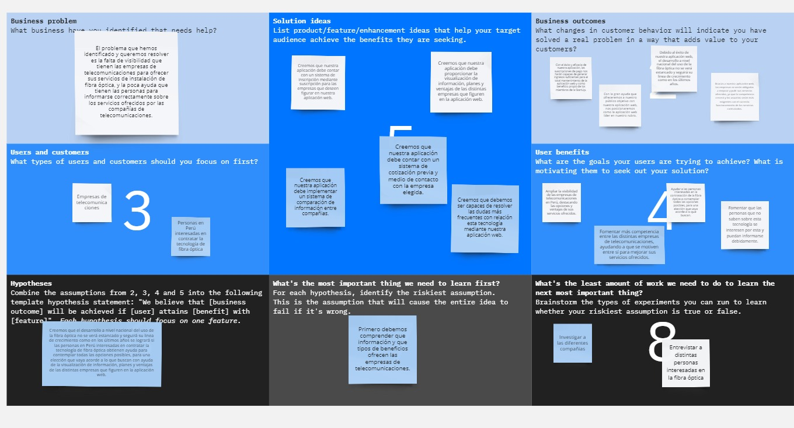
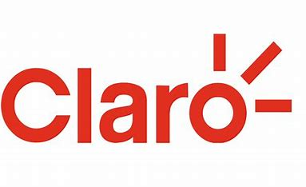

# 
COURSE PROJECT

    <strong>Universidad Peruana de Ciencias Aplicadas</strong> 
     
    <strong>Ingeniería de Software - 5to Ciclo</strong> 
    <strong>Desarrollo de Aplicaciones Open Source - WX55</strong> 
    <strong>Profesor: Angel Augusto Velasquez Nuñez</strong> 
     INFORME DE TRABAJO FINAL - TB1

    <strong>Startup: OpenMind</strong> 
    <strong>Producto: PostNetQuote</strong>

    <h3>Team Members:</h3>
    <table align="center">
        <tr>
            <th style="text-align:center;">Member</th>
            <th style="text-align:center;">Code</th>
        </tr>
        <tr>
            <td>Avellaneda Ramos, Carlos Edward</td>
            <td>U201923994</td>
        </tr>
        <tr>
            <td>Chavez Guerrero, Luis Sebastian</td>
            <td>U202216444</td>
        </tr>
        <tr>
            <td>Zagaceta Bardales, Rodrigo Enrique</td>
            <td>U202215489</td>
        </tr>
        <tr>
            <td>Barrionuevo Reto, Jean Franco Joel</td>
            <td>U202219284</td>
        </tr>
        <tr>
            <td>Cueva Elera, Erick Armando</td>
            <td>U201910151</td>
        </tr>
    </table>

 

# Registro de Versiones del Informe

| Versión |   Fecha    |                                Autor                                | Descripción de modificación                                                                                                                                                                                                                      | 
|:-------:|:----------:|:-------------------------------------------------------------------:|:-------------------------------------------------------------------------------------------------------------------------------------------------------------------------------------------------------------------------------------------------| 
|   1.0   | 27/03/2024 |                  Todos los integrantes del equipo                   | Creación del informe en MarkDown. Se añadió la Tabla de Contenidos.                                                                                                                                                                              |
|   1.1   | 29/03/2024 | Todos los integrantes del equipo | Se añadió el Studen Outcome. Se añadió el Capítulo 1: "Introducción".                                                                                                                                                                            |
|   1.2   | 01/04/2024 | Todos los integrantes del equipo | Se desarrollaron las preguntas para las entrevistas. Se realizaron las entrevistas. Se realizó el analisis de las entrevistas.                                                                                                                   |
|   1.3   | 02/04/2024 | Todos los integrantes del equipo | Se realizó el Needfinding y se culminó con el Capítulo 2: "Requirements Elicitation & Analysis"                                                                                                                                                  |
|   1.4   | 05/04/2024 | Todos los integrantes del equipo | Se realizó el To-Be Scenario Mapping. Se realizaron las User Stories.                                                                                                                                                                            |
|   1.5   | 06/04/2024 | Todos los integrantes del equipo | Se realizó el Impact Mapping. Se realizó el Product Backlog.                                                                                                                                                                                     |
|   1.6   | 08/04/2024 | Todos los integrantes del equipo | Se realizó el Style Guideline. Se realizó el Information Arquitecture. Se realizó el Landing Page UI Design. Se realizó el Web Applications UI/UX Design. Se realizó el Web Application Prototyping. Se desarrolló la Landing Page del proyecto. |
|   1.7   | 10/04/2024 | Todos los integrantes del equipo | Se culminó con los puntos restantes del capitulo 4 "Product Design". Se realizó el Capítulo 5 "Product Implementation, Validation & Deployment". Se realizó el informe de reporte de participación.                                              |
|   1.8   |29/04/2024| Erick Cueva, Charlie Avellaneda| Se realizó el diseño parcial del front-end, incluyendo login, register, nav bar y body, así como una fake api en json server                                                                                                                     |
  

# Project Report Collaboration Insights

https://github.com/OpenSourceidk/PostNetQuote/pulse
  

# Contenido
## Tabla de Contenidos
### [Registro de versiones del informe]()
### [Project Report Collaboration Insights]()
### [Contenido]()
### [Student Outcome]()
### [Capítulo I: Introducción]()
- [1.1. Startup Profile]()
  - [1.1.1. Descripción de la Startup]()
  - [1.1.2. Perfiles de integrantes del equipo]()
- [1.2. Solution Profile]()
  - [1.2.1 Antecedentes y problemática]()
  - [1.2.2 Lean UX Process]()
    - [1.2.2.1. Lean UX Problem Statements]()
    - [1.2.2.2. Lean UX Assumptions]()
    - [1.2.2.3. Lean UX Hypothesis Statements]()
    - [1.2.2.4. Lean UX Canvas]()
- [1.3. Segmentos objetivo]()

### [Capítulo II: Requirements Elicitation & Analysis]()
- [2.1. Competidores]()
  - [2.1.1. Análisis competitivo]()
  - [2.1.2. Estrategias y tácticas frente a competidores]()
- [2.2. Entrevistas]()
  - [2.2.1. Diseño de entrevistas]()
  - [2.2.2. Registro de entrevistas]()
  - [2.2.3. Análisis de entrevistas]()
- [2.3. Needfinding]()
  - [2.3.1. User Personas]()
  - [2.3.2. User Task Matrix]()
  - [2.3.3. User Journey Mapping]()
  - [2.3.4. Empathy Mapping]()
  - [2.3.5. As-is Scenario Mapping]()

### [Capítulo III: Requirements Specification]()
- [3.1. To-Be Scenario Mapping]()
- [3.2. User Stories]()
- [3.3. Impact Mapping]()
- [3.4. Product Backlog]()

### [Capítulo IV: Product Design]()
- [4.1. Style Guidelines]()
  - [4.1.1. General Style Guidelines]()
  - [4.1.2. Web Style Guidelines]()
- [4.2. Information Architecture]()
  - [4.2.1. Organization Systems]()
  - [4.2.2. Labeling Systems]()
  - [4.2.3. SEO Tags and Meta Tags]()
  - [4.2.4. Searching Systems]()
  - [4.2.5. Navigation Systems]()
- [4.3. Landing Page UI Design]()
  - [4.3.1. Landing Page Wireframe]()
  - [4.3.2. Landing Page Mock-up]()
- [4.4. Web Applications UX/UI Design]()
  - [4.4.1. Web Applications Wireframes]()
  - [4.4.2. Web Applications Wireflow Diagrams]()
  - [4.4.3. Web Applications Mock-ups]()
  - [4.4.4. Web Applications User Flow Diagrams]()
- [4.5. Web Applications Prototyping]()
- [4.6. Domain-Driven Software Architecture]()
  - [4.6.1. Software Architecture Context Diagram]()
  - [4.6.2. Software Architecture Container Diagrams]()
  - [4.6.3. Software Architecture Components Diagrams]()
- [4.7. Software Object-Oriented Design]()
  - [4.7.1. Class Diagrams]()
  - [4.7.2. Class Dictionary]()
- [4.8. Database Design]()
  - [4.8.1. Database Diagram]()

### [Capítulo V: Product Implementation, Validation & Deployment]()
- [5.1. Software Configuration Management]()
  - [5.1.1. Software Development Environment Configuration]()
  - [5.1.2. Source Code Management]()
  - [5.1.3. Source Code Style Guide & Conventions]()
  - [5.1.4. Software Deployment Configuration]()
- [5.2. Landing Page, Services & Applications Implementation]()
  - [5.2.1. Sprint 1]()
    - [5.2.1.1. Sprint Planning 1]()
    - [5.2.1.2. Sprint Backlog 1]()
    - [5.2.1.3. Development Evidence for Sprint Review]()
    - [5.2.1.4. Testing Suite Evidence for Sprint Review]()
    - [5.2.1.5. Execution Evidence for Sprint Review]()
    - [5.2.1.6. Services Documentation Evidence for Sprint Review]()
    - [5.2.1.7. Software Deployment Evidence for Sprint Review]()
    - [5.2.1.8. Team Collaboration Insights during Sprint]()

### [Conclusiones]()
- [Conclusiones y recomendaciones]()
### [Bibliografía]()
### [Anexos]()

  

# Student Outcome
Criterio: Capacidad de comunicarse efectivamente con un rango de audiencias

En el siguiente cuadro se describe las acciones realizadas y enunciados de
conclusiones por parte del grupo, que permiten sustentar el haber alcanzado el logro del ABET – EAC - Student Outcome 3.

<table>
  <tr>
    <td><b>Criterio específico</b></td>
    <td><b>Acciones realizadas</b></td>
    <td><b>Conclusiones</b></td>
  </tr>
  <tr>
    <td><b>Comunica oralmente con efectividad a diferentes rangos de audiencia.</b></td>
    <td> TB1  
         <b>Carlos Edward Avellaneda Ramos </b> 
        - 
           
         <b>Rodrigo Enrique Zagaceta Bardales</b> 
        - Se llevaron a cabo las historias de usuario siguiendo una planificación y asignando los puntos correspondientes para garantizar una elaboración eficiente. Posteriormente, fueron adecuadamente ubicadas en el backlog del producto, utilizando los story points para su clasificación y priorización.
          
        <b>Luis Sebastian Chavez Guerrero</b> 
        - Como responsable del capítulo final del informe, me encargué de detallar y demostrar el procedimiento completo de implementación, verificación, despliegue y validación de la solución propuesta para la Landing Page. Este proceso involucró una estrecha coordinación con todos los miembros del equipo con el objetivo de garantizar el desarrollo de una Landing Page con un diseño excepcional y efectivo.
           
        <b>Jean Franco Joel Barrionuevo Reto</b> 
        - Como encargado de los competidores, realicé un análisis exhaustivo y desarrollé estrategias y tácticas para enfrentarlos. Este trabajo permitió obtener un entendimiento profundo de la competencia, identificar oportunidades y amenazas en el mercado, y entender mejor el panorama competitivo.
          
        <b>Erick Armando Cueva Elera</b> 
        - Como encargado de la primera parte del informe que envuelve toda la explicación de la startup, coordine con todo el equipo para desarrollar la correcta definicion del proyecto, comunicandonos las ideas principales y tomanda en cuenta todas nuestras opiniones.
          
        <b>TP</b> 
          
        <b>Erick Armando Cueva Elera</b> 
        - He investigado y desarrollado parcialmente el frontend, así como la implementación de una fake api en json server
          
        <b>Carlos Edward Avellaneda Ramos </b> 
        - He investigado y desarrollado parcialmente el frontend, así como la implementación de una fake api en json server
          
   </td>
    <td>Es necesaria la comunicación entre los integrantes del equipo para la correcta definición sobre lo que va a tratar nuestra startut y poder realizar de manera correcta las entrevistar necesarias a los segmentos objetivos.  
  </td>
  </tr>
  <tr>
    <td><b>Comunica por escrito con efectividad a diferentes rangos de audiencia.</b></td>
    <td> TB1  
         <b>Carlos Edward Avellaneda Ramos</b> 
        - 
           
         <b>Rodrigo Enrique Zagaceta Bardales</b> 
        - Se llevaron a cabo las historias de usuario siguiendo una planificación y asignando los puntos correspondientes para garantizar una elaboración eficiente. Posteriormente, fueron adecuadamente ubicadas en el backlog del producto, utilizando los story points para su clasificación y priorización.
          
        <b>Luis Sebastian Chavez Guerrero</b> 
        - Como responsable del capítulo final del informe, me encargué de detallar y demostrar el procedimiento completo de implementación, verificación, despliegue y validación de la solución propuesta para la Landing Page. Este proceso involucró una estrecha coordinación con todos los miembros del equipo con el objetivo de garantizar el desarrollo de una Landing Page con un diseño excepcional y efectivo.
           
        <b>Jean Franco Joel Barrionuevo Reto</b> 
        - Con la información recopilada, se realizó un proceso de “Needfinding”. Este proceso implicó la identificación y comprensión de las necesidades de los usuarios para poder desarrollar soluciones más efectivas.
          
        <b>Erick Armando Cueva Elera</b> 
        - Con la información debatida con el resto de integrantes del grupo, me encargué de plasmar de manera clara y concisa la información en la primera parte de nuestro reporte, intentando que los lectores encuentren nuestro informe ameno para el entendimiento.
          
        <b>TP</b> 
          
        <b>Erick Armando Cueva Elera</b> 
        - He investigado y desarrollado parcialmente el frontend, así como la implementación de una fake api en json server
          
        <b>Carlos Edward Avellaneda Ramos </b> 
        - He investigado y desarrollado parcialmente el frontend, así como la implementación de una fake api en json server
          
   </td>
    <td>Debemos realizar la escritura del informe de manera correcta, para poder lograr que quien quiera entender sobre los inicios de nuestro proyecto, pueda hacerlo de forma amena y sin confusión a la hora de leer nuestro informe.  
  </td>
  </tr>
</table>

  

# Capítulo I: Introducción
## 1.1. StartUp Profile
### 1.1.1. Description de la StartUp
Nuestra StartUp "PostNetQuote" consiste en una aplicación web dedicada al funcionamiento del servicio de instalación para postes de fibra óptica en Perú y gestión de proyectos de infraestructura de telecomunicaciones. El sitio web funcionará bajo un modelo de negocio por suscripción, dirigido principalmente a empresas de postes que deseen aumentar su visibilidad y captar clientes. Estas empresas se suscribiran para poder hacer uso de la plataforma y poder conseguir los trabajos y servicios. Por otro lado, los usuarios finales, que no incurriran en costos por suscripcion, estos tendran acceso a la informacion y servicios de la aplicación.

### 1.1.2. Perfiles de integrantes del equipo

<table>
    <tr>
        <td rowspan="3">
            
        </td>
        <td>
            <b>Nombre y Apellido:</b>
                         
            Rodrigo Enrique Zagaceta Bardales
        </td>
    </tr>
    <tr>
        <td>
        <b>Carrera:</b>
         
        Ing. de Software
        </td>
    </tr>
    <tr>
        <td>
        <b>Acerca de:</b>
         
        Soy Rodrigo Zagaceta, estudiante de quinto ciclo de la carrera de Ingeniería de Software. Poseo conocimientos intermedios en programación C + +. Entre mis habilidades poseo la empatía y la puntualidad.
        </td>
    </tr>
    <tr>
        <td rowspan="3">
            
        </td>
        <td>
            <b>Nombre y Apellido:</b>
                         
            Erick Armando Cueva Elera
        </td>
    </tr>
    <tr>
        <td>
        <b>Carrera:</b>
         
        Ing. de Software
        </td>
    </tr>
    <tr>
        <td>
        <b>Acerca de:</b>
         
        Soy Erick Cueva, estudiante de la carrera de Ingenieria de Software, cuento con experiencia en el lenguaje C++, además de un enfoque colaborativo y puntual que ayudará al desarrollo de este proyecto en conjunto.
        </td>
    </tr>
    <tr>
        <td rowspan="3">
            
        </td>
        <td>
            <b>Nombre y Apellido:</b>
                         
            Carlos Edward Avellaneda Ramos
        </td>
    </tr>
    <tr>
        <td>
        <b>Carrera:</b>
         
        Ing. de Software
        </td>
    </tr>
    <tr>
        <td>
        <b>Acerca de:</b>
         
        Soy Carlos Avellaneda, estudiante de la carrera de Ingenieria de Software en la Universidad Peruana de Ciencias Aplicadas (UPC). Cuento con conocimientos en distintos lenguajes, tales como: Java, C++, Python y conocimientos básicos en C#. Soy una persona bastante proactiva y espero que eso ayude en el desarrollo de nuestra startup grupal. 
        </td>
    </tr>
    <tr>
        <td rowspan="3">
            
        </td>
        <td>
            <b>Nombre y Apellido:</b>
                         
            Luis Sebastian Chavez Guerrero
        </td>
    </tr>
    <tr>
        <td>
        <b>Carrera:</b>
         
        Ing. de Software
        </td>
    </tr>
    <tr>
        <td>
        <b>Acerca de:</b>
         
        Mi nombre es Luis Sebastian Chavez Guerrero tengo 19 años de edad y actualmente curso el quinto ciclo de la carrera de ingeniería de software en la Universidad Peruana de Ciencias Aplicadas (UPC).Tengo conocimientos de diferentes lenguajes de programación como C++ y Java entre otros. 
Me considero que soy una persona con la capacidad de trabajar de manera eficiente ademas cuento con la habilidad para resolver problemas de la mejor manera posible.
        </td>
    </tr>
     <tr>
        <td rowspan="3">
            
        </td>
        <td>
            <b>Nombre y Apellido:</b>
                         
            Jean Franco Joel Barrionuevo Reto
        </td>
    </tr>
    <tr>
        <td>
        <b>Carrera:</b>
         
        Ing. de Software
        </td>
    </tr>
    <tr>
        <td>
        <b>Acerca de:</b>
         
        Mi nombre es Jean Franco Barrionuevo, me encuentro en el 5to ciclo de Ingeniería de Software. Decidí estudiar esta carrera porque siempre me ha apasionado el mundo de la tecnología y software en particular.
        </td>
    </tr>
</table>

## 1.2. Solution Profile
### 1.2.1. Antecedentes y problemática

La expansión de fibra optica en el Perú es un fenómeno que año tras año va avanzando a una velocidad increible.

Según un informe de Point Topic, en el último trimestre de 2022, Perú experimentó un crecimiento del 16.2% en conexión a internet fijo con fibra óptica.

Esto supone una gran responsabilidad para las empresas de telecomunicaciónes que se encargan de proveer este servicio a todo el país, ya que tienen que ofrecer los mejores servicios y comodidades a los usuarios finales. Además, también supone una gran duda para los usuarios que desean contratar esta tecnología, ya que deberán comparar las diferentes opciones y seleccionar la que más le convenga entre todas.

Sin embargo, no existe hasta el momento una aplicación web totalmente dedicada a brindar esta información de forma simple e intuitiva, carencia que afecta directamente tanto a las empresas, que muchas no son tomadas en cuenta, como a los usuarios finales, quieren no contemplan todas las opciones existentes en el mercado.

Nuestra StartUp "PostNetQuote" se centra en crear una aplicación web que ayude a facilitar la visibilidad de las diferentes empresas que proveen los servicios de instalación de fibra óptica en el Perú.

-   **What?**

    El problema principal es la poca visibilidad que tienen las empresas que se encargan de proveer la tecnología de fibra óptica alrededor de todo el Perú y la poca información y forma de contrastar esta información que tienen los usuarios finales.

-   **When?**

    El problema surge cuando las empresas de telecomunicaciones no cuentan con una aplicación web en donde se les de visibilidad a su información y las personas que desean contratarlas no saben que opción les conviene más.

-   **Where?**

    El problema reside a nivel nacional, en todas las zonas en donde se desea implementar la fibra óptica.

-   **Who?**

    El problema afecta a ambos sectores, a las empresas de telecomunicaciones y los usuarios finales.

-   **Why?**

    Uno de los principales motivos de este problema es la ausencia de una aplicación web que permite la facil y eficaz interacción entre los 2 segmentos objetivos.

-   **How?**

    La problematica se complica cuando existe una gran demanda de empresas de telecomunicaciones, en donde necesitarán los servicios de las empresas de postes y estas no tengan una manera de ofrecer sus servicios en un lugar con visibilidad.

-   **How much?**

    Según el informe de Point Topic, en el último trimestre de 2022, Perú experimentó un crecimiento del 16.2% en conexión a internet fijo con fibra óptica Esto nos puede dar indicios de que el problema planteado puede ser bastante común debido a la gigantesca demanda de la contratación de estos servicios.

### 1.2.2. Lean UX Process
#### 1.2.2.1. Lean UX Problem Statements

- En la actualidad, la conexión mediante fibra óptica es la conexión que más se usa a nivel mundial, debido a sus grandes ventajas, como la increible velocidad que ofrece a diferencia de las demás tecnologías.
  En los últimos años, Perú ha sufrido un exponencial crecimiento de implementación de la conexión por fibra óptica, siendo solo superado por Alemania. Esto conlleva a que las empresas de telecomunicaciones tengan una gran responsabilidad, que es ofrecer a toda la población la oportunidad de unirse a este desarrollo. Por tal motivo, los usuarios finales, tambien tienen el derecho de poder contemplar toda la información de dichas empresas, comparar tal información y elegir la opción que más le convenga y convenza.
  Nuestra aplicación web tiene como objetivo servir como puente entre las empresas de telecomunicaciones y los usuarios que requieren tener el conocimiento de estas empresas para poder cumplir su objetivo de contratar esta tecnología.

#### 1.2.2.2. Lean UX Assumptions

**Business Assumptions:**
1. Creemos que nuestros usuarios necesitan un medio que sea eficiente e intuitivo para poder determinar la compañia de telecomunicaciónes que van a contratar basandose en los criterios que ellos crean necesarios.
2. Esta necesidad se puede satisfacer con el desarrollo de una aplicación web que permitirá el registro de las compañias de telecomunicaciones, las cuales proveeran información sobre sus servicios, así como sus ventajas y por qué deberian elegirlos a ellos por encima del resto. Además que esta información será visible para todo el públicos, los cuales podrán comparar las compañias entre sí para poder realizar una elección más precisa.
3. Nuestros clientes iniciales serán las personas interesadas en contar con la tecnología de fibra óptica.
4. Lo principal que buscará un cliente en nuestro servicio será contar con toda la información de las empresas registradas, detallando y resaltando sus planes ofrecidos y sus ventajas.
5. Vamos a obtener ingresos mediante la suscripción de las compañias que deseen figurar en nuestra aplicación web.
6. Vamos a tener ventaja sobre nuestra competencia debido a que nuestra aplicación web contará con la opción de comparar los planes de las distincas compañías, resaltando sus características más importantes y sus ventajas frente a la competencia.

**Business outcomes:**

- Con la gran ayuda que ofreceremos a nuestro público objetivo con nuestra aplicación web, nos posicionaremos como la aplicación web lider en nuestro rubro.

- Con el éxito y eficacia de nuestra aplicación, las suscripciones de pago nos harán capaces de generar ingresos suficientes para el total mantenimiento de la aplicación web y como beneficio propio de los miembros de la StartUp.

- Debido al éxito de nuestra aplicación web, el desarrollo a nivel nacional del uso de la fibra óptica no se verá estancado y seguirá su linea de crecimiento como en los últimos años.

- Gracias a nuestra aplicación web, las empresas se verán obligadas a mejorar y pulir sus servicios ofrecidos, ya que la competencia crecerá y los usuarios serán más exigentes con el correcto funcionamiento de los servicios contratados.

**Users:**
- Empresas de telecomunicaciones.
- Personas en Perú interesadas en contratar la tecnología de fibra óptica.

**Users outcomes:**
- Ampliar la visibilidad de las empresas de telecomunicaciones en Perú, destacando las opciones y ventajas de sus servicios ofrecidos.
- Fomentar más competencia entre las distintas empresas de telecomunicaciones, ayudando a que se motiven entre sí para mejorar sus servicios ofrecidos.
- Ayudar a las personas interesadas en la contratación de la fibra óptica a contemplar todas las opciones posibles, para una elección que vaya acorde a lo que buscan.
- Fomentar que las personas que no saben sobre esta tecnología se interesen por esta y puedan informarse debidamente.

**Features:**
- Creemos que nuestra aplicación debe contar con un sistema de inscripción mediante suscripción para las empresas que deseen figurar en nuestra aplicación web.
- Creemos que nuestra aplicación debe proporcionar la visualización de información, planes y ventajas de las distintas empresas que figuren en la aplicación web.
- Creemos que nuestra aplicación debe implementar un sistema de comparación de información entre compañias.
- Creemos que nuestra aplicación debe contar con un sistema de cotización previa y medio de contacto con la empresa elegida.
- Creemos que debemos ser capaces de resolver las dudas más frecuentes con relación esta tecnología mediante nuestra aplicación web.

#### 1.2.2.3. Lean UX Hypothesis Statements

- Hypothesis Statement 01:
  Creemos que las compañías de telecomunicaciones sufrirán un incremento de ingresos gracias a aparecer en nuestra aplicación web.
  Sabremos que hemos tenido éxito
  Cuando la tasa de incremento de ingresos de las compañias incremente en un 5% durante los 3 primeros meses de nuestra aplicación web.

- Hypothesis Statement 02:
  Creemos que nuestra aplicación será bien recibida por los usuarios finales, situandonos como los líderes a comparación de la competencia.
  Sabremos que hemos tenido éxito
  Cuando la cantidad de usuarios que usen nuestra aplicación web sea igual o superior a 100k en los 3 primeros meses luego de nuestro lanzamiento.

- Hypothesis Statement 03:
  Creemos que los usuarios encontrarán utilidad en nuestra aplicación web y la usarán de manera casual.
  Sabremos que hemos tenido éxito
  Cuando la el porcentaje de usuarios que son activos en nuestra aplicación web sea igual o superior al 35% de los usuarios registrados en ese momento.

- Hypothesis Statement 04:
  Creemos que nuestra aplicación web contribuirá en el crecimiento exponencial que ha tenido el Péru durante este último tiempo.
  Sabremos que hemos tenido éxito
  Cuando en informes posteriores al lanzamiento de nuestra aplicación se observe un pico de incremento superior a comparación de años anteriores.

- Hypothesis Statement 05:
  Creemos que nuestra aplicación web servirá como motivación para que las compañias de telecomunicaciones mejoren sus servicios ofrecidos.
  Sabremos que hemos tenido éxito
  Cuando las compañias anuncien cambios, mejoras y/o mayores beneficios para los usuarios finales en los primemos 6 meses luego del lanzamiento de nuestra aplicación web.
#### 1.2.2.4. Lean UX Canvas

## 1.3. Segmentos Objetivo

Para el correcto desarrollo de nuestro proyecto, hemos reconocido y definido a nuestros segmentos objetivos, con el fin de poder cubrir todas las necesidades que estos nos presenten y poder ofrecer el mejor servicio posible.

**Primer Segmento Objetivo:**

Nuestro primer segmento objetivo consiste en las empresas de telecomunicaciones, que buscan implementar la conexión de fibra óptica a quien la solicite.

**Segundo Segmento Objetivo:**

En nuestro segundo segmento objetivo tenemos a las personas a nivel nacional interesadas en la obtención de la tecnología de fibra óptica.

# Capítulo II: Requirements Elicitation & Analysis
## 2.1. Competidores

Luego de realizar una investigación en el mercado peruano, hemos hallado tres portales de trabajo que ofrecen características similares a la de PostNetQuote. Es por eso que son considerados como potenciales competidores. Estos son:

1. **Claro:**

   Es uno de los principales proveedores de servicios de telecomunicaciones en Perú. Ofrecen fibra óptica para hogares y empresas en diversas regiones del país.

  

2. **WIN:**

   Es una empresa de telecomunicaciones peruana que ofrece una red de transmisión totalmente de fibra óptica, desde su centro de distribución principal hasta la ONT del cliente

  

    </img>
  

3. **Optical Networks:**

   Es una empresa peruana de telecomunicaciones que cuenta con más de 20 años de experiencia en el sector de las telecomunicaciones y las tecnologías de la información para el segmento B2B. Proporcionan servicios de infraestructura de telecomunicaciones, TI y energía.

   

    </img>
  

### 2.1.1. Análisis competitivo

<table>
  <tr>
    <th colspan="7" valign="top"><b>Competitive Analysis Landscape</b></th>
  </tr>
  <tr>
    <td colspan="2" rowspan="2">¿Por qué llevar a cabo este análisis?</td>
    <td colspan="5">Escriba en el recuadro la pregunta que busca responder o el objetivo de este análisis.</td>
  </tr>
  <tr>
    <td colspan="5">Este análisis se realizó con la finalidad de poder identificar a nuestros potenciales competidores e idear estrategias y tácticas para diferenciarnos de estos.</td>
  </tr>
  <tr>
    <td colspan="2"></td>
    <td colspan="1" valign="top" style="font-weight: bold;">
        Claro
  

    </img>
  

  <td colspan="1" valign="top" style="font-weight: bold;">
    Win

    </img>

</td>
    <td colspan="1" valign="top" style="font-weight: bold;">
      Optical Networks

      </img>

</td>
    <td colspan="1" valign="top" style="font-weight: bold;" >
      PostNetQuote

      </img>

    </td>
  </tr>
  <tr>
    <td rowspan="2">Perfil</td>
    <td>Overview</td>
    <td>Es uno de los principales proveedores de servicios de telecomunicaciones en Perú. Ofrecen fibra óptica para hogares y empresas en diversas regiones del país.</td>
    <td>Ofrece una red de transmisión totalmente de fibra óptica en Perú. Desde su centro de distribución principal hasta la ONT del cliente.</td>
    <td>Empresa peruana que brinda servicios de telecomunicaciones, con una red de fibra óptica. Ofrecen soluciones tecnológicas, equipo especializado y colaboran con socios de industria.</td>
    <td>PostNetQuote es una startup que busca facilitar la visibilidad de los servicios de diferentes empresas de postes en Perú. Su objetivo es conectar a las empresas de telecomunicaciones con las empresas de postes a través de una plataforma digital.</td>  
</tr>
  <tr>
    <td>Ventaja competitiva</td>
    <td>Amplia cobertura y variedad de servicios de telecomunicaciones.</td>
    <td>Especialización en la transmisión de fibra óptica.</td>
    <td>Conocimiento local del mercado peruano y soluciones tecnológicas integrales.</td>
    <td>La principal ventaja competitiva de PostNetQuote es ser la primera plataforma en Perú que conecta a las empresas de telecomunicaciones con las empresas de postes, lo que le da una ventaja competitiva.</td>  
</tr>
  <tr>
    <td rowspan="2">Perfil de Marketing</td>
    <td>Mercado objetivo</td>
    <td>Hogares y empresas en diversas regiones del Perú que necesitan servicios de telecomunicaciones.</td>
    <td>Clientes que necesitan una red de transmisión de fibra óptica en Perú.</td>
    <td>Empresas y clientes individuales en Perú que necesitan soluciones tecnológicas y servicios de telecomunicaciones.</td>
    <td>Empresas de telecomunicaciones que buscan servicios de postes y las empresas de postes que buscan aumentar su visibilidad en el mercado.</td>  
</tr>
  <tr>
    <td>Estrategias de marketing</td>
    <td>Marketing digital y promociones para atraer a más clientes.</td>
    <td>Enfoque en la calidad y velocidad de la fibra óptica para atraer a los clientes.</td>
    <td>Colaboraciones con socios de la industria y marketing digital para aumentar su presencia en el mercado.</td>
    <td>PostNetQuote se centrará en el marketing digital y las colaboraciones con empresas de telecomunicaciones y empresas de postes para aumentar su visibilidad en el mercado.</td>  
</tr>
  <tr>
    <td rowspan="2">Perfil de Producto</td>
    <td>Productos & Servicios</td>
    <td>Proveedor de servicios de telecomunicaciones que ofrece fibra óptica para hogares y empresas.</td>
    <td>Proveedor de una red de transmisión totalmente de fibra óptica en Perú.</td>
    <td>Proveedor de servicios de telecomunicaciones con una red de fibra óptica. Ofrece soluciones tecnológicas y colabora con socios de industria.</td>
    <td>PostNetQuote ofrece una plataforma digital que permite a las empresas de telecomunicaciones ver y comparar los servicios ofrecidos por diferentes empresas de postes.</td>  
</tr>
  <tr>
    <td>Precios & Costos</td>
    <td>Versión de pago con tarifas basadas en planes.</td>
    <td>Versión de pago con tarifas basadas en planes.</td>
    <td>Aplicación totalmente gratuita.</td>
    <td>PostNetQuote será una plataforma gratuita para empresas de postes/clientes, mientras que ofrecerá planes de suscripción premium para las empresas de telecomunicaciones.</td>
  </tr>
  <tr>
  <td rowspan="4">Análisis SWOT</td>
  <td>Fortalezas</td>
  <td>Claro tiene una gran presencia en Perú, lo que le permite llegar a una amplia base de clientes. Además, ofrece una amplia gama de servicios de telecomunicaciones, incluyendo telefonía móvil, telefonía fija, televisión por cable e internet, lo que le permite satisfacer una variedad de necesidades de los clientes.</td>
  <td>WIN se especializa en la transmisión de fibra óptica, lo que le permite ofrecer servicios de internet de alta velocidad. Esta especialización podría ser una ventaja competitiva en el mercado de telecomunicaciones de Perú.</td>
  <td>Optical Networks es una empresa local con un profundo conocimiento del mercado peruano. Además, ofrece soluciones tecnológicas integrales, lo que le permite satisfacer una variedad de necesidades de los clientes.</td>
  <td>PostNetQuote es la primera plataforma en Perú que conecta a las empresas de telecomunicaciones con las empresas de postes, lo que le da una ventaja competitiva.</td>
</tr>
<tr>
  <td>Debilidades</td>
  <td>Una de las principales debilidades de Claro es su dependencia de la infraestructura de telecomunicaciones. Cualquier interrupción o problema con esta infraestructura podría afectar la calidad de sus servicios.</td>
  <td>WIN está limitada a la fibra óptica. Esto podría ser una desventaja si la demanda de otros tipos de servicios de internet aumenta.</td>
  <td>Optical Networks depende de la infraestructura de telecomunicaciones. Cualquier problema con esta infraestructura podría afectar la calidad de sus servicios.</td>
  <td>Como startup, PostNetQuote puede enfrentar desafíos para ganar reconocimiento en el mercado y confianza entre las empresas de telecomunicaciones y las empresas de postes.</td>
</tr>
<tr>
  <td>Oportunidades</td>
  <td>La expansión de la fibra óptica en Perú representa una gran oportunidad para Claro. Esto podría permitirle ofrecer servicios de internet de alta velocidad a más clientes.</td>
  <td>La creciente demanda de fibra óptica en Perú representa una gran oportunidad para WIN. Esto podría permitirle expandir su base de clientes y aumentar sus ingresos.</td>
  <td>La creciente demanda de soluciones tecnológicas en Perú representa una gran oportunidad para Optical Networks. Esto podría permitirle expandir su base de clientes y aumentar sus ingresos.</td>
  <td>La expansión de la fibra óptica en Perú y la falta de una plataforma que conecte a las empresas de telecomunicaciones con las empresas de postes representan una gran oportunidad para PostNetQuote.</td>
</tr>
<tr>
  <td>Amenazas</td>
  <td>Claro enfrenta una fuerte competencia en el mercado de telecomunicaciones de Perú. Esto podría limitar su capacidad para ganar nuevos clientes y retener a los existentes.</td>
  <td>WIN depende de la demanda de fibra óptica. Si esta demanda disminuye, podría afectar negativamente a su negocio.</td>
  <td>Optical Networks también enfrenta una fuerte competencia en el mercado de telecomunicaciones de Perú. Esto podría limitar su capacidad para ganar nuevos clientes y retener a los existentes.</td>
  <td>PostNetQuote puede enfrentar competencia si otras plataformas deciden ofrecer servicios similares. Además, la regulación gubernamental en el sector de las telecomunicaciones podría representar una amenaza.</td>
</tr>
</table>

### 2.1.2. Estrategias y tácticas frente a competidores

Usaremos estrategias y tácticas que aprovechen nuestras fortalezas y oportunidades y poder sacar ventaja de las debilidades y amenazas de nuestros competidores. Por lo mismo nuestras estrategias son las siguientes:

## Estrategias y tácticas frente a competidores:

### Análisis FODA de nuestro negocio:
- **Fortalezas (F):**
  - Experiencia especializada en el despliegue de infraestructura de fibra óptica en Perú.
  - Modelo de negocio por suscripción que ofrece ingresos recurrentes y estabilidad financiera.
  - Plataforma dedicada que facilita la gestión de proyectos de infraestructura de telecomunicaciones para empresas de postes.

- **Oportunidades (O):**
  - Crecimiento continuo en la demanda de servicios de infraestructura de telecomunicaciones en Perú.
  - Potencial para expandir nuestros servicios a nuevos mercados y sectores dentro de la industria de las telecomunicaciones.

- **Debilidades (D):**
  - Limitaciones presupuestarias para promoción y marketing para aumentar la visibilidad de nuestra plataforma.
  - Competencia potencial de otros proveedores de servicios de infraestructura de telecomunicaciones en el mercado.

- **Amenazas (A):**
  - Posibilidad de la entrada de nuevos competidores en el mercado de infraestructura de telecomunicaciones en Perú.
  - Riesgo de perder clientes ante la competencia de otras plataformas o proveedores de servicios similares.

### Estrategias y tácticas:
1. **Diferenciación de servicios:**
- Destacarnos ofreciendo herramientas especializadas para la gestión de proyectos de infraestructura de telecomunicaciones, como seguimiento de progreso, asignación de recursos y comunicación en tiempo real entre equipos.

2. **Campañas de marketing digital:**
- Ejecutar campañas publicitarias dirigidas a empresas de postes de telecomunicaciones en Perú a través de marketing de contenido, anuncios en redes sociales y campañas de correo electrónico para aumentar la conciencia de nuestra plataforma y sus beneficios.

3. **Alianzas estratégicas:**
- Establecer asociaciones con empresas de telecomunicaciones y proveedores de servicios relacionados para ofrecer servicios integrados y ampliar nuestra base de clientes potenciales.

4. **Desarrollo de comunidad:**
- Crear una comunidad en línea para empresas de postes y profesionales de la industria de telecomunicaciones donde puedan intercambiar conocimientos, compartir experiencias y acceder a recursos exclusivos proporcionados por nuestra plataforma.

5. **Optimización de la experiencia del usuario:**
- Mejorar continuamente la usabilidad y funcionalidad de nuestra plataforma para garantizar una experiencia de usuario óptima y aumentar la retención de clientes.

6. **Análisis de datos y retroalimentación del cliente:**
- Utilizar análisis de datos para comprender mejor las necesidades y preferencias de nuestros clientes, y recopilar retroalimentación regular para iterar y mejorar nuestros servicios según las demandas del mercado.

## 2.2. Entrevistas
### 2.2.1. Diseño de entrevistas

En esta sección se han definido una cierta cantidad de preguntas para nuestro segmento objetivo, con la finalidad de obtener información cualitativa como opiniones o descripciones. Esta información nos será de gran ayuda en el desarrollo de nuestra solución.

**Preguntas demográficas:**

1. ¿Cómo te llamas?
2. ¿Cuántos años tienes?
3. ¿Cuál es tu ubicación?
4. ¿Cuál es tu ocupación actual o en qué industria trabajas?

**Preguntas sobre personalidad**

1. ¿Tienes experiencia en la industria de las telecomunicaciones o en proyectos de infraestructura?
2. ¿Qué nivel de familiaridad tienes con la instalación de postes de fibra óptica?

**Preguntas Segmento 1: Empresas de telecomunicaciones**

1. ¿Ha tenido dificultades para aumentar su visibilidad y captar clientes para sus servicios de instalación de postes de fibra óptica?
2. ¿Qué obstáculos encuentra habitualmente al gestionar proyectos de infraestructura de telecomunicaciones?
3. ¿Qué tipo de servicios o proyectos de instalación de postes de fibra óptica ofrece su empresa?
4. ¿Cómo establece los precios para sus servicios? ¿Qué factores influyen en esta decisión?
5. ¿Qué características o funcionalidades consideraría esenciales en una plataforma en línea dedicada a la gestión de proyectos y la captación de clientes para servicios de instalación de postes?
6. ¿Qué aspectos valoraría más al suscribirse a una plataforma como la nuestra? ¿La facilidad de uso, la variedad de oportunidades de negocio, la seguridad de los datos?

**Segmento 2: Clientes**

1. ¿Qué consideras importante al momento de contratar a alguien?
2. ¿Consideras que la experiencia previa es importante?
3. ¿Prefieres contratar a trabajadores especializados o considerarías a aquellos sin experiencia previa?
4. ¿Cuáles son las cualidades o habilidades clave que buscas al contratar a un trabajador para un empleo eventual o proyecto?
5. ¿Qué factores influyen en tu decisión de contratar a alguien que carece de experiencia laboral pero muestra entusiasmo y potencial?
6. ¿Has tenido experiencias previas con trabajadores jóvenes o sin experiencia? ¿Cuáles fueron los aspectos positivos y los desafíos?
7. ¿Qué tan importante es la flexibilidad de horarios en los candidatos que consideras para empleos temporales?

**Para mejorar la idea del negocio**

1. ¿Qué opinas sobre la idea de nuestro proyecto? ¿Crees que sería útil para las empresas de postes y los usuarios?
2. ¿Qué características adicionales te gustaría ver en nuestro sitio web para que sea más útil o atractivo para ti?
3. ¿Tienes alguna preocupación o consideración sobre la seguridad de tus datos al utilizar un sitio web en línea para gestionar proyectos y servicios de instalación de postes de fibra óptica?

### 2.2.2. Registro de entrevistas

**Segmento 01**

**Entrevista 01**

Nombre: Ángel

Edad: 31 años

Distrito: Lince

Evidencia de la reunión:

  

Duración: 12:31

Enlace de entrevista: [https://www.youtube.com/watch?v=J6JVWyPkIjY&ab_channel=crhlatinoxD](https://www.youtube.com/watch?v=J6JVWyPkIjY&ab_channel=crhlatinoxD)

Resumen de la entrevista:

La entrevista aborda el proceso y las fases involucradas en la realización de un proyecto de tendido de fibra óptica, desde la concepción inicial hasta la finalización y entrega al cliente, incluyendo el uso de tecnología y software para mejorar la eficiencia y la comunicación cliente-empresa.

El proyecto inicia con una fase de diseño, donde se realiza un estudio de viabilidad que incluye la recopilación de información a través de fotografías y georreferenciación mediante GPS. Este diseño preliminar se presenta al cliente en documentos de Word con capturas de Google Earth o como un archivo KMZ georreferenciado, junto con un reporte fotográfico.

Además de la fase de diseño, se menciona la importancia de la gestión de permisos, que es vital para la realización del proyecto, especialmente cuando este se ubica cerca de vías públicas o zonas protegidas, requiriendo autorizaciones de diversas entidades como el Ministerio de Cultura o empresas de servicios públicos.

Se destacó la idea de desarrollar un sitio web interactivo que permita a los clientes visualizar el progreso del proyecto y acceder a datos relevantes. Este portal también podría incluir funciones para la gestión de tickets por diferentes grupos de trabajo (como Nitrógenos, Networking, Averías, etc.), asignación de tareas, y reportes de avance, mejorando la comunicación y eficiencia en la gestión de proyectos.

Se habló sobre la posibilidad de automatizar ciertos procesos y utilizar software para controlar el flujo de información y trabajos. La creación de una base de datos flexible, posiblemente utilizando MongoDB, y la consideración de aspectos técnicos como hosting y desarrollo de frontend fueron discutidos como pasos futuros.

Finalmente, se mencionó la intención de estructurar bien el sitio, definiendo los roles de los usuarios y sus funcionalidades para facilitar la interacción y la gestión de datos. El proceso terminaría con el diseño y la implementación de la interfaz de usuario, con un enfoque en la estética y la usabilidad.

**Segmento 02**

**Entrevista 02**

Nombres: Ana Lucero

Apellidos: Barrionuevo Reto

Edad: 22 años

Distrito: Pueblo Libre

Evidencia de la reunión:
 

    

Duracion: 7:43

Enlace de entrevista: [https://youtu.be/rZdEwrJbjxY](https://youtu.be/rZdEwrJbjxY)

Resumen de la entrevista:

Se entrevistó a Lucero Barrionuevo, una joven de 22 años que reside en Lima, Perú, trabaja en una empresa de telecomunicaciones especializada en la instalación de infraestructura de fibra óptica.
Mencionó que tiene experiencia en proyectos de infraestructura y está familiarizada con la instalación de postes de fibra óptica.
También comentó que valora la experiencia previa y las habilidades técnicas sólidas al contratar personal.
Considera importante la flexibilidad de horarios para empleos temporales.
Además, respecto al proyecto propuesto, cree que sería útil tanto para las empresas de postes como para los usuarios, sugiriendo características adicionales como un servicio personalizado y herramientas de seguimiento de proyectos.
Finalmente, no mostró preocupaciones significativas sobre la seguridad de los datos en el sitio web.

**Entrevista 03**

Nombres: Adriana Lizeth

Apellidos: García Bardales

Edad: 28 años

Distrito: Pueblo Libre

Evidencia de la reunión:

  

Duración: 5:40

Enlace de entrevista: [https://youtu.be/F3mO6B6Ll7s](https://youtu.be/F3mO6B6Ll7s)

Resumen de la entrevista:

Adriana Lizeth comparte su rol como animadora independiente y sus preferencias de contratación.
Valora la responsabilidad, la proactividad y la puntualidad, pero también ha tenido experiencias positivas con trabajadores sin experiencia que aprenden rápido.
Agrega que el proyecto será útil, ya que puede ayudar a las empresas a aumentar su visibilidad y captar más clientes.
Sugiere agregar funciones como servicio personalizado y programación de recordatorios para que la plataforma sea más efectiva.
Finalmente, expresa que no tiene mayores preocupaciones sobre la seguridad de los datos en un sitio web si se agrega algo al mismo.

### 2.2.3. Análisis de entrevistas

**Segmento 1: Empresas de telecomunicaciones**

Las entrevistas con las empresas de de telecomunicaciones arrojaron una variedad de perspectivas sobre el proceso de gestión de proyectos y la utilidad del sitio web.
Se destaca la necesidad de aumentar la visibilidad y captar clientes para los servicios de instalación de postes de fibra óptica, así como la importancia de superar obstáculos habituales en la gestión de proyectos de infraestructura de telecomunicaciones.
Los entrevistados describen los servicios y proyectos que ofrecen sus empresas, así como los factores que influyen en la fijación de precios para dichos servicios.
Recomendaron que el sitio web dedicada debe ofrecer características esenciales como facilidad de uso, variedad de oportunidades de negocio y seguridad de los datos para atraer a las empresas de postes como suscriptores.

**Segmento 2: Clientes**

Las entrevistas nos ofrecieron una variedad de perspectivas sobre la contratación y la utilidad del servicio. Se destacó la importancia de la experiencia previa y las cualidades personales al momento de contratar a alguien para un proyecto o empleo temporal.
Los entrevistados expresan preferencia por trabajadores especializados, pero también consideran a aquellos sin experiencia previa si demuestran entusiasmo y potencial.
Además, se resalta la flexibilidad de horarios como un factor importante en la decisión de contratación.
En relación con la propuesta del sitio web PostNetQuote, valoran su utilidad potencial para las empresas de postes y los usuarios, destacando la importancia de características adicionales como un sistema de búsqueda avanzada y medidas de seguridad de datos sólidas.

## 2.3. Needfinding
### 2.3.1. User Personas

**Segmento 1**

 

 </img>
  

**Segmento 2**

  

  </img>
  

### 2.3.2. User Task Matrix

<table>
  <tr>
    <th>Tarea</th>
    <th>Frecuencia</th>
    <th>Importancia</th>
  </tr>
  <tr>
    <td>Monitorear los procesos de gestión de proyectos</td>
    <td>Alta</td>
    <td>Alta</td>
  </tr>
  <tr>
    <td>Supervisar los registros de proyectos</td>
    <td>Media</td>
    <td>Alta</td>
  </tr>
  <tr>
    <td>Contratar personal para proyectos</td>
    <td>Alta</td>
    <td>Media</td>
  </tr>
  <tr>
    <td>Valorar la experiencia previa y habilidades técnicas al contratar</td>
    <td>Alta</td>
    <td>Alta</td>
  </tr>
  <tr>
    <td>Considerar la flexibilidad de horarios para empleos temporales</td>
    <td>Alta</td>
    <td>Media</td>
  </tr>
  <tr>
    <td>Superar obstáculos en la gestión de proyectos</td>
    <td>Alta</td>
    <td>Alta</td>
  </tr>
  <tr>
    <td>Describir los servicios y proyectos que ofrecen</td>
    <td>Alta</td>
    <td>Alta</td>
  </tr>
  <tr>
    <td>Fijar precios para los servicios</td>
    <td>Alta</td>
    <td>Alta</td>
  </tr>
  <tr>
    <td>Contratar empresas de postes a través de la plataforma</td>
    <td>Media</td>
    <td>Media</td>
  </tr>
  <tr>
    <td>Actualizar la información de los servicios ofrecidos</td>
    <td>Alta</td>
    <td>Alta</td>
  </tr>
  <tr>
    <td>Responder a las solicitudes de las empresas de telecomunicaciones</td>
    <td>Media</td>
    <td>Media</td>
  </tr>
  <tr>
    <td>Seguimiento de las solicitudes de las empresas de telecomunicaciones</td>
    <td>Media</td>
    <td>Media</td>
  </tr>
  <tr>
    <td>Ofrecer características esenciales como facilidad de uso, variedad de oportunidades de negocio y seguridad de los datos</td>
    <td>Alta</td>
    <td>Alta</td>
  </tr>
  <tr>
    <td>Contratar a trabajadores especializados</td>
    <td>Alta</td>
    <td>Media</td>
  </tr>
  <tr>
    <td>Considerar a trabajadores sin experiencia previa si demuestran entusiasmo y potencial</td>
    <td>Alta</td>
    <td>Media</td>
  </tr>
  <tr>
    <td>Valorar la flexibilidad de horarios en los candidatos</td>
    <td>Alta</td>
    <td>Media</td>
  </tr>
  <tr>
    <td>Utilizar la plataforma para aumentar la visibilidad y captar clientes</td>
    <td>Alta</td>
    <td>Alta</td>
  </tr>
  <tr>
    <td>Recomendar características adicionales para la plataforma</td>
    <td>Media</td>
    <td>Media</td>
  </tr>
</table>

### 2.3.3. User Journey Mapping
En la presente sección se ilustra el end-to-end journey de la aplicación PostNetQuote para los segmentos objetivos, Empresas de telecomunicaciones y clientes. El User Journey Mapping empieza desde el momento en el que el cliente adquiere
conocimiento de la aplicación pasando por el proceso de tomar la decisión de usarlo, registrarse, hacer uso de este mismo y finalmente la posibilidad de que deje de hacer uso de este mismo.

**Segmento 1**
  

  </img>
  

**Segmento 2**
  

 </img>
  

### 2.3.4. Empathy Mapping

**Segmento 1**

  

  </img>
  

**Segmento 2**

  

  </img>
  

### 2.3.5. As-Is Scenario

**Segmento 1**

</img>

**Segmento 2**

</img>

# Capítulo III: Requirements Specification

# 3.1. To-Be Scenario Mapping

El escenario To-Be es una herramienta crucial en la planificación estratégica, ya que define los objetivos futuros y las metas deseadas para mejorar los procesos y sistemas existentes. Este proceso proporciona una visión clara y detallada del estado futuro deseado, identificando áreas de mejora y oportunidades para el cambio. A continuación, se presentará una descripción detallada de este proceso y su aplicación en el contexto del proyecto en cuestión.

</img>

</img>

# 3.2. User Stories

En esta sección, vamos a en las historias de usuario de nuestra plataforma de instalación de postes de fibra óptica. Estas historias de usuario nos ayudan a entender mejor cómo interactúan las personas con nuestra plataforma y qué necesidades tienen. Al explorar diferentes situaciones y escenarios, podemos obtener una visión más clara de cómo mejorar la experiencia de nuestros usuarios y hacer que nuestra plataforma sea más útil y satisfactoria para todos.

<table>
  <tr>
    <th>Epic ID</th>
    <th>Título</th>
    <th>Descripción</th>
  </tr>
  <tr>
    <td>E01</td>
    <td>Creación y Gestión de Cuentas de Usuario</td>
    <td>Desarrollar la funcionalidad de registro, inicio de sesión y gestión de cuentas de usuario.</td>
  </tr>
  <tr>
    <td>E02</td>
    <td>Búsqueda y Filtrado de Empresas de Postes.</td>
    <td>Implementar la funcionalidad de búsqueda y filtrado para permitir a las empresas de telecomunicaciones encontrar empresas de instalación de postes según sus necesidades.</td>
  </tr>
  <tr>
    <td>E03</td>
    <td>Gestión de Proyectos de Instalación de Postes.</td>
    <td>Desarrollar la funcionalidad para que las empresas de instalación de postes gestionen sus proyectos de manera efectiva desde la plataforma.</td>
  </tr>
  <tr>
    <td>E04</td>
    <td>Funcionalidades Avanzadas de Interacción</td>
    <td>Desarrollar funcionalidades avanzadas para mejorar la interacción entre las empresas de telecomunicaciones y las empresas de instalación de postes.</td>
  </tr>
  <tr>
    <td>E05</td>
    <td>Mejora de la Experiencia del Usuario</td>
    <td>Mejorar la experiencia del usuario en la plataforma para garantizar una navegación intuitiva y una interacción fluida.</td>
  </tr>
  <tr>
    <td>E06</td>
    <td>Seguridad y Privacidad de Datos</td>
    <td>Garantizar la seguridad y privacidad de los datos de los usuarios en la plataforma para cumplir con los estándares de protección de datos.</td>
  </tr>
  <tr>
    <td>E07</td>
    <td>Soporte al Usuario</td>
    <td>Proporcionar capacitación y soporte efectivos a los usuarios para garantizar que puedan aprovechar al máximo todas las funcionalidades de la plataforma.</td>
  </tr>
  <tr>
    <td>E08</td>
    <td>Integración con Plataformas de Pago</td>
    <td>Integrar la plataforma con sistemas de pago para facilitar la facturación y el procesamiento de transacciones para suscripciones y servicios adicionales.</td>
  </tr>
  <tr>
    <td>E09</td>
    <td>Mejoras en la Presentación y Experiencias del Usuario</td>
    <td>Mejoras relacionadas con la presentación visual, el diseño, el contenido y la experiencia del usuario tanto en la landing page como en todas las páginas estáticas del sitio web.</td>
  </tr>
  <tr>
    <td>E10</td>
    <td>Implementación de Seguridad en el RESTful API</td>
    <td>Implementar las funcionalidades de seguridad necesarias en el RESTful API para garantizar la autenticación y autorización adecuadas de los usuarios.</td>
  </tr>
</table>

<table>
  <tr>
    <th>Story ID</th>
    <th>Título</th>
    <th>Descripción</th>
    <th>Criterios de Aceptación</th>
    <th>Relacionados con Epic (Epic ID)</th>
  </tr>
  <tr>
    <td>US01</td>
    <td>Registro de nuevo usuario</td>
    <td>Como visitante al sitio web, quiero poder registrarme como usuario para acceder a las funciones de la plataforma.</td>
    <td>Escenario 1:
Dado que el usuario accede al formulario de registro.
Cuando haga clic en el botón de registro desde la página de inicio.
Entonces se muestra un formulario de registro con campos para ingresar la información requerida.

Escenario 2:
Dado que el usuario completa todos los campos del formulario de registro.
Cuando envía la solicitud de registro.
Entonces se crea una nueva cuenta de usuario y se redirige al usuario a la página de inicio de sesión.

Escenario 3:
Dado que el usuario intenta registrarse con un correo electrónico que ya está en uso.
Cuando envía la solicitud de registro.
Entonces se muestra un mensaje de error indicando que el correo electrónico ya está registrado y se le sugiere iniciar sesión en su lugar.
</td>
    <td>E01</td>
  </tr>
   <tr>
    <td>US02</td>
    <td>Inicio de sesión de usuario</td>
    <td>Como usuario registrado, quiero poder iniciar sesión en mi cuenta para acceder a las funciones.</td>
    <td>Escenario 1:
Dado que el usuario accede al formulario de inicio de sesión.
Cuando haga clic en el enlace de inicio de sesión desde la página de inicio.
Entonces se muestra un formulario de inicio de sesión con campos para ingresar correo electrónico y contraseña.

Escenario 2:
Dado que el usuario ingresa las credenciales correctas.
Cuando envía la solicitud de inicio de sesión.
Entonces se autentica al usuario y se le redirige al panel de control de su cuenta.

Escenario 3:
Dado que el usuario olvida su contraseña.
Cuando haga clic en el enlace de recuperación de contraseña.
Entonces se le redirige a una página donde puede restablecer su contraseña mediante un correo electrónico de restablecimiento.
</td>
    <td>E01</td>
  </tr>
      <td>US03</td>
    <td>Gestión de Perfil de Usuario</td>
    <td>Como usuario registrado, quiero poder editar mi perfil y actualizar mi información personal.</td>
    <td>Escenario 1:
Dado que el usuario accede a la página de configuración de perfil.
Cuando desde el panel de control, hace clic en la opción de editar perfil.
Entonces se muestra un formulario rellenado con la información actual del usuario.

Escenario 2:
Dado que el usuario realiza cambios en su perfil.
Cuando edita y guarda los cambios.
Entonces la información del perfil se actualiza correctamente en la base de datos.

Escenario 3:
Dado que el usuario desea cambiar su contraseña.
Cuando accede a la página de configuración de contraseña.
Entonces se le permite cambiar su contraseña, y la nueva contraseña se almacena de forma segura en la base de datos.
</td>
    <td>E01</td>
  </tr>
    </tr>
      <td>US04</td>
    <td>Búsqueda por ubicación</td>
    <td>Como usuario, quiero poder buscar empresas de instalación de postes por ubicación para encontrar opciones cercanas a una área específica.</td>
    <td>Escenario 1:
Dado que el usuario accede a la página de búsqueda.
Cuando desde el panel de control, selecciona la opción de búsqueda por ubicación.
Entonces se muestra un mapa interactivo donde el usuario puede ingresar una ubicación o hacer clic en un punto en el mapa.

Escenario 2:
Dado que el usuario ingresa una ubicación específica.
Cuando completa el campo de búsqueda con una dirección o coordenadas.
Entonces se muestran las empresas de instalación de postes cercanas a esa ubicación, ordenadas por distancia.

Escenario 3:
Dado que el usuario hace clic en una empresa de postes en el mapa.
Cuando selecciona un marcador en el mapa.
Entonces se muestra información detallada sobre esa empresa de instalación de postes, como su nombre, dirección y servicios ofrecidos.
</td>
    <td>E02</td>
  </tr>
    </tr>
      <td>US05</td>
    <td>Filtrado por servicios ofrecidos</td>
    <td>Como usuario, quiero poder filtrar las empresas de instalación de postes por los servicios específicos que ofrecen.</td>
    <td>Escenario 1:
Dado que el usuario accede a la página de búsqueda.
Cuando desde el panel de control, selecciona la opción de filtrar por servicios.
Entonces se muestran opciones de filtro que incluyen diferentes servicios relacionados con la instalación de postes de fibra óptica.

Escenario 2:
Dado que el usuario selecciona un servicio específico.
Cuando marca la casilla correspondiente en el menú de filtrado.
Entonces se muestran solo las empresas de instalación de postes que ofrecen ese servicio en particular.

Escenario 3:
Dado que el usuario selecciona múltiples servicios para filtrar.
Cuando marca varias casillas de servicios en el menú de filtrado.
Entonces se muestran las empresas de instalación de postes que ofrecen todos los servicios seleccionados, cumpliendo con todos los criterios de filtro.
</td>
    <td>E02</td>
  </tr>
    </tr>
      <td>US06</td>
    <td>Visualización de resultados de búsqueda</td>
    <td>Como usuario, quiero poder ver los resultados de mi búsqueda de manera clara y ordenada.</td>
    <td>Escenario 1:
Dado que el usuario realiza una búsqueda.
Cuando ingresa sus criterios de búsqueda y envía la solicitud.
Entonces se muestran los resultados de manera clara, con información relevante como el nombre de la empresa y su ubicación.

Escenario 2:
Dado que la búsqueda no arroja resultados.
Cuando el usuario ingresa criterios de búsqueda que no coinciden con ninguna empresa de instalación de postes.
Entonces se muestra un mensaje indicando que no se encontraron resultados coincidentes y se le sugiere al usuario que intente con diferentes criterios de búsqueda.

Escenario 3:
Dado que el usuario desea ver más detalles sobre una empresa de postes.
Cuando se hace clic en el nombre de una empresa en los resultados de búsqueda.
Entonces se muestra una ventana emergente o una página nueva con información detallada sobre esa empresa.
</td>
    <td>E02</td>
  </tr>
  </tr>
    </tr>
      <td>US07</td>
    <td>Recepción de Solicitudes de Cotización</td>
    <td>Como empresa de instalación de postes, quiero recibir solicitudes de cotización de las empresas de telecomunicaciones interesadas en mis servicios.</td>
    <td>Escenario 1:
Dado que la empresa de telecomunicaciones selecciona la opción de solicitar cotización.
Cuando completa un formulario con detalles sobre el proyecto.
Entonces se genera automáticamente una solicitud de cotización y se envía a la empresa de instalación de postes seleccionada.

Escenario 2:
Dado que la empresa de instalación de postes recibe una solicitud de cotización.
Cuando accede a su panel de control.
Entonces se muestra la solicitud con todos los detalles proporcionados por la empresa de telecomunicaciones.

Escenario 3:
Dado que la empresa de instalación de postes desea responder a la solicitud.
Cuando revisa los detalles del proyecto y determina un precio.
Entonces envía una cotización detallada a la empresa de telecomunicaciones a través de la plataforma.
</td>
    <td>E03</td>
  </tr>
    </tr>
      <td>US08</td>
    <td>Gestión de Proyectos Asignados</td>
    <td>Como empresa de instalación de postes, quiero poder gestionar los proyectos asignados de manera efectiva para garantizar su finalización exitosa.</td>
    <td>Escenario 1:
Dado que la empresa de instalación de postes recibe una solicitud de proyecto.
Cuando se acepta una solicitud de cotización y se convierte en un proyecto asignado.
Entonces el proyecto se añade automáticamente a la lista de proyectos activos en el panel de control de la empresa.

Escenario 2:
Dado que la empresa de instalación de postes desea asignar recursos al proyecto.
Cuando accede a los detalles del proyecto.
Entonces puede asignar empleados, materiales y equipos necesarios para completar el proyecto.

Escenario 3:
Dado que la empresa de instalación de postes actualiza el estado del proyecto.
Cuando hay avances significativos en el proyecto.
Entonces actualiza el estado del proyecto en la plataforma, indicando si está en progreso, completado o pendiente de aprobación.
</td>
    <td>E03</td>
  </tr>
   </tr>
      <td>US09</td>
    <td>Comunicación con los clientes</td>
    <td>Como empresa de instalación de postes, quiero poder comunicarme de manera efectiva con mis clientes a través de la plataforma.</td>
    <td>Escenario 1:
Dado que el cliente solicita actualizaciones sobre el proyecto.
Cuando accede al panel de control y envía un mensaje a la empresa de instalación de postes.
Entonces la empresa recibe la solicitud de información y puede responder directamente desde la plataforma.

Escenario 2:
Dado que la empresa de instalación de postes desea enviar actualizaciones periódicas.
Cuando hay cambios importantes en el proyecto.
Entonces puede enviar notificaciones automáticas o mensajes personalizados a los clientes para mantenerlos informados sobre el progreso del proyecto.

Escenario 3:
Dado que el cliente tiene una queja o consulta.
Cuando envía un mensaje a través de la plataforma.
Entonces la empresa de instalación de postes recibe la notificación y puede responder de manera oportuna para resolver el problema o responder a la consulta.
</td>
    <td>E03</td>
    </tr>
      <td>US10</td>
    <td>Calificación y Comentarios sobre Empresas</td>
    <td>Como usuario, quiero poder calificar y dejar comentarios sobre las empresas de instalación de postes con las que he trabajado para ayudar a otros usuarios en sus decisiones.</td>
    <td>Escenario 1:
Dado que el usuario accede a la página de perfil de una empresa.
Cuando desde los resultados de búsqueda o la lista de proyectos, hace clic en el nombre de una empresa.
Entonces se muestra la información detallada de la empresa, incluida su calificación actual y los comentarios de otros usuarios.

Escenario 2:
Dado que el usuario desea dejar una calificación.
Cuando accede a la página de perfil de una empresa.
Entonces puede seleccionar una calificación de estrellas y escribir un comentario opcional sobre su experiencia con la empresa.

Escenario 3:
Dado que el usuario visualiza las calificaciones y comentarios de otras personas.
Cuando busca empresas de instalación de postes o revisa su historial de proyectos.
Entonces puede ver las calificaciones promedio y los comentarios de otros usuarios sobre cada empresa.
</td>
    <td>E04</td>
  </tr>
    </tr>
      <td>US11</td>
    <td>Notificaciones Personalizadas</td>
    <td>Como usuario, quiero recibir notificaciones personalizadas sobre actualizaciones relevantes y eventos importantes.</td>
    <td>Escenario 1:
Dado que el usuario accede a la página de configuración de notificaciones.
Cuando desde su perfil, accede a la configuración de notificaciones.
Entonces puede seleccionar qué tipos de notificaciones desea recibir.

Escenario 2:
Dado que el usuario recibe una notificación.
Cuando ocurre un evento relevante según la configuración del usuario.
Entonces recibe una notificación instantánea en la plataforma y/o un correo electrónico, según sus preferencias.

Escenario 3:
Dado que el usuario desea desactivar ciertas notificaciones.
Cuando cambia su configuración de notificaciones.
Entonces puede desactivar notificaciones específicas.
</td>
    <td>E04</td>
  </tr>
    </tr>
      <td>US12</td>
    <td>Diseño Responsivo</td>
    <td>Como usuario, quiero que la interfaz se adapte automáticamente a diferentes dispositivos y tamaños de pantalla para una experiencia consistente en cualquier dispositivo.</td>
    <td>Escenario 1:
Dado que el usuario accede a la plataforma desde un dispositivo móvil.
Cuando carga la página de inicio o cualquier otra página dentro de la plataforma.
Entonces todos los elementos de la interfaz se reorganizan y ajustan para adaptarse a la pantalla más pequeña, manteniendo la usabilidad y la legibilidad.

Escenario 2:
Dado que el usuario accede a la plataforma desde una tableta.
Cuando navega por diferentes secciones y funciones de la plataforma.
Entonces la interfaz se ajusta automáticamente para aprovechar el espacio disponible en la pantalla, proporcionando una experiencia de usuario cómoda y funcional.

Escenario 3:
Dado que el usuario accede a la plataforma desde un ordenador de escritorio.
Cuando utiliza la plataforma en una pantalla grande.
Entonces la interfaz se expande para aprovechar al máximo el espacio disponible.
</td>
    <td>E05</td>
  </tr>
    </tr>
      <td>US13</td>
    <td>Mejora de la navegación</td>
    <td>Como usuario, quiero una navegación clara y consistente para poder encontrar rápidamente la información que necesito.</td>
    <td>Escenario 1:
Dado que el usuario accede a la plataforma desde cualquier dispositivo y conexión a internet.
Cuando carga cualquier página dentro de la plataforma.
Entonces la página se carga completamente en menos de 3 segundos, proporcionando una experiencia de usuario fluida y sin esperas.

Escenario 2:
Dado que el usuario accede a la plataforma en momentos de alta demanda.
Cuando navega por la plataforma durante horas pico o períodos de carga elevada.
Entonces la velocidad de carga de las páginas se mantiene constante y no se ven afectadas por la carga del servidor.

Escenario 3:
Dado que el usuario accede a la plataforma desde una conexión de datos móviles.
Cuando utiliza la plataforma en un entorno con conexión a internet móvil.
Entonces las páginas se cargan rápidamente incluso en conexiones más lentas, gracias a la optimización de imágenes y recursos.
</td>
    <td>E05</td>
  </tr>
    </tr>
      <td>US14</td>
    <td>Optimización de la velocidad de carga</td>
    <td>Como usuario, quiero que las páginas carguen rápidamente para poder acceder a la información y funciones sin demoras.</td>
    <td>Escenario 1:
Dado que el usuario accede a la plataforma desde cualquier página.
Cuando busca un menú de navegación.
Entonces encuentra un menú claramente visible y fácil de usar que le permite acceder a todas las secciones principales de la plataforma.

Escenario 2:
Dado que el usuario desea volver a la página de inicio.
Cuando navega por diferentes secciones de la plataforma.
Entonces encuentra un enlace de "Inicio" o un botón de logo que le permite volver a la página de inicio en cualquier momento.

Escenario 3:
Dado que el usuario desea acceder a funciones específicas desde cualquier página.
Cuando necesita acceder a su perfil, configuración o funciones principales de la plataforma.
Entonces encuentra enlaces o botones consistentes en todas las páginas que le permiten acceder a estas funciones de manera rápida y directa.
</td>
    <td>E05</td>
  </tr>
    </tr>
      <td>US15</td>
    <td>Implementación de HTTPS</td>
    <td>Como Developer, quiero asegurarme de que todas las comunicaciones entre el navegador del usuario y el servidor estén cifradas mediante HTTPS para proteger la privacidad de los datos.</td>
    <td>Escenario 1:
Dado que el usuario accede a la plataforma a través de un navegador web.
Cuando carga cualquier página dentro de la plataforma.
Entonces la conexión se realiza a través de HTTPS, lo que se indica mediante el icono de un candado en la barra de direcciones del navegador.

Escenario 2:
Dado que el usuario envía datos sensibles a través de formularios en la plataforma.
Cuando completa campos de datos personales o confidenciales.
Entonces los datos se transmiten de manera segura a través de una conexión cifrada HTTPS para protegerlos contra accesos no autorizados.

Escenario 3:
Dado que se accede a la plataforma desde dispositivos móviles o conexiones públicas.
Cuando el usuario utiliza la plataforma en entornos potencialmente menos seguros.
Entonces la conexión HTTPS garantiza la privacidad de los datos incluso en redes Wi-Fi públicas o conexiones móviles.
</td>
    <td>E06</td>
  </tr>
    </tr>
      <td>US16</td>
    <td>Política y Gestión de Contraseñas</td>
    <td>Como usuario, quiero que se apliquen políticas de gestión de contraseñas para garantizar la seguridad de mi cuenta.</td>
    <td>Escenario 1:
Dado que el usuario crea una nueva contraseña.
Cuando se registra como nuevo usuario o cambia su contraseña existente.
Entonces la plataforma exige una contraseña que cumpla con requisitos mínimos de complejidad, como longitud y caracteres especiales.

Escenario 2:
Dado que el usuario olvida su contraseña.
Cuando intenta restablecer su contraseña utilizando la opción de recuperación de contraseña.
Entonces recibe un enlace de restablecimiento de contraseña seguro y de un solo uso para evitar accesos no autorizados.

Escenario 3:
Dado que el usuario intenta ingresar múltiples contraseñas incorrectas.
Cuando se detectan intentos repetidos de acceso no autorizado.
Entonces la cuenta se bloquea temporalmente y se le solicita al usuario que siga un proceso de verificación adicional para desbloquearla.
</td>
    <td>E06</td>
  </tr>
    </tr>
      <td>US17</td>
    <td>Desarrollo de documentación detallada</td>
    <td>Como usuario, quiero tener acceso a documentación detallada que describa todas las funciones y características de la plataforma para resolver cualquier duda o problema que pueda surgir.</td>
    <td>Escenario 1:
Dado que el usuario accede al centro de ayuda o documentación.
Cuando desde la plataforma, encuentra un enlace a la documentación de ayuda.
Entonces se le redirige a una página que contiene una descripción general de la plataforma y enlaces a recursos adicionales.

Escenario 2:
Dado que el usuario busca información sobre una función específica.
Cuando utiliza la función de búsqueda dentro de la documentación.
Entonces encuentra resultados relevantes que describen cómo utilizar esa función y los pasos a seguir.

Escenario 3:
Dado que el usuario tiene una pregunta específica que no se encuentra en la documentación.
Cuando contacta al equipo de soporte a través de la plataforma.
Entonces recibe una respuesta rápida y detallada del equipo de soporte para resolver su pregunta o problema.
</td>
    <td>E07</td>
  </tr>
    </tr>
      <td>US18</td>
    <td>Creación de Foro de usuarios</td>
    <td>Como usuario de la plataforma, quiero tener acceso a un foro de usuarios donde pueda hacer preguntas, intercambiar ideas y compartir experiencias con otros usuarios.</td>
    <td>Escenario 1:
Dado que el usuario accede al foro de usuarios desde la plataforma.
Cuando encuentra un enlace o botón dedicado al foro en la interfaz.
Entonces se le redirige a una sección donde puede ver las discusiones más recientes y participar en ellas.

Escenario 2:
Dado que el usuario tiene una pregunta o problema.
Cuando publica una nueva pregunta o tema en el foro.
Entonces recibe respuestas y comentarios de otros usuarios de la comunidad, así como del equipo de soporte si es necesario.

Escenario 3:
Dado que el usuario desea buscar discusiones anteriores.
Cuando utiliza la función de búsqueda dentro del foro.
Entonces encuentra hilos de discusión relevantes que abordan su pregunta o problema y puede encontrar soluciones previamente publicadas.
</td>
    <td>E07</td>
  </tr>
    </tr>
      <td>US19</td>
    <td>Integración con Pasarelas de Pago</td>
    <td>Como Developer, quiero integrar la plataforma con pasarelas de pago confiables y seguras para procesar transacciones de suscripción y pagos por servicios adicionales.</td>
    <td>Escenario 1:
Dado que el Developer accede a la configuración de pagos.
Cuando navega a la sección de integración de pasarelas de pago.
Entonces encuentra una lista de opciones de pasarelas de pago compatibles para integrar con la plataforma.

Escenario 2:
Dado que el Developer elige una pasarela de pago.
Cuando selecciona una pasarela de pago y proporciona la información de configuración necesaria, como claves API y credenciales de cuenta.
Entonces la pasarela de pago se integra correctamente con la plataforma y está lista para procesar transacciones.

Escenario 3:
Dado que el usuario realiza un pago de suscripción.
Cuando selecciona un plan de suscripción y completa el proceso de pago.
Entonces el pago se procesa correctamente a través de la pasarela de pago integrada y se actualiza el estado de la suscripción del usuario.
</td>
    <td>E08</td>
  </tr>
    </tr>
      <td>US20</td>
    <td>Gestión de suscripciones</td>
    <td>Como usuario de la plataforma, quiero poder gestionar mi suscripción, ver detalles sobre mi plan actual y realizar cambios si es necesario.</td>
    <td>Escenario 1:
Dado que el usuario accede a la sección de gestión de suscripciones.
Cuando navega a su perfil o a una sección dedicada a las suscripciones.
Entonces encuentra información detallada sobre su plan actual, incluyendo el precio, la fecha de renovación y las características incluidas.

Escenario 2:
Dado que el usuario desea cambiar su plan de suscripción.
Cuando selecciona la opción para cambiar de plan dentro de la plataforma.
Entonces puede seleccionar un nuevo plan de suscripción y completar el proceso de actualización del plan.

Escenario 3:
Dado que el usuario quiere cancelar su suscripción.
Cuando accede a la sección de gestión de suscripciones y selecciona la opción para cancelar su suscripción.
Entonces se le guía a través del proceso de cancelación y su suscripción se cancela correctamente sin complicaciones.
</td>
    <td>E08</td>
  </tr>
    </tr>
      <td>US21</td>
    <td>Implementación de Diseño Responsivo</td>
    <td>Como Developer, quiero implementar un diseño responsivo en el sitio web para garantizar una experiencia de usuario óptima en todos los dispositivos y tamaños de pantalla.</td>
    <td>Escenario 1:
Dado que el desarrollador accede al código fuente del sitio web.
Cuando trabaja en la implementación del diseño responsivo.
Entonces utiliza técnicas de diseño flexible y media queries para garantizar que el sitio web se adapte automáticamente a diferentes dispositivos y resoluciones de pantalla.

Escenario 2:
Dado que el usuario accede al sitio web desde un dispositivo móvil.
Cuando carga la página de inicio o cualquier otra página.
Entonces encuentra que el contenido se reorganiza y ajusta para adaptarse al tamaño de la pantalla, manteniendo la usabilidad y la legibilidad.
</td>
    <td>E09</td>
  </tr>
    </tr>
      <td>US22</td>
    <td>Optimización para SEO</td>
    <td>Como Developer, quiero optimizar el contenido de la landing page y las páginas estáticas para mejorar el posicionamiento en los motores de búsqueda y aumentar la visibilidad en línea.</td>
    <td>Escenario 1:
Dado que el administrador accede al panel de administración del sitio web.
Cuando navega a la sección de configuración de SEO.
Entonces encuentra opciones para ingresar metadatos, palabras clave y descripciones que se utilizarán para optimizar el contenido para SEO.

Escenario 2:
Dado que el visitante busca en línea temas relacionados con la industria.
Cuando realiza una búsqueda en Google utilizando palabras clave relevantes.
Entonces encuentra la landing page y las páginas estáticas del sitio web entre los primeros resultados de búsqueda.
</td>
    <td>E09</td>
  </tr>
    </tr>
      <td>US23</td>
    <td>Diseño atractivo y profesional</td>
    <td>Como visitante del sitio web, quiero encontrar un diseño atractivo y profesional en la landing page y en todas las páginas estáticas para generar confianza en la marca.</td>
    <td>Escenario 1:
Dado que el usuario accede a la landing page.
Cuando carga la página en cualquier dispositivo o navegador.
Entonces encuentra un diseño moderno, limpio y estéticamente agradable que refleja la imagen de la marca de manera positiva.

Escenario 2:
Dado que el usuario navega por las páginas estáticas.
Cuando explora diferentes secciones del sitio web, como la página "Acerca de nosotros" o "Servicios".
Entonces encuentra un diseño coherente y consistente en todas las páginas, con una navegación intuitiva y fácil de usar.
</td>
    <td>E09</td>
  </tr>
    </tr>
      <td>US24</td>
    <td>Llamado a la Acción (Call-to-Action) Efectivo.</td>
    <td>Como visitante del sitio web, quiero encontrar un llamado a la acción efectivo en la landing page que me invite a realizar una acción específica.</td>
    <td>Escenario 1:
Dado que el usuario accede a la página de inicio.
Cuando observa el banner principal de la landing page.
Entonces encuentra una imagen visualmente atractiva que capture su atención y refleje el propósito de la plataforma.

Escenario 2:
Dado que el usuario se desplaza hacia abajo en la landing page.
Cuando llega a la sección de "Características" o "Beneficios".
Entonces encuentra una lista clara y concisa de las características clave o los beneficios ofrecidos por la plataforma, presentados de manera atractiva y fácil de entender.

Escenario 3:
Dado que el usuario llega al final de la landing page.
Cuando encuentre la sección de "Contacto" o "Registro".
Entonces encuentra información clara sobre cómo ponerse en contacto con la plataforma o cómo registrarse para obtener más información o acceder a los servicios.
</td>
    <td>E09</td>
  </tr>
    </tr>
      <td>US25</td>
    <td>Elementos visuales atractivos</td>
    <td>Como visitante del sitio web, quiero encontrar elementos visuales atractivos en la landing page, como imágenes de alta calidad o videos relevantes, para mantener mi atención y mejorar la experiencia de usuario.</td>
    <td>Escenario 1:
Dado que el usuario accede a la landing page.
Cuando observa el carrusel de imágenes en la parte superior de la página.
Entonces encuentra una serie de imágenes llamativas que ilustran los aspectos destacados de la plataforma.

Escenario 2:
Dado que el usuario se desplaza hacia abajo en la landing page.
Cuando llega a la sección de testimonios o casos de éxito.
Entonces encuentra testimonios auténticos de clientes satisfechos o ejemplos de éxito que respaldan la credibilidad y confianza en la plataforma.
</td>
    <td>E09</td>
 </tr>
    <td>US26</td>
    <td>Autenticación de Usuarios a través de API</td>
    <td>Como Developer, quiero implementar una API de autenticación de usuarios que permita a los clientes autenticarse y obtener un token de acceso para acceder a las funciones protegidas de la API.</td>
    <td>Escenario 1: 
Dado que el Developer recibe las credenciales de inicio de sesión del cliente. 
Cuando las envía a la API de autenticación. 
Entonces la API verifica las credenciales y devuelve un token de acceso válido si son correctas.

Escenario 2:
Dado que el cliente proporciona un token de acceso caducado.
Cuando lo envía a la API en una solicitud protegida. Entonces la API devuelve un error indicando que el token ha caducado y solicita al cliente que vuelva a autenticarse.
</td>
    <td>E10</td>
 </tr>
    <td>US27</td>
    <td>Creación de Nuevos Usuarios a través de API</td>
    <td>Como Developer, quiero implementar una API que permita a los clientes crear nuevos usuarios en el sistema.</td>
    <td>Escenario 1: 
Dado que el cliente envía una solicitud de creación de usuario a la API. 
Cuando proporciona los datos necesarios para crear un nuevo usuario. 
Entonces la API crea el usuario y devuelve un mensaje de confirmación.

Escenario 2:
Dado que el cliente intenta crear un usuario con credenciales inválidas o incompletas.
Cuando envía una solicitud de creación de usuario a la API.
Entonces la API devuelve un error indicando los campos inválidos o faltantes.
</td>
    <td>E10</td>
 </tr>
    <td>US28</td>
    <td>Gestión de Proyectos a través de API</td>
    <td>Como Developer, quiero implementar una API que permita a los clientes gestionar proyectos en el sistema, incluyendo la creación, actualización y eliminación de proyectos.</td>
    <td>Escenario 1: 
Dado que el cliente envía una solicitud de creación de proyecto a la API. 
Cuando proporciona los datos necesarios para crear un nuevo proyecto. 
Entonces la API crea el proyecto y devuelve un mensaje de confirmación.

Escenario 2:
Dado que el cliente envía una solicitud de actualización de proyecto a la API.
Cuando proporciona los datos actualizados para un proyecto existente.
Entonces la API actualiza el proyecto y devuelve un mensaje de confirmación.

Escenario 3:
Dado que el cliente envía una solicitud de eliminación de proyecto a la API.
Cuando proporciona el identificador de un proyecto existente.
Entonces la API elimina el proyecto y devuelve un mensaje de confirmación.
</td>
    <td>E10</td>
 </tr>
    <td>US29</td>
    <td>Gestión de Cotizaciones a través de API</td>
    <td>Como Developer, quiero implementar una API que permita a los clientes gestionar cotizaciones en el sistema, incluyendo la creación, actualización y eliminación de cotizaciones.</td>
    <td>Escenario 1: 
Dado que el cliente envía una solicitud de creación de cotización a la API. 
Cuando proporciona los datos necesarios para crear una nueva cotización. 
Entonces la API crea la cotización y devuelve un mensaje de confirmación.

Escenario 2:
Dado que el cliente envía una solicitud de actualización de cotización a la API.
Cuando proporciona los datos actualizados para una cotización existente.
Entonces la API actualiza la cotización y devuelve un mensaje de confirmación.

Escenario 3:
Dado que el cliente envía una solicitud de eliminación de cotización a la API.
Cuando proporciona el identificador de una cotización existente.
Entonces la API elimina la cotización y devuelve un mensaje de confirmación.
</td>
    <td>E10</td>
 </tr>
</table>

# 3.3. Impact Mapping

El impact mapping es una herramienta estratégica que alinea los objetivos del negocio con las características de nuestra plataforma. Nos ayuda a visualizar cómo cada aspecto del desarrollo contribuye a los resultados deseados. Al desglosar objetivos en impactos y actividades, tomamos decisiones más centradas en el valor.

</img>

</img>

# 3.4. Product Backlog

El product backlog es una lista dinámica que enumera todas las características, mejoras y correcciones que se planean implementar en nuestra plataforma de instalación de postes de fibra óptica. En esta sección, priorizamos estas tareas según su valor para los usuarios y el negocio, lo que nos permite planificar y gestionar eficazmente el desarrollo de la plataforma.

<table>
  <thead>
    <tr>
      <th># Orden</th>
      <th>User Story ID</th>
      <th>Título</th>
      <th>Descripción</th>
      <th>Story Points (1/2/3/5/8)</th>
    </tr>
  </thead>
  <tbody>
    <tr>
      <td>1</td>
      <td>US15</td>
      <td>Implementación de HTTPS</td>
      <td>Como Developer, quiero asegurarme de que todas las comunicaciones entre el navegador del usuario y el servidor estén cifradas mediante HTTPS para proteger la privacidad de los datos.</td>
      <td>5</td>
    </tr>
    <tr>
      <td>2</td>
      <td>US19</td>
      <td>Integración con Pasarelas de Pago</td>
      <td>Como Developer, quiero integrar la plataforma con pasarelas de pago confiables y seguras para procesar transacciones de suscripción y pagos por servicios adicionales.</td>
      <td>5</td>
    </tr>
    <tr>
      <td>3</td>
      <td>US26</td>
      <td>Autenticación de Usuarios a través de API</td>
      <td>Como Developer, quiero asegurarme de que todas las comunicaciones entre el navegador del usuario y el servidor estén cifradas mediante HTTPS para proteger la privacidad de los datos.</td>
      <td>5</td>
    </tr>
    <tr>
      <td>4</td>
      <td>US27</td>
      <td>Creación de Nuevos Usuarios a través de API</td>
      <td>Como Developer, quiero implementar una API que permita a los clientes crear nuevos usuarios en el sistema.</td>
      <td>5</td>
    </tr>
    <tr>
      <td>5</td>
      <td>US28</td>
      <td>Gestión de Proyectos a través de API</td>
      <td>Como Developer, quiero implementar una API que permita a los clientes gestionar proyectos en el sistema, incluyendo la creación, actualización y eliminación de proyectos.</td>
      <td>5</td>
    </tr>
    <tr>
      <td>6</td>
      <td>US29</td>
      <td>Gestión de Cotizaciones a través de API</td>
      <td>Como Developer, quiero implementar una API que permita a los clientes gestionar cotizaciones en el sistema, incluyendo la creación, actualización y eliminación de cotizaciones.</td>
      <td>5</td>
    </tr>
    <tr>
      <td>7</td>
      <td>US16</td>
      <td>Política y Gestión de Contraseñas</td>
      <td>Como usuario, quiero que se apliquen políticas de gestión de contraseñas para garantizar la seguridad de mi cuenta.</td>
      <td>5</td>
    </tr>
     <tr>
      <td>8</td>
      <td>US20</td>
      <td>Gestión de suscripciones</td>
      <td>Como usuario de la plataforma, quiero poder gestionar mi suscripción, ver detalles sobre mi plan actual y realizar cambios si es necesario.</td>
      <td>3</td>
    </tr>
    <tr>
      <td>9</td>
      <td>US17</td>
      <td>Desarrollo de documentación detallada</td>
      <td>Como usuario, quiero tener acceso a documentación detallada que describa todas las funciones y características de la plataforma para resolver cualquier duda o problema que pueda surgir.</td>
      <td>3</td>
    </tr>
    <tr>
      <td>10</td>
      <td>US11</td>
      <td>Notificaciones personalizadas</td>
      <td>Como usuario, quiero recibir notificaciones personalizadas sobre actualizaciones relevantes y eventos importantes.</td>
      <td>3</td>
    </tr>
    <tr>
      <td>11</td>
      <td>US07</td>
      <td>Recepción de Solicitudes Cotización</td>
      <td>Como empresa de instalación de postes, quiero recibir solicitudes de cotización de las empresas de telecomunicaciones interesadas en mis servicios.</td>
      <td>3</td>
    </tr>
    <tr>
      <td>12</td>
      <td>US08</td>
      <td>Gestión de Proyectos Asignados</td>
      <td>Como empresa de instalación de postes, quiero poder gestionar los proyectos asignados de manera efectiva para garantizar su finalización exitosa.</td>
      <td>3</td>
    </tr>
    <tr>
      <td>13</td>
      <td>US09</td>
      <td>Comunicación con los clientes</td>
      <td>Como empresa de instalación de postes, quiero poder comunicarme de manera efectiva con mis clientes a través de la plataforma.
</td>
      <td>3</td>
    </tr>
    <tr>
      <td>14</td>
      <td>US12</td>
      <td>Diseño Responsivo</td>
      <td>Como usuario, quiero que la interfaz se adapte automáticamente a diferentes dispositivos y tamaños de pantalla para una experiencia consistente en cualquier dispositivo.</td>
      <td>3</td>
    </tr>
    <tr>
      <td>15</td>
      <td>US13</td>
      <td>Mejora de la navegación</td>
      <td>Como usuario, quiero una navegación clara y consistente para poder encontrar rápidamente la información que necesito.</td>
      <td>3</td>
    </tr>
    <tr>
      <td>16</td>
      <td>US14</td>
      <td>Optimización de la velocidad</td>
      <td>XComo usuario, quiero que las páginas carguen rápidamente para poder acceder a la información y funciones sin demoras.</td>
      <td>3</td>
    </tr>
    <tr>
      <td>17</td>
      <td>US21</td>
      <td>Implementación de Diseño Responsivo</td>
      <td>Como Developer, quiero implementar un diseño responsivo en el sitio web para garantizar una experiencia de usuario óptima en todos los dispositivos y tamaños de pantalla.</td>
      <td>3</td>
    </tr>
    <tr>
      <td>18</td>
      <td>US22</td>
      <td>Optimización para SEO</td>
      <td>Como Developer, quiero optimizar el contenido de la landing page y las páginas estáticas para mejorar el posicionamiento en los motores de búsqueda y aumentar la visibilidad en línea.</td>
      <td>3</td>
    </tr>
    <tr>
      <td>19</td>
      <td>US24</td>
      <td>LLamado a la Acción (Call-to-Action) Efectivo</td>
      <td>Como visitante del sitio web, quiero encontrar un llamado a la acción efectivo en la landing page que me invite a realizar una acción específica</td>
      <td>3</td>
    </tr>
    <tr>
      <td>20</td>
      <td>US23</td>
      <td>Diseño atractivo y profesional</td>
      <td>Como visitante del sitio web, quiero encontrar un diseño atractivo y profesional en la landing page y en todas las páginas estáticas para generar confianza en la marca.</td>
      <td>3</td>
    </tr>
    <tr>
      <td>21</td>
      <td>US25</td>
      <td>Elementos visuales y atractivos</td>
      <td>Como visitante del sitio web, quiero encontrar elementos visuales atractivos en la landing page, como imágenes de alta calidad o videos relevantes, para mantener mi atención y mejorar la experiencia de usuario.</td>
      <td>3</td>
    </tr>
    <tr>
      <td>22</td>
      <td>US01</td>
      <td>Registro de nuevo Usuario</td>
      <td>Como visitante al sitio web, quiero poder registrarme como usuario para acceder a las funciones de la plataforma.</td>
      <td>2</td>
    </tr>
    <tr>
      <td>23</td>
      <td>US02</td>
      <td>Inicio de Sesión de Usuario</td>
      <td>Como usuario registrado, quiero poder iniciar sesión en mi cuenta para acceder a las funciones.</td>
      <td>2</td>
    </tr>
    <tr>
      <td>24</td>
      <td>US03</td>
      <td>Gestión de Perfil de Usuario</td>
      <td>Como usuario registrado, quiero poder editar mi perfil y actualizar mi información personal.</td>
      <td>2</td>
    </tr>
    <tr>
      <td>25</td>
      <td>US04</td>
      <td>Búsqueda por ubicación</td>
      <td>Como usuario, quiero poder buscar empresas de instalación de postes por ubicación para encontrar opciones cercanas a una área específica.</td>
      <td>2</td>
    </tr>
    <tr>
      <td>26</td>
      <td>US05</td>
      <td>Filtrado por servicios ofrecidos</td>
      <td>Como usuario, quiero poder filtrar las empresas de instalación de postes por los servicios específicos que ofrecen.</td>
      <td>2</td>
    </tr>
    <tr>
      <td>27</td>
      <td>US06</td>
      <td>Visualización de resultados de búsqueda</td>
      <td>Como usuario, quiero poder ver los resultados de mi búsqueda de manera clara y ordenada.</td>
      <td>2</td>
    </tr>
    <tr>
      <td>28</td>
      <td>US10</td>
      <td>Calificación y Comentarios sobre Empresas</td>
      <td>Como usuario, quiero poder calificar y dejar comentarios sobre las empresas de instalación de postes con las que he trabajado para ayudar a otros usuarios en sus decisiones.</td>
      <td>2</td>
    </tr>
    <tr>
      <td>29</td>
      <td>US18</td>
      <td>Creación de Foro de usuarios</td>
      <td>Como usuario de la plataforma, quiero tener acceso a un foro de usuarios donde pueda hacer preguntas, intercambiar ideas y compartir experiencias con otros usuarios.</td>
      <td>2</td>
    </tr>
  </tbody>
</table>

# 4.1. Style Guidelines

## 4.1.1. General Style Guidelines
La coherencia visual y la accesibilidad son pilares de nuestro diseño web. Nos enfocamos en crear una experiencia de usuario uniforme a través de colores, tipografías, y elementos de diseño consistentes. Nuestro objetivo es facilitar una interfaz intuitiva y agradable, que refleje la identidad de nuestra marca y mejore la interacción del usuario con nuestra plataforma. Seleccionamos una paleta de colores que refuerza nuestra imagen de marca, con colores primarios, secundarios, y de acento cuidadosamente elegidos para mejorar la legibilidad y la navegación. Las tipografías se eligen para garantizar la legibilidad en diversos dispositivos, manteniendo un equilibrio entre estética y funcionalidad.

## 4.1.2. Web Style Guidelines
Para las interfaces web responsivas, adoptamos un enfoque 'mobile-first', asegurando que nuestro diseño sea efectivo y atractivo en dispositivos móviles, y luego escalando hacia arriba para adaptarse a pantallas más grandes. Los principios de diseño inclusivo guían cada decisión, desde el contraste de colores hasta el tamaño de los elementos interactivos, para asegurar que nuestro sitio sea accesible para todos los usuarios, independientemente de sus capacidades. Implementamos también un sistema de diseño modular, lo que nos permite reutilizar componentes y garantizar consistencia a través de la experiencia del usuario.

# 4.2. Information Architecture

## 4.2.1. Organization Systems
Nuestra arquitectura de información se estructura alrededor de sistemas de organización claramente definidos. Utilizamos una combinación de organización jerárquica para estructurar el contenido por importancia y relevancia, y organización secuencial para guiar a los usuarios a través de procesos paso a paso. Para categorizar contenido, aplicamos esquemas temáticos, permitiendo a los usuarios encontrar información basada en temas específicos o áreas de interés. La organización por audiencia también juega un papel crucial, segmentando el contenido para diferentes grupos de usuarios, asegurando que la información sea relevante y fácilmente accesible.

## 4.2.2. Labeling Systems
Nuestro sistema de etiquetado está diseñado para claridad y simplicidad. Utilizamos etiquetas intuitivas y descriptivas para grupos de información y enlaces, reduciendo la ambigüedad y mejorando la navegación. Cada etiqueta es el resultado de un análisis detallado de la terminología más comprensible para nuestro público objetivo, asegurando que la estructura de la información sea fácil de entender y seguir.

## 4.2.3. SEO Tags and Meta Tags
Optimizamos nuestro sitio web para motores de búsqueda a través de un uso estratégico de SEO tags y meta tags. Para cada página principal, definimos títulos únicos y descripciones meta que reflejan el contenido y las keywords clave. Esto mejora la visibilidad y el ranking en resultados de búsqueda. Además, implementamos tags para redes sociales, asegurando que el contenido compartido se vea atractivo y sea coherente con nuestra marca.

## 4.2.4. Searching Systems
Para mejorar la búsqueda de información dentro de nuestro producto digital, implementamos sistemas de búsqueda avanzada con opciones de filtrado por categoría, fecha, y tipo de contenido. Nuestro objetivo es minimizar el tiempo que los usuarios pasan buscando información, proporcionando resultados relevantes y organizados de manera intuitiva. Estos sistemas se diseñan pensando en la facilidad de uso, con sugerencias de búsqueda y corrección automática de errores comunes de entrada.

## 4.2.5. Navigation Systems
Nuestro sistema de navegación está diseñado para ser intuitivo y eficiente, permitiendo a los usuarios moverse por el sitio sin esfuerzo. Utilizamos menús claramente estructurados, breadcrumbs para indicar la ubicación actual dentro del sitio, y enlaces de navegación lógica para guiar a los usuarios. El diseño responsivo asegura que la navegación sea coherente en todos los dispositivos, y las acciones comunes están accesibles desde cualquier punto dentro del sitio, reduciendo la cantidad de clics necesarios para llegar al destino deseado.

## 4.3. Landing Page UI Design

### 4.3.1. Landing Page Wireframe

### 4.3.2. Landing Page Mock-upX

La página de inicio de PostNetQuote está diseñada para ofrecer una experiencia informativa y funcional a sus usuarios, reflejando el compromiso de la empresa con la vanguardia en proyectos de infraestructura de fibra óptica. La estructura de la página se detalla a continuación:

#### Encabezado y Navegación

- **Logo:** Situado en la parte superior izquierda, actúa como un punto de referencia visual para la marca.
- **Menú de Navegación:** Incluye enlaces a secciones importantes del sitio como "Para empresas", "Para usuarios", y "Sobre Nosotros", además de botones para "Registrarme" e "Iniciar Sesión", facilitando la navegación y la interacción con el sitio.

#### Sección de Descripción

- **Imagen de Fondo:** Presenta una fotografía relacionada con la industria, estableciendo el contexto visual.
- **Texto Descriptivo:** Expone el papel de PostNetQuote en la industria de la fibra óptica, ofreciendo actualizaciones detalladas sobre los proyectos y fomentando la transparencia y la comunicación con los interesados.

#### Nuestros Servicios

- **Listado de Servicios:** Se detallan los servicios clave como la "Gestión Integral de Proyectos", "Visualización de Avances en Tiempo Real", y "Automatización y Personalización", cada uno acompañado por una descripción de su valor añadido.
- **Descripciones Detalladas:** Se proporcionan explicaciones sobre cómo cada servicio mejora la gestión y ejecución de los proyectos, destacando la importancia de la plataforma para la planificación y el seguimiento.

#### Nuestros Proyectos

- **Galería de Proyectos:** Muestra ejemplos de proyectos con imágenes y descripciones breves, ofreciendo una vista previa del tipo de trabajos realizados.
- **Botón de "Ver más":** Invita a los usuarios a explorar más a fondo el portafolio de proyectos de la empresa.

#### Pie de Página

- **Información Adicional:** Incluye un menú de navegación secundario y detalles sobre la empresa, tales como oportunidades de empleo y formas de contacto.
- **Derechos de Autor:** Un recordatorio de los derechos reservados de la empresa, reforzando la identidad de la marca.

La página está diseñada siguiendo los principios de diseño web moderno, incluyendo el diseño inclusivo y una arquitectura de la información bien estructurada, todo ello dentro del marco del sistema de diseño establecido para los productos digitales de la empresa.

## 4.4. Web Applications UX/UI Design

### 4.4.1. Web Applications Wireframes

### 4.4.2. Web Applications Wireflow Diagrams

### 4.4.2. Web Applications Mock-ups

### 4.4.3. Web Applications User Flow Diagrams

## 4.5. Web Applications Prototyping

## 4.6. Domain-Driven Software Architecture

### 4.6.1. Software Architecture Context Diagram
El diagrama de contexto proporciona una visión de alto nivel del sistema "PostNetQuote.com", resaltando cómo interactúa con los usuarios finales y otros sistemas externos. En este caso, los actores identificados son el "Cliente" y el "Administrador", quienes interactúan directamente con el sistema, representando a las personas o entidades que monitorean el progreso de proyectos y gestionan el sistema, respectivamente.

Este diagrama es crucial para entender el alcance del sistema "PostNetQuote.com", que se enfoca en la gestión de proyectos de infraestructura y tendido de fibra óptica. La claridad en las interacciones externas es fundamental para definir los límites del sistema y las expectativas de los usuarios. Además, ayuda a identificar las necesidades de integración con sistemas externos, como bases de datos o servicios de autenticación, que podrían ser relevantes pero no se especifican directamente en este nivel.

### 4.6.2. Software Architecture Container Diagrams
El diagrama de contenedores descompone el sistema "PostNetQuote.com" en sus componentes de alto nivel, mostrando la tecnología subyacente y cómo se organizan para proporcionar la funcionalidad del sistema. Los contenedores identificados incluyen la "Web App", desarrollada con Angular y Java Spring Boot, y el "API Gateway", que utiliza Spring Cloud Gateway.

Este nivel de detalle es esencial para comprender la arquitectura técnica del sistema y cómo los diferentes contenedores sirven a los distintos tipos de usuarios. La "Web App" sirve como punto de acceso principal para "Clientes" y "Administradores", permitiéndoles interactuar con el sistema a través de un navegador. El "API Gateway" actúa como un intermediario entre la aplicación web y los servicios de backend, asegurando una comunicación eficiente y segura.

El enfoque en estos contenedores ayuda a los desarrolladores y arquitectos a planificar y ejecutar la implementación y mantenimiento del sistema, garantizando que cada componente esté correctamente integrado y que el sistema sea escalable y seguro.

### 4.6.3. Software Architecture Components Diagrams
Los diagramas de componentes, o bounded contexts, profundizan en la estructura interna de los contenedores identificados, como el "Project Management Context", "Design and Planning Bounded Context", entre otros. Cada uno de estos contexts encapsula una parte específica de la lógica de negocio del sistema, permitiendo una mejor organización del código y facilitando el mantenimiento y la escalabilidad del sistema.

Por ejemplo, el "Project Management Context" se enfoca en la gestión de proyectos y tickets, crucial para el propósito central del sistema. Al detallar los componentes como "Project Controller" y "Project Repository", se define claramente cómo se manejan las solicitudes y se accede a los datos, respectivamente.

Esta descomposición en bounded contexts refleja un enfoque de diseño de software moderno, promoviendo la separación de preocupaciones y haciendo el sistema más manejable y adaptable a cambios futuros. También facilita la colaboración entre equipos, ya que cada equipo puede centrarse en un contexto específico sin interferir con el trabajo de otros.

#### 4.6.3.1 Client Interaction Boundend Context

#### 4.6.3.2 Client Interaction Boundend Context

#### 4.6.3.3 Design and Planning Boundend Context

#### 4.6.3.4 Document and Report Boundend Context

#### 4.6.3.5 Georeferencing And Mapping Boundend Context

## 4.7. Software Object-Oriented Design

### 4.7.1. Class Diagrams.
El diseño del diagrama de clases para el sistema de gestión de proyectos, como el propuesto para "PostNetQuote.com", juega un papel crucial en el desarrollo y mantenimiento del software. A continuación, se presenta una justificación detallada de las clases principales, sus relaciones, y cómo estas facilitan la implementación y escalabilidad del sistema.

### Clases Principales

#### Usuario
- **Propósito**: Representa tanto a clientes como a administradores que interactúan con el sistema.
- **Justificación**: Fundamental para personalizar la experiencia de usuario y garantizar el acceso adecuado a las funcionalidades del sistema según el rol.

#### Proyecto
- **Propósito**: Encapsula toda la información relacionada con proyectos de infraestructura y tendido de fibra óptica.
- **Justificación**: Es el núcleo del sistema, permitiendo a los usuarios monitorear el avance, administrar documentos y comunicaciones relacionadas.

#### Ticket
- **Propósito**: Maneja incidencias, solicitudes o consultas relacionadas con los proyectos.
- **Justificación**: Facilita una comunicación efectiva y un seguimiento organizado de todas las incidencias y consultas.

#### Documento
- **Propósito**: Gestiona la documentación asociada a los proyectos, incluyendo permisos, reportes y planos.
- **Justificación**: Clave para la gestión de la documentación del proyecto, asegurando que la información relevante esté accesible de manera centralizada.

#### Georreferencia
- **Propósito**: Almacena datos geográficos precisos relacionados con los proyectos.
- **Justificación**: Esencial para proyectos que requieren precisión geográfica en su planificación y ejecución.

### Relaciones

- **Usuarios y Proyectos**: Demuestra la capacidad de los usuarios para estar asociados con múltiples proyectos, reflejando su participación y acceso a la información del proyecto.

- **Proyectos y Tickets**: Ilustra cómo los proyectos pueden tener múltiples tickets asociados, permitiendo un seguimiento detallado de incidencias y solicitudes.

### Métodos Clave

- **agregarUsuario**, **actualizarUsuario**, **eliminarUsuario** en la clase Usuario: Permiten la gestión eficiente de usuarios dentro del sistema.

- **crearProyecto**, **actualizarProyecto**, **eliminarProyecto** en la clase Proyecto: Facilitan la creación, modificación y eliminación de proyectos, aspectos centrales de la funcionalidad del sistema.

- **crearTicket**, **asignarTicket**, **actualizarEstadoTicket** en la clase Ticket: Esenciales para la gestión de tickets, permitiendo a los usuarios reportar y seguir incidencias y solicitudes.

### Automatización y Escalabilidad

La definición de estas clases y métodos no solo facilita la implementación inicial del sistema, sino que también asegura que el diseño es escalable y capaz de adaptarse a futuras necesidades. La estructura permite añadir nuevas funcionalidades y manejar crecimientos en la cantidad de usuarios y proyectos sin comprometer la integridad ni el rendimiento del sistema.

### 4.7.2. Class Dictionary.

## 4.8. Database Design.

### 4.8.1. Database Diagram.
La estructura de la base de datos diseñada para el sistema PostNetQuote.com es esencial para cumplir con las necesidades operativas y funcionales del proyecto. A continuación, se detalla la justificación para las principales entidades y relaciones definidas en la base de datos.

### Entidades Principales

#### Usuarios
- **Propósito**: Almacena información crucial sobre los usuarios, incluyendo autenticación y roles específicos.
- **Justificación**: Fundamental para personalizar la experiencia en la plataforma, asegurando el acceso adecuado a las funcionalidades según el rol del usuario.

#### Proyectos
- **Propósito**: Representa los proyectos de infraestructura y tendido de fibra óptica gestionados a través del sistema.
- **Justificación**: Central para el objetivo del sistema, permitiendo a los usuarios monitorear el avance y gestionar todos los aspectos relacionados con los proyectos.

#### Tickets
- **Propósito**: Utilizada para el seguimiento de incidencias, solicitudes o consultas de los usuarios.
- **Justificación**: Facilita una comunicación organizada y efectiva entre clientes y administradores, esencial para la gestión de proyectos.

#### Documentos y Reportes
- **Propósito**: Almacena archivos y reportes digitales asociados a los proyectos.
- **Justificación**: Clave para la documentación y el acceso centralizado a información relevante del proyecto.

#### Georreferenciación
- **Propósito**: Contiene datos de ubicación precisos para proyectos específicos.
- **Justificación**: Esencial para proyectos de infraestructura que requieren precisión geográfica para su planificación y ejecución.

### Relaciones

- **Usuarios y Proyectos**: Asigna roles específicos a los usuarios dentro de los proyectos, asegurando acceso y participación adecuados.
- **Proyectos y Tickets**: Permite un seguimiento organizado de las incidencias y consultas relacionadas con cada proyecto.
- **Proyectos y Documentos/Reportes**: Vincula documentación específica con proyectos, garantizando acceso a información relevante.

### Automatización y Soporte de Decisiones
El diseño soporta la automatización de procesos y la toma de decisiones informadas, facilitando tareas como la gestión de permisos y la generación de reportes.

### Escalabilidad y Flexibilidad
El esquema de la base de datos permite la incorporación de nuevas entidades y relaciones, apoyando el crecimiento del sistema y la diversificación de las necesidades de los usuarios.

# Capítulo V: Product Implementation, Validation & Deployment
## 5.1. Software Configuration Management
### 5.1.1. Software Development Environment Configuration

Project management

Trello: https://trello.com/
Utilizaremos esta herramienta para la gestión del proyecto. Se crearán tableros para organizar tareas y así asignarle a cada miembro del equipo.

Requirements Management

Google Docs: https://docs.google.com/
Lo empleamos para documentar y gestionar los requisitos del proyecto. Se harán documentos compartidos para definir los requisitos funcionales y no funcionales del software

Product UX/UI Design

Figma: https://www.figma.com/
Usamos esta herrramienta para diseñar la interfaz de usuario y la experiencia del usuario de la aplicación web. Se crearán prototipos interactivos y se diseñarán los elementos de la interfaz de usuario, como botones, formularios y diseños de página.

Software Development

Para el desarrollo de nuestra landing page, empleamos herramientas estándar para la creación de páginas web, incluyendo HTML5, CSS3 y JavaScript

Software Documentation

Utilizaremos Markdown para la documentación del código y README, alojado en el repositorio de Github

### 5.1.2. Source Code Management.
Para nuestro proyecto utilizaremos GitHub como plataforma principal de gestión de código fuente y control de versiones. A continuación, se detalla cómo se organizará y gestionará el código para cada componente del proyecto:

Organization: https://github.com/Open-Souce-Final-Project

Landing Page Repository: https://github.com/Open-Souce-Final-Project/LandingPage

Report Repository: https://github.com/Open-Souce-Final-Project/Final-Project-OS

Seguiremos el modelo GitFlow para gestionar el flujo de trabajo y control de versiones del proyecto. Este modelo implica la creación de diferentes ramas para cada etapa del ciclo de vida del desarrollo de software. Las ramas principales incluyen:

main (Rama Principal)

develop (Rama de Desarrollo)

feature/{feature-name} (Ramas de Funcionalidades)

release/{version-number} (Ramas de Lanzamiento)

hotfix/{issue-number} (Ramas de Corrección)

Se aplicará Conventional Commits para los mensajes de commit, siguiendo las convenciones especificadas en el estándar.

5.1.3. Source Code Style Guide & Conventions.

Para el desarrollo de la parte HTML y CSS, seguiremos las convenciones del Google HTML/CSS Style Guide. Algunas de las convenciones que aplicaremos incluyen:

Declarar siempre el tipo de documento.
Usar minúsculas para los nombres de los elementos HTML, como `
, <h1>, <section>, etc".`
Cerrar siempre los elementos HTML, por ejemplo, `
 
.`
Colocar entre comillas los atributos de los elementos HTML, por ejemplo, `

.`
Especificar alt, width y height para las imágenes.
Evitar líneas de código muy largas.
Incluir el elemento `<title>` al principio.
Utilizar meta tags al inicio.
Para el lenguaje JavaScript, seguiremos las convenciones del Google JavaScript Style Guide. Algunas de las convenciones que aplicaremos son:
Utilizar comillas simples para los strings, como 'This is a string'.
Agregar punto y coma (; ) al final de cada sentencia.
Evitar declarar variables con var y usar let o const en su lugar.

## 5.2. Landing Page, Services & Applications Implementation
### 5.2.1. Sprint 1
En esta sección se registra y explica el avance en términos de producto y trabajo
colaborativo para el Sprint
#### 5.2.1.1. Sprint Planning 1

En esta sección se especifica los aspectos principales del Sprint Planning Meeting. Se
inicia la sección con una introducción y a continuación se coloca el cuadro de
resumen del sprint planning meeting.

<table align="center"  border="1" width="70%" style="text-align:center;">
    <tr align="left">
        <td>
            <b>Sprint #</b>
        </td>
        <td>
            <b>Sprint 1</b>           
        </td>
    </tr>
    <tr align="left">
        <td colspan="2">
            <b>Sprint Planning Background</b>
        </td>
    </tr>
    <tr align="left">
        <td>
            <b>Date</b>
        </td>
        <td>
            06/04/24         
        </td>
    </tr>
       <tr align="left">
        <td>
            <b>Time</b>
        </td>
        <td>
            15:00 pm         
        </td>
    </tr>
       <tr align="left">
        <td>
            <b>Location</b>
        </td>
        <td>
            Modalidad remota por Google Meet   
        </td>
    </tr>
     </tr>
       <tr align="left">
        <td>
            <b>Prepared By</b>
        </td>
        <td>
            OpenMind 
        </td>
    </tr>
    </tr>
       <tr align="left">
        <td>
            <b>Attendess (to planning meeting)</b>
        </td>
        <td>
            Todos los miembros del grupo OpenMind   
        </td>
    </tr>
      </tr>
       <tr align="left">
        <td>
            <b>Sprint n - 0</b>
            <b>Review Summary</b>
        </td>
        <td>
Las primeras historias de usuario se definieron con un enfoque en el desarrollo del Landing Page y la integración de la lógica funcional para la plataforma OpenMind.
  
El despliegue del Landing Page se realizó dentro del plazo establecido de manera exitosa.
  
Se ha mejorado la documentación mediante la ampliación de la perspectiva empresarial y la inclusión de los artefactos correspondientes.   
        </td>
    </tr>
    <tr align="left">
        <td>
            <b>Sprint n - 1</b>
            <b>Retrospective Summary</b>
        </td>
        <td>
En términos generales, hemos mantenido una sólida organización y comunicación como equipo, aprovechando herramientas como Google Meet. Sin embargo, siempre hay espacio para mejorar nuestra coordinación y colaboración para alcanzar la excelencia en nuestros proyectos.
  
Además, es crucial que incorporemos el formato Markdown de manera más frecuente y coherente en nuestras comunicaciones y documentación. Esto mejorará la accesibilidad y comprensión de la información por parte de todos los miembros del equipo.
        </td>
    </tr>
     <tr align="left">
        <td colspan="2">
            <b>Sprint Goal & User Stories</b>
        </td>
    </tr>
      <tr align="left">
        <td>
            <b>Sprint 1 Velocity</b>
        </td>
        <td>
            6
        </td>
    </tr>
       <tr align="left">
        <td>
            <b>Sum of Story Points</b>
        </td>
        <td>
            9  
        </td>
    </tr>
</table>
 

#### 5.2.1.2. Sprint Backlog 1

Durante el primer sprint backlog, el equipo planeó iniciar y finalizar la creación de la landing page. Para lograrlo, desglosaron todas las historias de usuario en tareas manejables y las distribuyeron entre los miembros del equipo según sus habilidades individuales. El objetivo principal del sprint era desarrollar la landing page por completo, asegurándose de que fuera atractiva y funcional.

<table align ="center" border="1" width="90%" style="text-align:center">
    <tr>
       <td colspan="1"><b>Sprint #</b></td>
       <td colspan="7"><b>Sprint 1</b></td>
     </tr>
     <tr>
       <td colspan="2"><b>User Story</b></td>
       <td colspan="6"><b>Work-Item / Task</b></td>
     </tr>
     <tr>
       <td><b>Id</b></td>
       <td><b>Title</b></td>
       <td><b>Id</b></td>
       <td><b>Title</b></td>
       <td><b>Description</b></td>
       <td><b>Estimation(Hours)</b></td>
       <td><b>Assigned To</b></td>
       <td><b>Status(To-do/ In-Process/ To-Review/ Done)</b></td>
     </tr>
     <tr>
       <td rowspan="3">US01</td>
       <td rowspan="3">Implementación de Diseño Responsivo</td>
       <td>T01</td>
       <td>Configuración del Entorno de Desarrollo</td>
       <td>Configurar el entorno de desarrollo con las herramientas necesarias para trabajar en el diseño responsivo.</td>
       <td>2</td>
       <td>Carlos Avellaneda</td>
       <td>Done</td>
    </tr>
    <tr>
       <td>T02</td>
       <td>Implementación de Media Queries</td>
       <td>Desarrollar y agregar media queries al código para hacer que el diseño sea sensible a diferentes tamaños de pantalla</td>
       <td>4</td>
       <td>Rodrigo Zagaceta</td>
       <td>Done</td>
    </tr>
     <tr>
       <td>T03</td>
       <td>Pruebas de Diseño Responsivo</td>
       <td>Realizar pruebas exhaustivas en diferentes dispositivos y tamaños de pantalla para garantizar que el diseño responsivo funcione correctamente.</td>
       <td>3</td>
       <td>Luis Chavez</td>
       <td>Done</td>
    </tr>
    <tr>
       <td rowspan="3">US02</td>
       <td rowspan="3"> Diseño Atractivo y Profesional</td>
       <td>T04</td>
       <td>Diseño de la Landing Page</td>
       <td>Desarrollar un diseño moderno y limpio para la landing page que refleje la imagen de la marca de manera positiva.</td>
       <td>5</td>
       <td>Jean Barrionuevo</td>
       <td>Done</td>
    </tr>
    <tr>
       <td>T05</td>
       <td>Diseño de Páginas Estáticas</td>
       <td>Crear un diseño coherente y consistente para todas las páginas estáticas del sitio web, como la página "Acerca de nosotros" o "Servicios".</td>
       <td>4</td>
       <td>Erick Cueva</td>
       <td>Done</td>
    </tr>
    <tr>
       <td>T06</td>
       <td>Implementación del Diseño</td>
       <td>Implementar los diseños creados en las páginas correspondientes del sitio web, utilizando HTML, CSS y JavaScript.</td>
       <td>3</td>
       <td>Erick Cueva</td>
       <td>Done</td>
    </tr>	

   <tr>
       <td rowspan="2">US03</td>
       <td rowspan="2">Llamado a la Acción (Call-to-Action) Efectivo</td>
       <td>T07</td>
       <td>Diseño del Call-to-Action</td>
       <td>Desarrollar un diseño atractivo y destacado para el llamado a la acción que capte la atención de los visitantes y los motive a realizar la acción deseada.</td>
       <td>4</td>
       <td>Luis Chavez</td>
       <td>Done</td>
    </tr>
    <tr>
       <td>T08</td>
       <td>Pruebas de Usabilidad</td>
       <td>Realizar pruebas de usabilidad para evaluar la efectividad del llamado a la acción </td>
       <td>1</td>
       <td>Rodrigo Zagaceta</td>
       <td>Done</td>
    </tr>
    <tr>
       <td rowspan="3">US04</td>
       <td rowspan="3">Elementos visuales atractivos</td>
       <td>T09</td>
       <td>Búsqueda y Selección de Imágenes</td>
       <td>Realizar una búsqueda exhaustiva de imágenes de alta calidad y relevantes para la landing page.</td>
       <td>0.5</td>
       <td>Carlos Avellaneda</td>
       <td>Done</td>
    </tr>
    <tr>
       <td>T010</td>
       <td>Pruebas de Elementos Visuales</td>
       <td>Realizar pruebas en diferentes dispositivos para asegurar que los elementos visuales se vean correctamente y mejoren la experiencia de usuario.</td>
       <td>1</td>
       <td>Jean Barrionuevo</td>
       <td>Done</td>
    </tr>
    <tr>
       <td>T011</td>
       <td>Integración de Imágenes en la Landing Page</td>
       <td>Integrar las imágenes editadas en la landing page de acuerdo con el diseño establecido.</td>
       <td>1</td>
       <td>Carlos Avellaneda</td>
       <td>Done</td>
    </tr>

   </table>

###  5.2.1.3. Development Evidence for Sprint Review
<table align ="center" border="1" width="90%" style="text-align:center">
     <tr>
       <td><b>Repository</b></td>
       <td><b>Branch</b></td>
       <td><b>Commit Id</b></td>
       <td><b>Commit Message</b></td>
       <td><b>Commit Message Body</b></td>
       <td><b>Commited on (Date)</b></td>
     </tr>
    <tr>
       <td>https://github.com/OpenSourceidk/PostNetQuote</td>
       <td>Carlos_Avellaneda</td>
       <td>367b77d</td>
       <td>chore: adding files and making-up the landing page</td>
       <td>chore: adding files and making-up the landing page</td>
       <td>10/04/2024</td>
    </tr>
  </table>

###  5.2.1.4. Testing Suite Evidence for Sprint Review
Para la entrega del Sprint 1 se intentó alcanzar el desarrollo completo, implementación y despliegue del Landing Page.
<table align ="center" border="1" width="90%" style="text-align:center">
     <tr>
       <td><b>Repository</b></td>
       <td><b>Branch</b></td>
       <td><b>Commit Id</b></td>
       <td><b>Commit Message</b></td>
       <td><b>Commited on (Date)</b></td>
     </tr>
    <tr>
       <td>Acceptance Test</td>
       <td>feature/epic-01</td>
       <td>5592949</td>
       <td>docs(README): added acepptance tests for epic 01</td>
       <td>10/04/2024</td>
    </tr>
        <tr>
       <td></td>
       <td>feature/epic-02</td>
       <td>5e98c41</td>
       <td>docs(README): added acceptance tests for epic 02</td>
       <td>10/04/2024</td>
    </tr>
        <tr>
       <td></td>
       <td>feature/epic-03</td>
       <td>58b71ec</td>
       <td>docs(README): added acceptance tests for epic 03</td>
       <td>10/04/2024</td>
    </tr>
       </tr>
        <tr>
       <td></td>
       <td>feature/epic-04</td>
       <td>ce59d49</td>
       <td>docs(README): added acceptance tests for epic 04</td>
       <td>10/04/2024</td>
    </tr>
       </tr>
        <tr>
       <td></td>
       <td>feature/epic-05</td>
       <td>c7ab84b</td>
       <td>docs(README): added acceptance tests for epic 05</td>
       <td>10/04/2024</td>
    </tr>
       </tr><tr>
       <td></td>
       <td>feature/epic-06</td>
       <td>84bdc1e</td>
       <td>docs(README): added acceptance tests for epic 06</td>
       <td>10/04/2024</td>
    </tr>
       </tr><tr>
       <td></td>
       <td>feature/epic-07</td>
       <td>367b77d</td>
       <td>docs(README): added acceptance tests for epic 07</td>
       <td>10/04/2024</td>
    </tr>
    </tr>
       </tr><tr>
       <td></td>
       <td>feature/epic-08</td>
       <td>8c08b37</td>
       <td>docs(README): added acceptance tests for epic 08</td>
       <td>10/04/2024</td>
    </tr>
        </tr>
       </tr><tr>
       <td></td>
       <td>feature/epic-09</td>
       <td>239a3b4</td>
       <td>docs(README): added acceptance tests for epic 09</td>
       <td>10/04/2024</td>
    </tr>
        </tr>
       </tr><tr>
       <td></td>
       <td>feature/epic-10</td>
       <td>dde09b1</td>
       <td>docs(README): added acceptance tests for epic 10</td>
       <td>10/04/2024</td>
    </tr>

  </table>

### 5.2.1.5. Execution Evidence for Sprint Review
En el sprint 1, se logró avanzar parcialmente en la implementación del despliegue de la landing page, la cual cuenta con diferentes secciones donde los usuarios pueden encontrar información importante sobre el producto y la startup. A continuación se detallan algunas pruebas que respaldan este avance.

1. Sección Menú Navegación

   

2. Sección Nuestros Servicios

    

3. Sección Nuestros Proyectos

    

### 5.2.1.6 Services Documentation Evidence for Sprint Review
En el plan inicial del primer sprint, no se consideró la inclusión de documentación de los servicios como parte de las pruebas o entregables.

### 5.2.1.7 Software Deployment Evidence for Sprint Review
Para la conclusión del Sprint número 1, se ha logrado desplegar una versión parcialmente completa de la landing page. Aunque esta implementación inicial no abarca todos los aspectos planeados, representa un avance significativo en el proyecto. Se ha establecido una base sólida sobre la cual se continuará construyendo en entregas posteriores. Es importante destacar que esta versión parcial ya ofrece funcionalidades y contenido que pueden ser evaluados por el equipo y los usuarios. Además, proporciona una visión clara del progreso realizado hasta el momento y permite identificar áreas de mejora y ajustes necesarios.

1.
 

2.
 

3.
 

### 5.2.1.8 Team Collaboration Insights during Sprint

### 5.2.2. Sprint 2
En esta sección se registra y explica el avance en términos de producto y trabajo
colaborativo para el Sprint
#### 5.2.2.1. Sprint Planning 2

En esta sección se especifica los aspectos principales del Sprint Planning Meeting. Se
inicia la sección con una introducción y a continuación se coloca el cuadro de
resumen del sprint planning meeting.

<table align="center"  border="1" width="70%" style="text-align:center;">
    <tr align="left">
        <td>
            <b>Sprint #</b>
        </td>
        <td>
            <b>Sprint 1</b>           
        </td>
    </tr>
    <tr align="left">
        <td colspan="2">
            <b>Sprint Planning Background</b>
        </td>
    </tr>
    <tr align="left">
        <td>
            <b>Date</b>
        </td>
        <td>
            18/04/24         
        </td>
    </tr>
       <tr align="left">
        <td>
            <b>Time</b>
        </td>
        <td>
            15:00 pm         
        </td>
    </tr>
       <tr align="left">
        <td>
            <b>Location</b>
        </td>
        <td>
            Modalidad remota por Google Meet   
        </td>
    </tr>
     </tr>
       <tr align="left">
        <td>
            <b>Prepared By</b>
        </td>
        <td>
            OpenMind 
        </td>
    </tr>
    </tr>
       <tr align="left">
        <td>
            <b>Attendess (to planning meeting)</b>
        </td>
        <td>
            Todos los miembros del grupo OpenMind   
        </td>
    </tr>
      </tr>
       <tr align="left">
        <td>
            <b>Sprint n - 1</b>
            <b>Review Summary</b>
        </td>
        <td>
Se implementaron las user stories. 
</td>
    </tr>
    <tr align="left">
        <td>
            <b>Sprint n - 1</b>
            <b>Retrospective Summary</b>
        </td>
        <td>
Hemos intentando mantener una comunicación constante, además de ayudarnos como grupo.
</td>
    </tr>
     <tr align="left">
        <td colspan="2">
            <b>Sprint Goal & User Stories</b>
        </td>
    </tr>
      <tr align="left">
        <td>
            <b>Sprint 2 Velocity</b>
        </td>
        <td>
            -
        </td>
    </tr>
       <tr align="left">
        <td>
            <b>Sum of Story Points</b>
        </td>
        <td>
            -
        </td>
    </tr>
</table>
 

#### 5.2.1.2. Sprint Backlog 1

Durante este sprint backlog, el equipo planeo desarrollar el front end de la pagina web de manera parcial, siguiendo el modelo de los wireframes propuestos por nosotros mismos en el Sprint anterior.
<table align ="center" border="1" width="90%" style="text-align:center">
    <tr>
       <td colspan="1"><b>Sprint #</b></td>
       <td colspan="7"><b>Sprint 1</b></td>
     </tr>
     <tr>
       <td colspan="2"><b>User Story</b></td>
       <td colspan="6"><b>Work-Item / Task</b></td>
     </tr>
     <tr>
       <td><b>Id</b></td>
       <td><b>Title</b></td>
       <td><b>Id</b></td>
       <td><b>Title</b></td>
       <td><b>Description</b></td>
       <td><b>Estimation(Hours)</b></td>
       <td><b>Assigned To</b></td>
       <td><b>Status(To-do/ In-Process/ To-Review/ Done)</b></td>
     </tr>
     <tr>
       <td rowspan="3">---</td>
       <td rowspan="3">Desarrollo parcial del frontend</td>
       <td>T01</td>
       <td>Desarrollo parcial del frontend</td>
       <td>Desarrollar de manera parcial el front end siguiente los wireframes propuestos con anterioridad.</td>
       <td>---</td>
       <td>Carlos Avellaneda / Erick Cueva</td>
       <td>In Progress</td>
    </tr>
  </table>

###  5.2.1.4. Testing Suite Evidence for Sprint Review

### 5.2.1.5. Execution Evidence for Sprint Review
En el sprint 2, se logró avanzar parcialmente la implementación del front end de la pagina web con fake api, logrando el login y register.

1. Sección de Log In

   

2. Sección Registro

    

3. Sección Cronograma de Proyectos

    

### 5.2.1.6 Services Documentation Evidence for Sprint Review
En el plan inicial del segundo sprint, no se consideró la inclusión de documentación de los servicios como parte de las pruebas o entregables.

### 5.2.1.7 Software Deployment Evidence for Sprint Review
Para la conclusión del Sprint número 2, se intentó desplegar el front-end de la pagina web mediante firebase, sin éxito.

### 5.2.1.8 Team Collaboration Insights during Sprint

